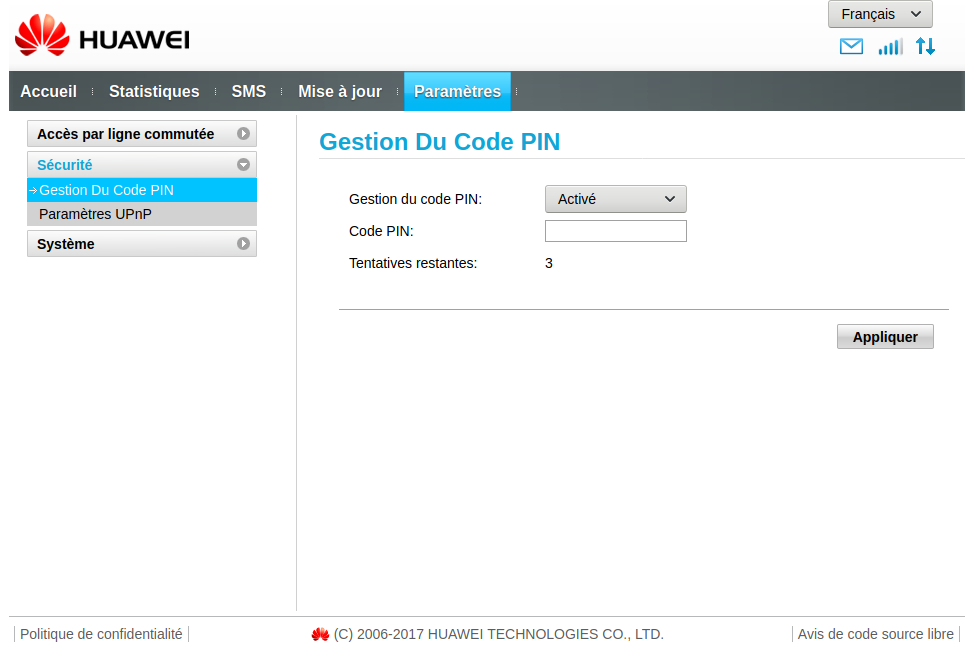
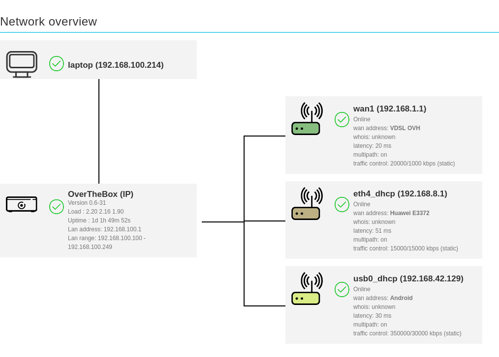
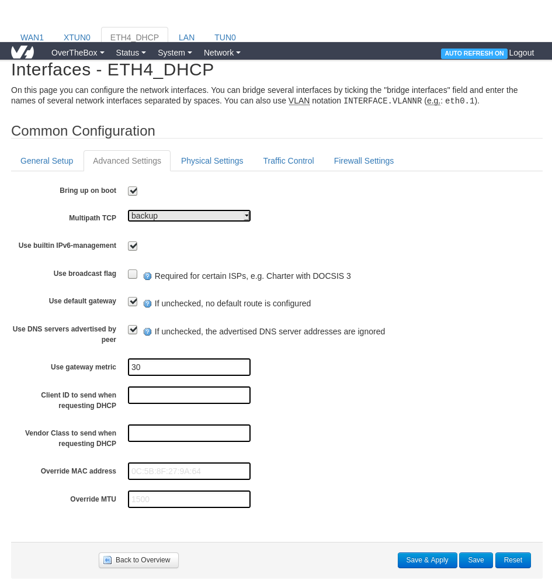

**Dernière mise à jour le 29/04/2021**

## Objectif

Grâce à un lien LTE, votre **OverTheBox** est capable de tirer partie des réseaux mobiles 3G/4G des opérateur.
Un lien LTE peut permettre une continuité de service en cas de défaillance sur votre réseau fixe (cuivre ou fibre), en utilisant un autre support technologique pour accéder à Internet.
De plus, les débits offert par les connexions LTE, sont souvent supérieur aux connexions cuivre, ce qui peut permettre d'améliorer significativement votre débit, en particulier le débit montant, grâce à l'aggregation permis par votre service OverTheBox.
Toutefois, les liens LTE souffrent d'une plus grande latence, ce qui peut avoir un impact négatif sur certaine application comme la VoIP.

## Prérequis

- Une **OverTheBox** fournie par OVHcloud ou une installation depuis le projet Open Source ([installer l'image overthebox sur votre materiel](../installer-limage-overthebox-sur-votre-materiel/))
- Disposer d'une clé LTE Huawei E3372 ainsi qu'une carte SIM permettant l'accès au réseau mobile de données.
- Alternativement vous pouvez également utiliser un téléphone sous Android ou iOS avec une carte SIM permettant l'accès au réseau mobile de données

## En pratique

### Étape 1 : configurer votre appareil LTE

#### Configurer une clé LTE Huawei E3372

Insérez la carte SIM dans votre clé Huawei E3372, puis branchez la clé sur votre ordinateur. Accédez à la clé via votre navigateur à l'adresse `192.168.8.1`.

Une fois connecté, accédez au menu `Paramètres`, puis dans le menu `Gestion Du Code PIN` entrez le code PIN de votre carte SIM.

{.thumbnail}

Retournez sur l'onglet `Accueil` pour vérifier que vous êtes bien connecté. Si la clé est correctement connectée, la LED sur celle-ci doit également être de couleur fixe, de couleur cyan pour un réseau 4G ou verte pour un réseau 3G.

{.thumbnail}

[!success]
>
> Votre clé est prête, il ne reste plus qu'à la brancher sur un des ports USB de votre **OverTheBox**
>

#### Configurer un téléphone Android

> [!warning]
>
> Sur les versions OverTheBox antérieur à la version 0.6, des manipulations supplémentaire sont nécessaire, voir la section « Aller plus loin »
>

> [!primary]
>
> L'interface Android dépends de votre constructeur, il est possible que le nom des menus ne soit pas exactement identique
>

- Branchez votre téléphone à l'aide d'un cable USB sur l'un des ports USB de votre **OverTheBox**
- Aller dans les paramètres de votre téléphone
- Cliquez sur **Réseau et Internet**
- Cliquez sur **Point d'accès et partage de connexion**
- Activer le paramètre partage de connexion **Via USB**

{.thumbnail}

[!success]
>
> Votre téléphone partage sa connexion LTE avec votre **OverTheBox**
>

#### Configurer un téléphone Apple

> [!alert]
>
> Apple à introduit des changements depuis la version iOS14, qui peuvent rendre le partage impossible avec l'**OverTheBox**
>

> [!warning]
>
> Sur les versions OverTheBox antérieur à la version 0.6, des manipulations supplémentaire sont nécessaire, voir la section « Aller plus loin »
>

- Branchez votre téléphone à l'aide d'un cable USB sur l'un des ports USB de votre **OverTheBox**
- Aller dans les paramètres de votre téléphone
- Cliquez sur **Partage de connexion**
- Activer le paramètre **partage de connexion**

[!success]
>
> Votre téléphone partage sa connexion LTE avec votre **OverTheBox**
>

### Étape 2 : vérifier la connexion LTE

Que vous utilisez une clé LTE Huawei E3372 ou un téléphone, l'équipement fournissant la connexion LTE attribue automatiquement une IP à l'**OverTheBox** grâce au DHCP. L'interface est donc automatiquement détecté par l'**OverTheBox** sans besoin d'intervention de votre part.

Pour vérifier que l'interface est correctement détectée, vérifiez qu'elle est bien présente dans le cadran **Network overview** de la page principal.

{.thumbnail}

Pour vérifier que l'agrégation fonctionne correctement vérifier que du trafic de la couleur de l'interface dans **Network overview** est bien présent dans le cadran **Realtime trafic**.
Dans notre cas la courbe verte correspond à notre connexion VDSL tandis que la courbe marron correspond à notre clé LTE Huawei E3372.

{.thumbnail}

## Aller plus loin

### Utiliser un téléphone sur une OverTheBox antérieur à la version 0.6

> [!warning]
>
> Ceci n'est utile que sur les anciennes version d'OverTheBox, inférieur à la version 0.6
>

> [!primary]
>
> Ces commandes doivent être effectuer depuis le CLI de l'OverTheBox accessible depuis une connexion SSH
>

#### Pour un téléphone Android

```bash
opkg update
opkg install kmod-usb-net kmod-usb-net-rndis kmod-usb-net-cdc-ether
```

#### Pour un téléphone Apple

```bash
opkg update
opkg install kmod-usb-net-ipheth libimobiledevice usbmuxd
```

Ensuite, les commandes suivantes vont permettre à l'OverTheBox de passer le téléphone en mode **Network USB** même après chaque reboot

```bash
/usr/sbin/usbmuxd
sed -i '/^exit 0/i/usr/sbin/usbmuxd' /etc/rc.local
```

### Configurer un lien LTE en backup uniquement

Bien que les quotas des liens LTE ont grandement augmentés ces dernières années, ils existent toujours et peuvent poser problème.
Dans le cas où vous souhaitez activer l'agrégation sur le lien LTE uniquement en cas de défaillance de votre accès principal, vous pouvez modifier pour chaque connexion la politique d'agrégation.

- Cliquez sur l'onglet **Network**
- Cliquez sur **Interfaces**
- Cliquez sur l'onglet correspondant à votre interface, dans notre cas «ETH4_DHCP» pour notre clé LTE
- Cliquez sur **Advanced Settings**
- Dans le menu déroulant **Multipath TCP**, choisissez **Backup**
- Sauvegardez vos changement avec le bouton **Save & Apply**

{.thumbnail}

Voici la description de chaque paramètre de l'option **Multipath TCP**

Paramètre | Description |
| ------------- | ------------- |
| Disabled  | Le lien n'est pas inclus dans l'aggrégation |
| Enabled  | Le lien est inclus dans l'aggrégation |
| Master | Le lien est inclus dans l'aggrégation et est la route par défaut pour tout les autres type de trafic. Seulement une seule interface doit utiliser ce paramètre |
| Backup | Le lien ne sera inclus dans l'aggrégation qu'en cas de perte des autres liens |
| Handover | Le lien ne sera inclus dans l'aggrégation qu'en cas de dégradation ou de perte des autres lien |

N'hésitez pas à échanger avec notre communauté d'utilisateurs sur vos produits Télécom sur notre site [OVHcloud Community](https://community.ovh.com/c/telecom)
