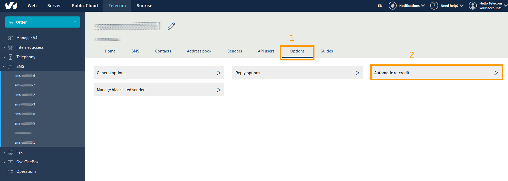
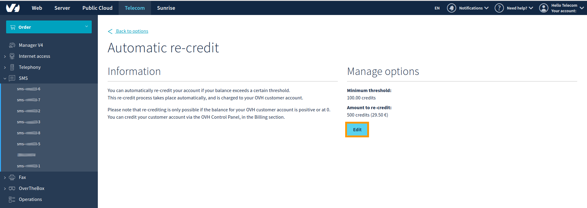
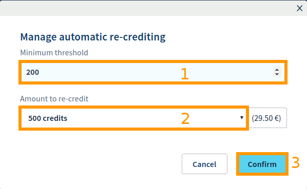

**Última actualización: 06/12/2019**

## Objetivo

Esta guía explica en qué consiste el crédito de SMS, cómo recargarlo de forma automática y cómo transferirlo entre cuentas de SMS.

## Requisitos

* Disponer de una cuenta de SMS en OVHcloud.
* Conectarse a la [API de OVHcloud](https://api.ovh.com/console/) (solo para la transferencia de crédito).

## Procedimiento

### **Crédito de SMS**

En España, 0,8 créditos equivalen a 1 SMS enviado (máximo 160 caracteres). El precio por SMS es decreciente y depende de la cantidad de crédito de SMS que se adquiera en una misma contratación. 

Puede consultar la lista de packs de créditos de SMS en el siguiente enlace: [https://www.ovh.es/sms/](https://www.ovh.es/sms/).

**Por ejemplo, si adquiere un pack de 100 créditos de SMS, cada crédito tendrá un precio de 0,06 €.**

Cada SMS enviado en España equivale a 0,8 créditos, por lo que podrá enviar hasta 125 SMS.
En el caso de India, por ejemplo, cada SMS equivale a 0,1 créditos, por lo que podrá enviar hasta 1000 SMS.

Para más información sobre el coste de envío en créditos de sus SMS en función del destino, consulte la siguiente página: [https://www.ovh.es/sms/precios/](https://www.ovh.es/sms/precios/).

> [!primary]
>
> Un SMS solo puede contener una cantidad limitada de caracteres en función de la codificación. Para más información sobre la codificación y los caracteres admitidos, consulte la siguiente guía:
> 
> [Enviar SMS desde el área de cliente](https://docs.ovh.com/es/sms/enviar-sms-desde-el-area-de-cliente/)
>

### **Recarga automática**

Para garantizar que su cuenta de SMS dispone siempre de crédito, puede activar la recarga automática. Con esta opción, cada vez que su cuenta de SMS baje de un número de créditos determinado, se añadirá de forma automática una nueva cantidad de crédito en su cuenta.

Para activar la recarga automática, conéctese a su [área de cliente de OVHcloud](https://www.ovh.com/auth/?action=gotomanager){.external}, acceda a la pestaña `Telecom`{.action} y abra la sección `SMS`{.action} en el menú de la izquierda. Seleccione la cuenta de SMS en la que desea activar la recarga automática.

Acceda al menú `Opciones`{.action} (1) y seleccione la opción `Recarga automática`{.action} (2).

{.thumbnail}

En la sección `Configurar las opciones`{.action}, haga clic en `Modificar`{.action}.

{.thumbnail}

Por último, configure los siguientes campos:

* Umbral mínimo (1): límite mínimo por debajo del cual se realizará la recarga automática.
* Cantidad a recargar (2): cantidad de créditos que desea recargar en su cuenta de SMS. Puede elegir entre 100, 200, 250, 500 y 1000 créditos.
* Haga clic en `Aceptar`{.action} (3) para guardar los cambios.

{.thumbnail}

### **Transferencia de créditos**

> [!primary]
>
> Solo es posible transferir créditos entre cuentas de SMS de un mismo ID de cliente de OVHcloud. No es posible transferir créditos entre dos ID de cliente de OVHcloud diferentes.
>

Solo es posible transferir créditos de SMS a través de la API.

Para ello, conéctese a [https://api.ovh.com/](https://api.ovh.com/console/)  y utilice la siguiente API:

> [!api]
>
> @api {post} /sms/{serviceName}/transferCredits
>

Introduzca la información solicitada:

* serviceName: referencia de la cuenta de SMS que transfiere los créditos.
* credits: número de créditos que desea transferir.
* smsAccountTarget: referencia de la cuenta de SMS que recibe los créditos.

Haga clic en `Execute`{.action} para confirmar la transferencia, que se realizará de forma inmediata.

## Más información

Interactúe con nuestra comunidad de usuarios en [ovh.es/community](https://community.ovh.com).
