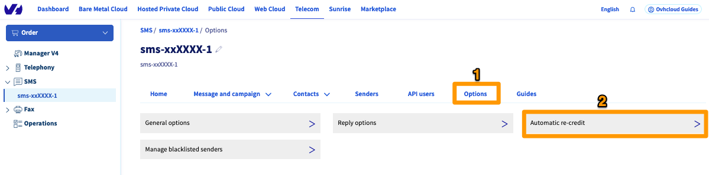

**Dernière mise à jour le 29/08/2022**

## Objectif

Ce guide à pour objectif de vous expliquer ce que sont les crédit SMS, comment les recharger automatiquement et comment les transférer entre vos comptes SMS.

## Prérequis

- Disposer d'un compte SMS OVHcloud.
- Être connecté aux [API OVHcloud](https://api.ovh.com/) (uniquement pour les transferts de crédits).
- Être connecté à l'[espace client OVHcloud](https://www.ovh.com/auth?onsuccess=https%3A%2F%2Fwww.ovhtelecom.fr%2Fmanager&ovhSubsidiary=fr){.external}, partie `Télécom`{.action} puis `SMS`{.action}.

{.thumbnail}

## En pratique

### Les crédits SMS

1 crédit SMS correspond au coût pour l'envoi de 1 SMS en France métropolitaine, le tarif étant dégressif en fonction du nombre de crédits SMS que vous achetez en une fois. 

Vous trouverez la liste des packs SMS en suivant ce lien : [https://www.ovhtelecom.fr/sms/](https://www.ovhtelecom.fr/sms/).

**Exemple pour l'achat d'un pack de 100 crédits SMS, chaque crédit coûtant donc 0,06 € HT :**

L'envoi de 1 SMS en France métropolitaine coûte 1 crédit. Avec ce pack, vous pourrez envoyer 100 SMS en France métropolitaine.
L'envoi de 1 SMS en Inde coûte 0,4 crédit. Avec ce pack, vous pourrez envoyer 250 SMS en Inde.

Le lien suivant vous permettra de retrouver le coût d'envoi, en crédits, de vos SMS en fonction de leur destination : [https://www.ovhtelecom.fr/sms/tarifs.xml](https://www.ovhtelecom.fr/sms/tarifs.xml).

> [!primary]
>
> Un SMS ne peut contenir qu'une quantité limitée de caractères en fonction de son encodage. Le détail des encodages et caractères admis est disponible sur ce guide :
> 
> [Envoyer des SMS depuis mon espace client OVHcloud](../envoyer_des_sms_depuis_mon_espace_client/#etape-2-composer-votre-sms)
>

### La recharge automatique

Afin de n'être jamais à court de crédit sur votre compte, vous pouvez activer la recharge automatique. Dès qu'un seuil minimum de crédits restants est atteint, une nouvelle quantité de crédits est automatiquement ajoutée sur votre compte SMS.

> [!warning]
>
> L'option de recharge automatique ne peut être activée que si les conditions suivantes sont remplies :
>
> - un moyen de paiement de type Prélèvement SEPA est présent et validé sur votre compte OVHcloud;
> - votre service SMS doit avoir au moins 2 mois d'ancienneté.

Pour activer la recharge automatique, connectez-vous à votre [espace client OVHcloud](https://www.ovh.com/auth/?action=gotomanager&from=https://www.ovh.com/fr/&ovhSubsidiary=fr){.external}, rendez-vous dans l'onglet `Télécom`{.action} puis cliquez sur la section `SMS`{.action}. Choisissez le compte SMS sur lequel activer la recharge automatique.

Rendez-vous dans le menu `Options`{.action} (1) puis `Recharge automatique`{.action} (2).

{.thumbnail}

Cliquez alors sur `Modifier`{.action} dans la rubrique « Gérer les options ».

{.thumbnail}

Enfin, remplissez les champs requis :

* Seuil minimum (1) : lorsque ce seuil est atteint, la recharge automatique se déclenche.
* Quantité à recharger (2) : définit la quantité de crédits à recharger sur votre compte SMS. Les choix possibles sont : 100, 200, 250, 500, 1000, 5000 et 10000.
* Cliquez sur le bouton `Valider`{.action} pour appliquer le paramétrage.

{.thumbnail}

### Le transfert de crédits

> [!primary]
>
> Le transfert de crédits n'est possible qu'entre les comptes SMS d'un seul et même compte client OVHcloud. Le transfert de crédits entre deux comptes clients OVHcloud est impossible.
>

Le transfert de crédits SMS ne peut s'effectuer que via API.

> [!success]
> Si vous n'êtes pas familier avec l'utilisation de l'API OVHcloud, consultez notre guide « [Premiers pas avec les API OVHcloud](https://docs.ovh.com/fr/api/first-steps-with-ovh-api/)».

Connectez-vous sur [https://api.ovh.com/](https://api.ovh.com/) puis utilisez l'API suivante :

> [!api]
>
> @api {post} /sms/{serviceName}/transferCredits
>

Vous devrez compléter les trois champs requis :

- `serviceName` : renseignez la référence du compte SMS léguant les crédits.
- `credits` : renseignez le nombre de crédits à transférer
- `smsAccountTarget` : renseignez la référence du compte SMS recevant les crédits.

Cliquez sur `Execute`{.action} pour valider le transfert. Celui-ci est immédiat.

## Aller plus loin

Échangez avec notre communauté d'utilisateurs sur [https://community.ovh.com](https://community.ovh.com).
