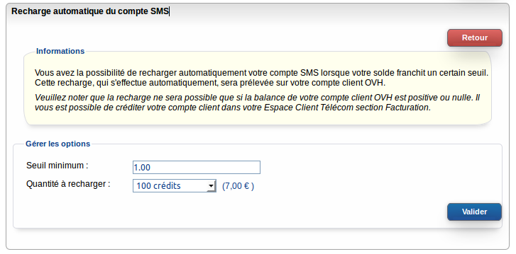

### Préambule {#préambule}

Afin de n'être jamais à cours de crédit, il est possible d'activer la recharge automatique de celui-ci : passé un certain seuil, le compte est automatiquement crédité et vous permet de continuer à utiliser votre service sans interruption.

**Sommaire :**

Niveau : Débutant

------------------------------------------------------------------------

### Activer la recharge {#activer-la-recharge}

Pour activer la recharge automatique du compte :

-   Connectez-vous à votre Espace Client OVH : <https://www.ovhtelecom.fr/espaceclient/>.
-   Cliquez sur le lien "**Administrez vos services de téléphonie via l'ancienne interface**".
-   Cliquez sur l'icône "**SMS**".
-   Cliquez sur l'onglet "**Options**" dans le menu "**Navigation**".
-   Cliquez ensuite sur l'onglet "**Rechargeautomatique**".
-   Cliquez sur le bouton "**Gérer**".
-   Les options à remplir sont :

{.thumbnail}

-   -   -   **Seuil minimum :**Lorsque ce seuil est atteint, la recharge automatique est effectuée.

<!-- -->

-   -   -   **Quantité à recharger :** Définit quelle quantité recharger sur votre compte SMS.

Les choix possibles sont : **Ne pas recharger, 100, 200, 250, 500**et**1000**.

-   Cliquez sur le bouton "**Valider**" pour appliquer le paramétrage.

La recharge sera effectuée uniquement si votre compte OVH est nul ou positif.

