Le carnet d'adresses permet de stocker un grand nombre de contacts afin de vous éviter de devoir renseigner le numéro du destinataire de votre SMS.

Voyons dans ce guide comment utiliser cette fonctionnalité.

**Sommaire :**

Niveau : Débutant

------------------------------------------------------------------------

### Création du carnet d'adresses {#création-du-carnet-dadresses}

Rendez-vous dans le Manager, section "**SMS**".

Cliquez sur "**Carnets d'adresses**" dans le menu de Navigation.

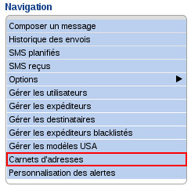{.thumbnail}

Il vous faut maintenant créer un carnet d'adresses. Pour ce faire, cliquez sur "**Carnet d'adresses**".

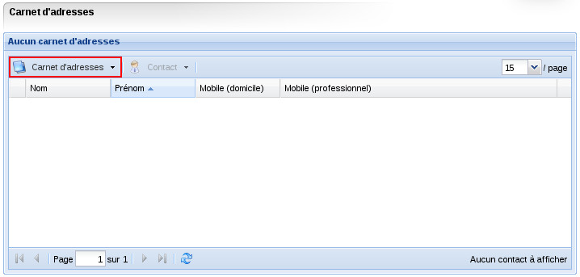{.thumbnail}

Un menu déroulant s'affiche, cliquez sur "**Nouveau**".

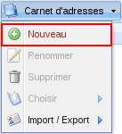{.thumbnail}

Donnez un nom à votre carnet d'adresses :

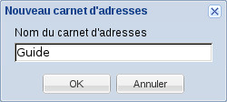{.thumbnail}

Le nom de votre carnet d'adresses s'affiche maintenant en haut à gauche de la fenêtre :

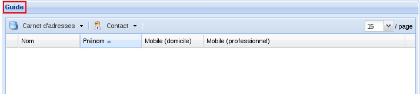{.thumbnail}

------------------------------------------------------------------------

### Renseigner le carnet d'adresses {#renseigner-le-carnet-dadresses}

Vous pouvez maintenant remplir votre carnet d'adresses. Cliquez sur "**Contact**".

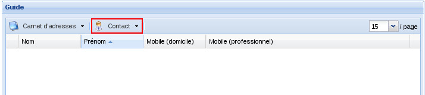{.thumbnail}

Plusieurs choix s'offrent à vous :

-   **Renseigner manuellement vos contacts**

Cliquez sur "**Nouveau**" :

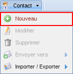{.thumbnail}

Renseignez les champs que vous souhaitez puis validez.

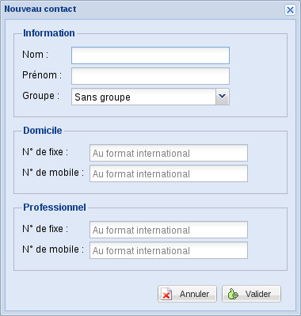{.thumbnail}

Répétez l'opération pour chaque contact.

-   **Importer un carnet de contact au format CSV**

Cliquez sur "**Importer / Exporter**".

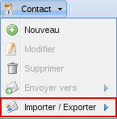{.thumbnail}

Cliquez sur "**Format CSV**" puis "Importer".

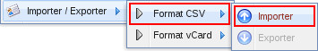{.thumbnail}

Cliquez sur l'icône représentant un écran avec un + puis sélectionnez le fichier au format .csv parmi les fichiers de votre ordinateur :

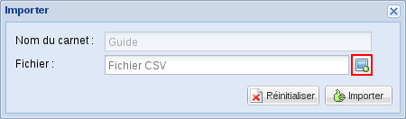{.thumbnail}

Enfin, cliquez sur "**Importer**" pour valider le transfert du fichier vers votre carnet d'adresses.

-   **Importer un carnet de contact au format vCard**

Cliquez sur "**Importer / Exporter**".

{.thumbnail}

Cliquez sur "**Format vCard**" puis "**Importer**".

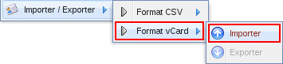{.thumbnail}

Cliquez sur l'icône représentant un écran avec un + puis sélectionnez le fichier au format .vcf parmi les fichiers de votre ordinateur.

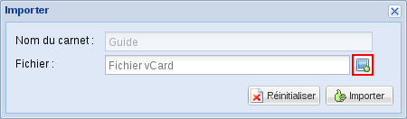{.thumbnail}

------------------------------------------------------------------------

### Renommer un carnet d'adresses {#renommer-un-carnet-dadresses}

Cliquez sur "**Carnet d'adresses**".

{.thumbnail}

Cliquez sur "**Renommer**".

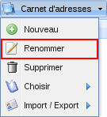{.thumbnail}

Puis donnez un nouveau nom à votre carnet d'adresses.

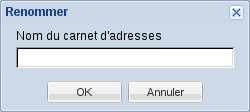{.thumbnail}

------------------------------------------------------------------------

### Supprimer un carnet d'adresses {#supprimer-un-carnet-dadresses}

Cliquez sur "**Carnet d'adresses**".

{.thumbnail}

Cliquez sur "**Supprimer**".

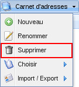{.thumbnail}

Après avoir confirmé la demande de suppression en cliquant sur "**Oui**" sur la boite de dialogue suivante, votre carnet d'adresses sera définitivement supprimé.

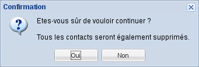{.thumbnail}

------------------------------------------------------------------------

### Choisir le carnet d'adresses sur lequel interagir {#choisir-le-carnet-dadresses-sur-lequel-interagir}

Cliquez sur "**Carnet d'adresses**".

{.thumbnail}

Cliquez sur "**Choisir**".

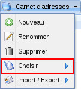{.thumbnail}

Sélectionnez le nom du guide sur lequel vous souhaitez interagir.

{.thumbnail}

------------------------------------------------------------------------

### Modifier un contact {#modifier-un-contact}

Sélectionnez un contact dans la liste des contacts (1)

puis cliquez sur "**Contact**" (2).

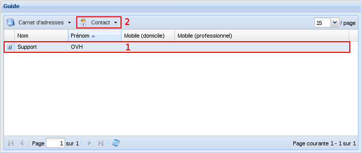{.thumbnail}

Cliquez sur "**Modifier**".

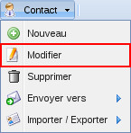{.thumbnail}

La fenêtre suivante s'affiche, vous pourrez alors modifier les informations que vous souhaitez et cliquer sur "**Valider**" pour enregistrer ces changements

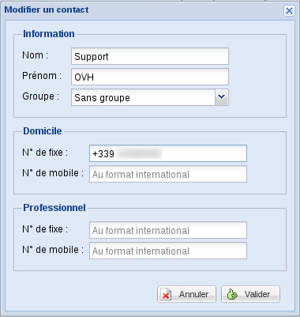{.thumbnail}

------------------------------------------------------------------------

### Supprimer un contact {#supprimer-un-contact}

Sélectionnez un contact dans la liste des contacts (1)

puis cliquez sur "**Contact**" (2).

{.thumbnail}

Cliquez sur "**Supprimer**".

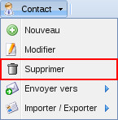{.thumbnail}

Une boîte de dialogue s'affiche vous invitant à confirmer votre souhait, en cliquant sur "**Oui**", le contact sera immédiatement supprimé.

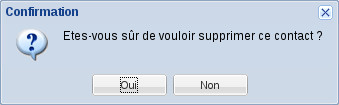{.thumbnail}

------------------------------------------------------------------------

### Envoyer une carte de visite à un destinataire sous forme d'e-mail {#envoyer-une-carte-de-visite-à-un-destinataire-sous-forme-de-mail}

Sélectionnez un contact dans la liste des contacts (1)

puis cliquez sur "**Contact**" (2).

{.thumbnail}

Cliquez sur "**Envoyer vers**" puis "**Destinataire**".

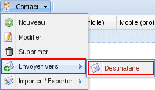{.thumbnail}

Renseignez alors une adresse e-mail puis cliquez sur "OK". Vous recevrez instantanément un e-mail contenant la fiche du contact au format vCard (.cvf).

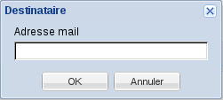{.thumbnail}

------------------------------------------------------------------------

### Sauvegarder / Restaurer votre carnet d'adresse {#sauvegarder-restaurer-votre-carnet-dadresse}

Il est possible de sauvegarder un carnet d'adresses afin de le modifier ou de le transférer vers un autre compte SMS.

-   Sauvegarder / Restaurer un carnet d'adresses au format .CSV.

Cliquez sur "**Carnet d'adresses**".

{.thumbnail}

Cliquez sur "**Import / Export**" puis sur "**Format CSV**".

Cliquez sur "**Importer**" dans le cas où vous souhaitez restaurer un carnet d'adresses.

Cliquez sur "**Exporter**" dans le cas où vous souhaitez sauvegarder un carnet d'adresses.

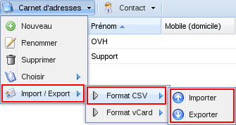{.thumbnail}

-   **Importer** :

Une fenêtre s'affiche, vous invitant à rechercher dans vos fichiers le carnet d'adresses à importer.

{.thumbnail}

-   **Exporter** :

Une fenêtre s'affiche vous invitant à choisir quelle action entreprendre avec le fichier : l'ouvrir ou le sauvegarder.

------------------------------------------------------------------------

-   Sauvegarder / Restaurer un carnet d'adresses au format .VCF (vCard)

Cliquez sur "**Carnet d'adresses**".

{.thumbnail}

Cliquez sur "**Import / Export**" puis sur "**Format vCard**".

Cliquez sur "**Importer**" dans le cas où vous souhaitez restaurer un carnet d'adresses.

Cliquez sur "**Exporter**" dans le cas où vous souhaitez sauvegarder un carnet d'adresses.

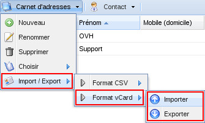{.thumbnail}

-   **Importer** :

Une fenêtre s'affiche, vous invitant à rechercher dans vos fichiers le carnet d'adresses à importer.

{.thumbnail}

-   **Exporter** :

Une fenêtre s'affiche vous invitant à choisir la façon dont sera exporté votre ficher.

Si vous souhaitez un fichier par contact, cliquez sur "Oui".

Si vous souhaitez un fichier contenant l'ensemble des contacts, cliquez sur "Non"

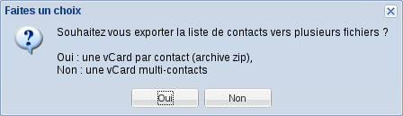{.thumbnail}

Besoin d'aide pour éditer votre fichier CSV ? : [Guide pour l'édition des CSV.](https://docs.ovh.com/fr/sms/gerer_mes_carnets_dadresses_sms/){.external-link} {#besoin-daide-pour-éditer-votre-fichier-csv-guide-pour-lédition-des-csv.}

