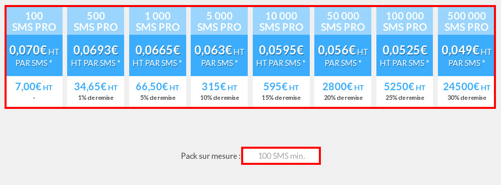
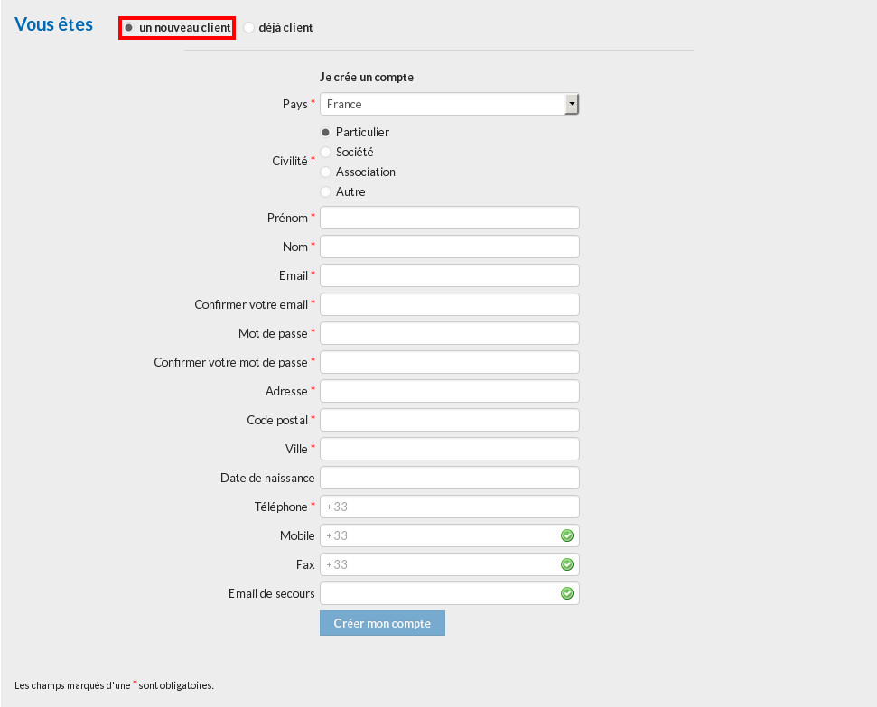
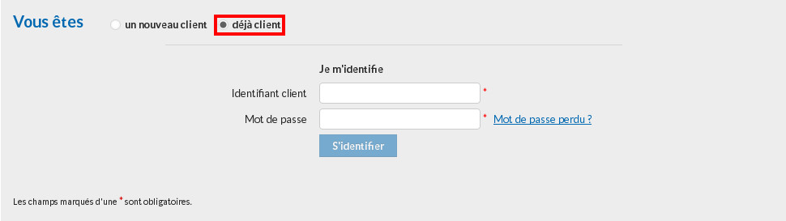
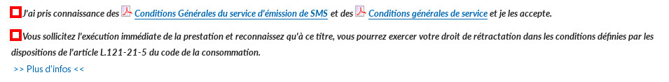
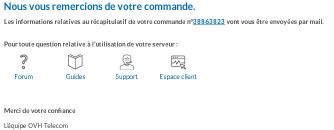
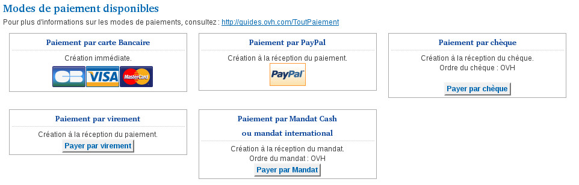
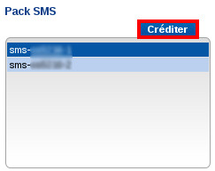
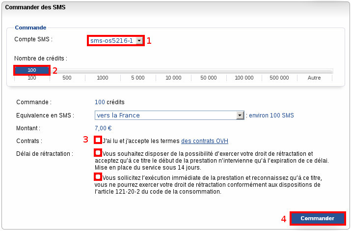
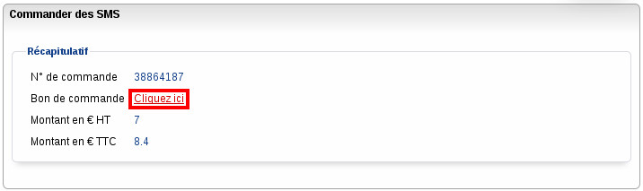

**Préambule**

Afin de pouvoir utiliser le service SMS, il vous faut au préalable disposer d'un crédit de SMS utilisable.

Pour cela, une commande sur notre site internet est indispensable.

Nous verrons dans ce guide comment procéder.

**Sommaire :**

Niveau : Débutant

------------------------------------------------------------------------

### Commander par le site web {#commander-par-le-site-web}

Dans le cas où il s'agit de votre première commande de pack SMS, il est indispensable de passer par le site web.

La commande va avoir pour effet de créer un service SMS associé à votre compte client.

Rendez-vous donc sur le site <http://www.ovhtelecom.fr/>.

{.thumbnail}

Cliquez sur "SMS" dans le bandeau, en haut de page.

{.thumbnail}

Sélectionnez le pack SMS dont vous souhaitez disposer ou indiquez dans le champ "**Pack sur mesure**" le nombre de SMS que vous souhaitez commander (100 au minimum).

{.thumbnail}

Après avoir fait votre choix, un récapitulatif de commande s'affiche, ainsi qu'une section vous permettant d'indiquer si vous êtes un nouveau client ou non.

Cochez la case correspondante à votre situation.

-   **Je suis un nouveau client :**

Renseignez alors les informations demandées puis cliquez sur "**Créer mon compte**".

{.thumbnail}

En validant ces informations, un compte client sera créé. Vous recevrez les informations de connexion par e-mail à l'adresse indiquée dans le champ.

-   **Je suis déjà client :**

Renseignez alors vos informations de connexion puis cliquez sur "**S'identifier**".

.{.thumbnail}

Enfin, cochez les deux cases ci-dessous et cliquez sur "**Confirmer et payer ma commande**".

{.thumbnail}

Une page de confirmation s'affiche alors. Cette page contient le numéro du bon de commande lié à votre commande de SMS.

{.thumbnail}

Vous devez cliquer dessus afin d'afficher le bon de commande. Aucun SMS ne sera crédité si le bon de commande n'est pas réglé.

Pour régler le bon de commande, rendez-vous en bas de ce dernier afin d'y trouver les moyens de paiement disponibles.

{.thumbnail}

------------------------------------------------------------------------

### Commander par le Manager {#commander-par-le-manager}

Si vous disposez déjà d'un compte SMS pour lequel vous souhaitez créditer des SMS, l'opération se passe directement sur le Manager SMS.

Connectez-vous alors à votre interface client, rendez-vous dans la section "**SMS**" puis cliquez sur "**Créditer**".

{.thumbnail}

1 - Sélectionnez le compte SMS pour lequel vous souhaitez commander des SMS supplémentaires.

2 - Le curseur bleu est par défaut sur "**100**". Pour choisir la quantité de SMS à commander, il vous suffit de déplacer le curseur sur la barre.

3 - Cochez la case "**J'ai lu et j'accepte les termes du contrat OVH**" puis l'une ou l'autre des cases en dessous en fonction du choix que vous souhaitez faire concernant le droit au délai de rétraction.

4 - Cliquez sur "**Commander**".

{.thumbnail}

Sur la fenêtre suivante s'affiche votre **numéro de bon de commande**. Cliquez dessus afin de l'afficher.

{.thumbnail}

Aucun SMS ne sera crédité si le bon de commande n'est pas réglé.

Pour régler le bon de commande, rendez-vous en bas de ce dernier afin de trouver les moyens de paiement disponibles.

{.thumbnail}
