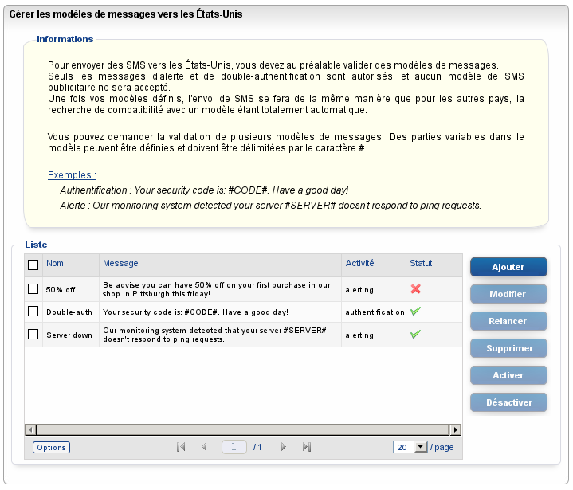

## Ouverture
OVH propose l'envoi de SMS dans plus de 200 pays dans le monde dont les Etats-Unis. Vers cette destination, nous proposons une solution "Out Of the box" qui permet l'envoi avec un délai de validation de moins de 24H.


## Restrictions
En accord avec l'autorité de régulation des sms des Etats-Unis (Neustar), nous procédons préalablement à la validation de modèles de messages. Seuls les messages d'alerte et de double authentification sont autorisés et aucun modèle de SMS publicitaire ne sera accepté. Une fois les modèles définis, l'envoi se fera de la même manière que pour les autres pays.


## Ajout d'un template via le manager
Rendez-vous dans le manager OVH puis cliquez sur :
"Administrez vos services de téléphonie via l'ancienne interface".

Cliquez ensuite sur le lien "SMS" en haut de la page. Cliquez ensuite dans le menu de droite sur "Gérez les modèles USA".

{.thumbnail}
Enfin cliquez sur "Ajouter"

Des parties variables dans le modèles peuvent être définies et doivent être délimitées par le caractère #.

{.thumbnail}


## Exemples
Exemple de template d'authentification :


```
Your security code is #CODE#, have a good day
```


Exemple de template d'alerting :


```
Our monitoring system detected your server #SERVER# doesn't respond to ping requests
```


## Ajout d'un template via l'Api
[Via l'API](https://api.ovh.com/console/#/sms)


> [!api]
>
> @api {POST} /sms/{serviceName}/templatesControl
>


## Use-case d'un SMS au contenu non modéré
Dans le cas d'un SMS dont le contenu n'a pas été modéré, ce dernier sera refusé avec un "Premium Tracking Transaction" Code à 1999. Ce code correspond au message d'erreur : "No templates available".


## Use-case d'un SMS au contenu modéré
La comparaison du contenu des SMS avec ceux des templates se fait automatiquement. Dans le cas où la comparaison est similaire, le SMS est envoyé de la même manière que dans les autres pays.
