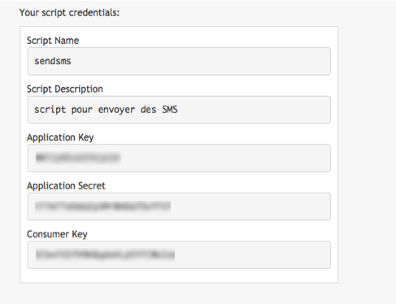

**Last updated 18th June 2020**

## Objective

SMS messages are widely used to share practical information, track an order status or transactional process, send alerts regarding unusual events, and send appointment reminders. This guide details the method for sending a first SMS message via the OVHcloud API in Node.js.

**Find out how to send SMS messages with the OVHcloud RESTful API in Node.js**

## Requirements

- An OVHcloud SMS account with SMS credits.
- A Node.js server and npm. Example on Ubuntu:

```
$ sudo apt-get install nodejs npm
```

You can find more information on the [GitHub project](https://github.com/ovh/node-ovh).


## Instructions

The quickest way to retrieve the Node.js wrapper for the OVHcloud API is to use npm for adding the ovh module:

```
$ npm install ovh
```

You will need to retrieve a directory named ./node_modules/ovh/...

### Step 1: Create your credentials.

You will need credentials to use the SMS API. These credentials are created once, to identify the application that will be sending SMS messages. The lifespan of these credentials can be configured.

Create all of your script credentials (all keys at once) on this page:
[https://eu.api.ovh.com/createToken/](https://eu.api.ovh.com/createToken/index.cgi?GET=/sms&GET=/sms/*/jobs/&POST=/sms/*/jobs/) (this URL will automatically give you the correct rights for the steps described in this guide).

{.thumbnail}

In this basic example, we retrieve the rights to access information on the account, the right to view pending SMS messages, and the right to send SMS messages. 

- GET /sms/
- GET/sms/\*/jobs/
- POST /sms/\*/jobs/


The asterisk (\*) enables calls to these methods for all of your SMS accounts. You can also limit calls to one account only, if you generate several SMS accounts on a single OVHcloud account. You can do this by replacing “/sms” with “/sms/ACCOUNT-NAME”, and  “/sms/\*/” with “/sms/ACCOUNT-NAME”.

You can then retrieve the credentials for your script:

- Application Key (identifies your application)
- Application Secret (authenticates your application)
- Consumer Key (authorises the application to access the methods chosen)


{.thumbnail}

The environment is ready, the credentials have been created, and you are now ready to code your Node.js script.


### Step 2: Retrieve your serviceName and send your first SMS message.

We will now retrieve the serviceName (the SMS account you hold — we will assume here that you only have one SMS account, otherwise you will need to adapt the way you follow this section, to fit the SMS account concerned). Then we will send an SMS message with the first WebService call:

```
var ovh = require('ovh')({
  appKey: 'your_app_key',
  appSecret: 'your_app_secret',
  consumerKey: 'your_consumer_key'
});
 
 // Get the serviceName (name of your SMS account)
ovh.request('GET', '/sms', function (err, serviceName) {
  if(err) {
    console.log(err, serviceName);
  }
  else {
    console.log("My account SMS is " + serviceName);
 
    // Send a simple SMS with a short number using your serviceName
    ovh.request('POST', '/sms/' + serviceName + '/jobs', {
      message: 'Hello World!',
      senderForResponse: true,
      receivers: ['0033600000000']
    }, function (errsend, result) {
      console.log(errsend, result);
    });
  }
});
```


Launch your script to send your first SMS message.

```
$ nodejs sms.js
my account SMS sms-XXXXXXX-1
{ totalCreditsRemoved: 1,
  invalidReceivers: [],
  ids: [ 2700042‡ ],
  validReceivers: [ '+33600000000' ] }
```


We retrieve the SMS account (ServiceName), and receive a response with 1 credit used for a valid phone number.

## Go further

With the API console ([https://api.ovh.com/console/#/sms](https://api.ovh.com/console/#/sms)), you can explore other methods for using SMS services, such as: SMS messages with the ability to send replies (for OVHcloud accounts in France only), mass-sending a CSV file, advertising mail, acknowledgements of receipt, etc.

Join our community of users on [https://community.ovh.com/en/](https://community.ovh.com/en/).
