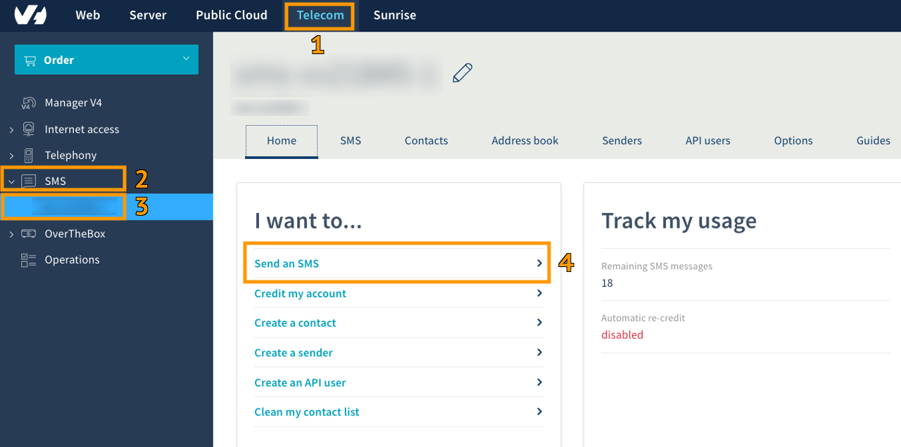
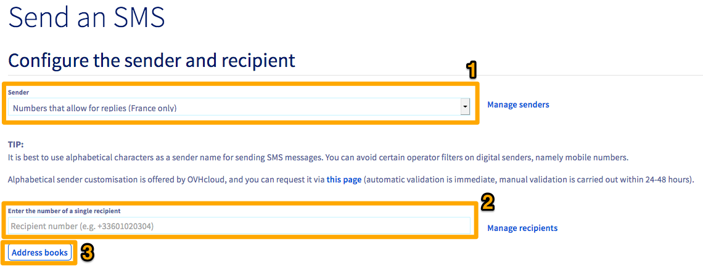
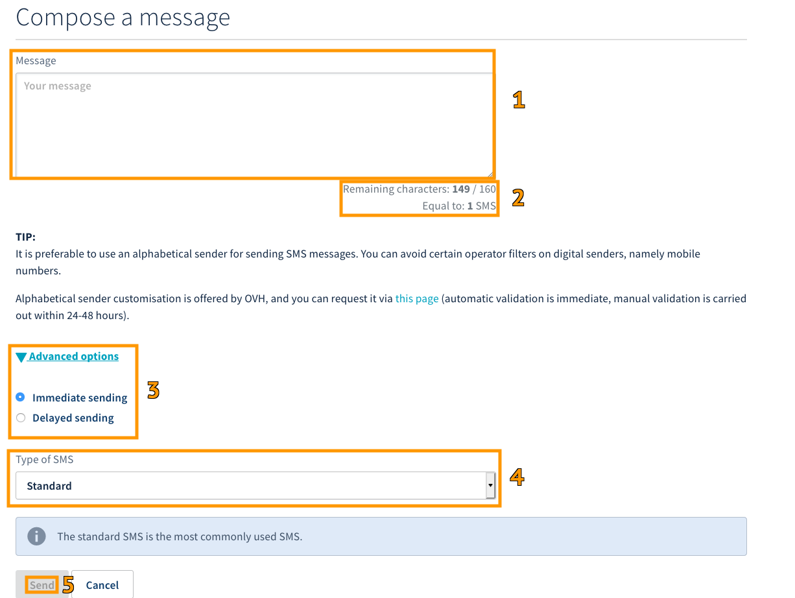
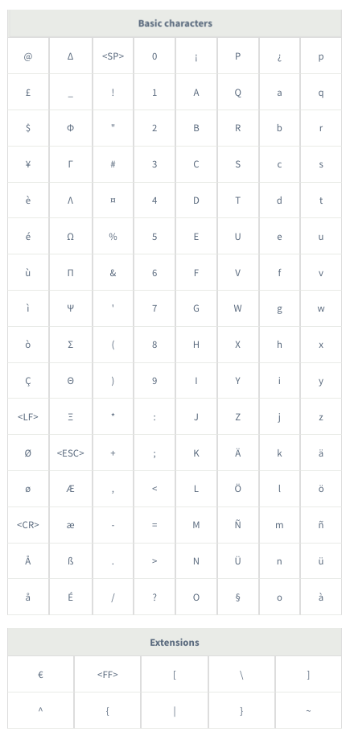
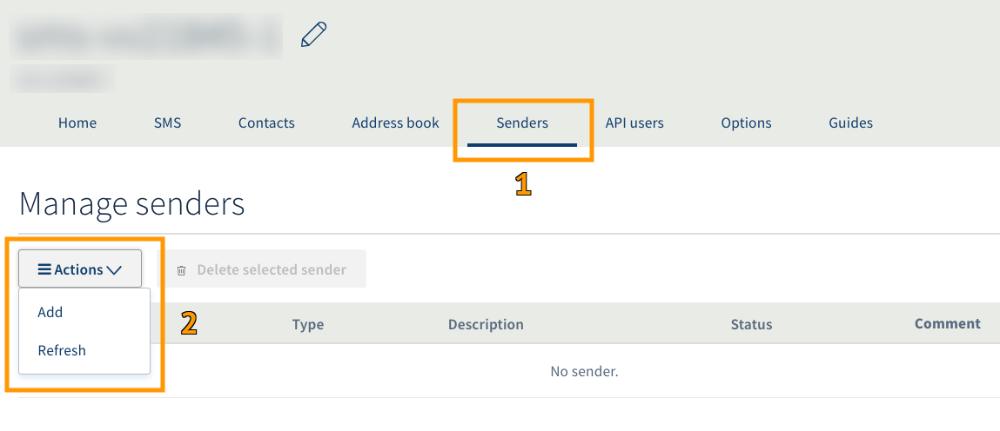

**Dernière mise à jour le 18/05/2020**

## Objectif

Vous pouvez envoyer des SMS directement via votre espace client. Ce guide indique étape par étape comment envoyer vos premiers SMS.

## Prérequis

- Disposer d’un compte SMS OVHcloud avec des crédits SMS.

## En pratique

Connectez-vous à votre [espace client](https://www.ovhtelecom.fr/manager/) puis sélectionnez `Télécom`{.action} (1). Cliquez ensuite sur `SMS`{.action} à gauche (2)  puis choisissez votre compte SMS (3).

Le champ "Envoyer un SMS" (4) est le premier élément disponible dans la liste des actions.

{.thumbnail}

### Étape 1 : configurer l’expéditeur et le destinataire

Une fois sur la page d'envoi de SMS, vous disposez de différents paramètres à renseigner pour adapter au mieux votre envoi de SMS à votre besoin.

{.thumbnail}

Pour l’expéditeur du SMS (1) , vous avez la possibilité de sélectionner soit un numéro court permettant la réponse (uniquement pour les comptes OVHcloud en France), soit un expéditeur alphanumérique. 
Renseignez ensuite  le numéro du destinataire (2) au format international (+336xxxxxxxx). 
Pour plus de renseignements sur la création d'un expéditeur, reportez-vous à l'[étape 3: choisir votre expéditeur SMS](https://docs.ovh.com/fr/sms/envoyer_des_sms_depuis_mon_espace_client/#etape-3-choisir-votre-expediteur-sms){.external}.

Vous pouvez également envoyer des SMS à plusieurs destinataires. Deux méthodes sont disponibles pour y parvenir :

- Par le biais d'une liste de destinataires au format .csv via le bouton "Gérer les destinataires". 
Pour plus d'informations, vous pouvez consulter notre [guide sur les listes de destinataires SMS](https://docs.ovh.com/fr/sms/liste_de_destinataire_sms/).

- Par le biais d'un carnet d'adresses (3) . Celui-ci peut être créé directement via votre espace client, ou être importé via un fichier .csv ou .txt. 
N'hésitez pas à consulter notre [guide sur les carnets d'adresses SMS](https://docs.ovh.com/fr/sms/gerer_mes_carnets_dadresses_sms/).

### Étape 2 : composer votre SMS

Une fois l'expéditeur sélectionné et vos destinataires renseignés, vous pouvez désormais passer à la composition du message.

{.thumbnail}

Tapez votre message dans le cadre prévu à cet effet (1). Un compteur est présent à titre indicatif pour le nombre de caractères utilisés et le nombre de SMS correspondants (2).

Les deux tableaux ci-dessous listent les caractères autorisés en encodage 7bit. Les caractères du tableau "Extensions" comptent double. 

La taille maximum d’un SMS est de 160 caractères en encodage 7bit (norme GSM 03.38).

L’utilisation de caractères ne figurant pas dans ces tableaux provoquera le basculement de l’encodage en Unicode et réduit à 70 caractères la taille maximale d’un SMS.

{.thumbnail}

#### Taille des SMS à caractère commercial

Un SMS à caractère commercial devra obligatoirement inclure la mention STOP. Celle-ci contient 11 caractères et est automatiquement déduite des 160 caractères de base du 1er SMS.
Le tableau ci-dessous indique donc le nombre maximum de caractères autorisés pour les SMS à caractère commercial. 

Exemple : en encodage 7bits, si votre message fait plus de 149 caractères, il sera envoyé en 2 SMS et coûtera donc 2 crédits.

| Encodage | 1er SMS | 2ème SMS et suivants  |
|---|---|---|
| 7bits (norme GSM 03.38) | 149 caractères | 153 caractères |
| Unicode | 59 caractères | 70 caractères  |

#### Options avancées

Dans cette section vous avez la possibilité d’effectuer un envoi immédiat ou différé.

Trois formats d’envoi sont également disponibles :

- Standard : SMS le plus couramment utilisé.
- Flash : le SMS s’affiche directement sur l’écran du téléphone.
- Sim : le SMS est automatiquement sauvegardé sur la carte SIM du téléphone.

### Étape 3 : choisir votre expéditeur SMS

#### Numéro court permettant la réponse (Uniquement pour les comptes OVHcloud en France)

Il permet de recevoir une réponse via l’onglet SMS reçus.

#### Numéro mobile virtuel (Uniquement pour les comptes OVHcloud en France)

Si vous disposez d'une offre SMS avec numéro mobile virtuel, vous pouvez renseigner celui-ci comme expéditeur. Pour plus d'informations, consultez notre [page numéro mobile virtuel](https://www.ovhtelecom.fr/sms/reponse/numeros-virtuels.xml).

> [!primary]
>
>Si vous disposez déjà d'un compte SMS, la création d'un numéro mobile virtuel pour ce compte existant est impossible. Il sera nécessaire de commander un nouveau compte SMS via la page de l'offre numéro mobile virtuel.
>

#### Expéditeur alphanumérique

Vous pouvez personnaliser votre expéditeur. Il n’est alors plus possible de recevoir une réponse de la part du destinataire de votre SMS. Pour accéder à la gestion des expéditeurs SMS, sélectionnez `Expéditeurs`{.action}(1) lorsque vous êtes sur le compte SMS concerné.

{.thumbnail}

Si vous souhaitez ajouter un expéditeur SMS supplémentaire, cliquez sur le bouton `Actions`{.action} au centre puis sur `Ajouter`{.action}(2).

{.thumbnail}

Une fois sur la page d'ajout, vous disposez de plusieurs options pour configurer un nouvel expéditeur SMS (3) :

- **Ajouter manuellement des expéditeurs** : Vous devez saisir l'expéditeur souhaité, la description et une justification pour l'utilisation de cet expéditeur (4). 

> [!primary]
>
>En cas de requête d'un expéditeur au nom d'une société tierce, un document justificatif vous sera demandé. Nous vous invitons dans ce cas à nous transmettre ce document via l'ouverture d'une demande d'assistance dans votre espace client.  La validation des expéditeurs créés manuellement est gratuite et est effectuée sous un à deux jours ouvrés du lundi au vendredi de 08h00 à 20h00.
>

- **Ajouter des expéditeurs à partir de données personnelles** : Vous pouvez demander un expéditeur se basant sur les coordonnées de votre compte OVH. Une liste déroulante des expéditeurs disponibles s'affichera alors.

- **Ajouter des expéditeurs à partir de vos noms de domaines OVH** : Vous pouvez utiliser un nom de domaine disponible dans votre compte OVHcloud en tant qu'expéditeur. Une liste déroulante des expéditeurs disponibles s'affichera alors.

## Aller plus loin

Échangez avec notre communauté d'utilisateurs sur <https://community.ovh.com>