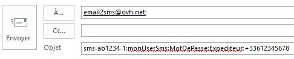
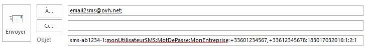
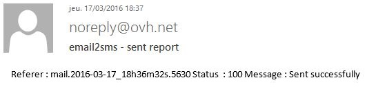
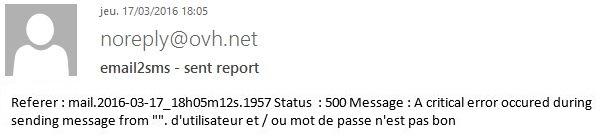

## 

Vous pouvez envoyer des SMS depuis votre adresse email avec votre compte SMS OVH simplement, peu importe l'expéditeur.

L'adresse du destinataire sera : email2sms@ovh.net

Le sujet contiendra les identifiants de votre compte, ainsi que les paramètres du SMS comme l'expéditeur et le(s) numéro(s) de téléphone destinataire(s).

Le corps du texte contiendra le message à envoyer par SMS. Il n'y a pas de limite du nombre de caractères. 1 SMS est limité à 160 caractères en Unicode.
Si votre texte dépasse cette limite, le message sera découpé en autant de SMS que nécessaires.
Le système contrôle que votre compte est suffisamment crédité en fonction.
NB : Si votre texte contient 2 sauts de ligne (double /n) ou si vous écrivez le paramètre "--end", tout ce qui se trouve ensuite ne sera pas pris en compte pour l'envoi.
Pour envoyer un SMS par cette méthode il vous faudra créer un utilisateur en API ou depuis l'espace client.
Vous pouvez consulter le guide suivant pour toute précision sur les utilisateur : []({legacy}2144)


## Champs obligatoires
Votre sujet devra avoir la forme suivante : 


```
CompteSMS:UtilisateurSMS:MotDePasse:Expediteur:Destinataire
```


- CompteSMS = Compte SMS à utiliser (ex : sms-ab1234-1).

- UtilisateurSMS = Utilisateur SMS à utiliser sur le compte associé.

- MotDePasse = Mot de passe de l'utilisateur.

- Expediteur = Un des expéditeurs déclarés sur votre compte SMS.

- Destinataire = Numéro de téléphone du destinataire du message.


Par défaut le message est envoyé immédiatement.

{.thumbnail}
Si vous souhaitez utiliser un numéro court permettant la réponse, renseignez senderForResponse=1 en tant qu'expéditeur.


## Champs facultatifs
Vous pouvez ajouter des champs supplémentaires dans le sujet, tels que :


```
CompteSMS:UtilisateurSMS:MotDePasse:Expediteur:Destinataire1,Destinataire2:DateEnvoi:ClasseSMS:smsCoding:NoStop
```


- Destinataire1 = Numéro de téléphone du destinataire du message, il est possible d'ajouter des destinataires à la suite, séparés par une virgule ",".

- DateEnvoi = Pour définir une date d'envoi différé, au format hhmmjjMMAAA (ex : 183017032016 pour un envoi le 18/03/2016 à 18h30). 

- ClasseSMS = Type de classe su SMS, au format N = 1 chiffre.

Classe 0 : Le message est directement affiché à l’utilisateur sur l’écran du mobile à la réception. Le message n’est enregistré ni dans la mémoire du téléphone ni dans la carte SIM. Il est effacé dès que l’utilisateur a validé la visualisation.
classe 1 : Le message est enregistré dans la mémoire du téléphone et si cette mémoire est pleine, dans la carte SIM par défaut.
classe 2 : Le message est enregistré sur la carte SIM.
classe 3 : Le message est transféré sur un équipement externe connecté au mobile (PDA, PC portable…).


- smsCoding = Encodage du SMS, au format N = 1 chiffre.

1 pour l'encodage sur 7bit ou 2 pour l'encodage sur 8bit (UTF8). Si vous modifiez l’encodage pour l'UTF8, votre SMS fera 70 caractères maximum contre 160 sur l'encodage 7bit.


- NoStop = Pour ne pas afficher "STOP au XXXXX" à la fin du message pour un SMS à caractère non commercial, au format N = 1 chiffre (ex : NoStop=1 pour ne pas l'afficher).


{.thumbnail}
Il est possible de déclarer les différents paramètres constituant le sujet, de 2 manières différentes :


- Soit dans l'ordre établi ci-avant, avec les paramètres séparés par ":" ou ";" entre chaque.
- Soit dans n'importe quel ordre, mais en déclarant chaque paramètre, séparés entre eux par un ":" ou ";" : Account=; Login=; Password=; From=; To=,; Deferred=; Class=.


## Gestion des destinataires
Le(s) destinataire(s) du message peut/peuvent être géré(s) de plusieurs manières.


- Soit comme vu précédemment, en le(s) notifiant au format international dans le sujet de l'email envoyé.

- Soit en ajoutant à l'email en tant que pièce jointe, un fichier texte (format txt) nommé "contact" qui contiendra le(s) numéro(s) de téléphone destinataire(s), au format international (+33xxxxxxxxx), à raison d'un numéro par ligne dans le fichier.


## Rapport d'envoi
Vous recevrez par email un rapport d'envoi.

{.thumbnail}
Si vous avez rencontrez une erreur lors de l'envoi, cette dernière sera notifiée dans le rapport.

{.thumbnail}
