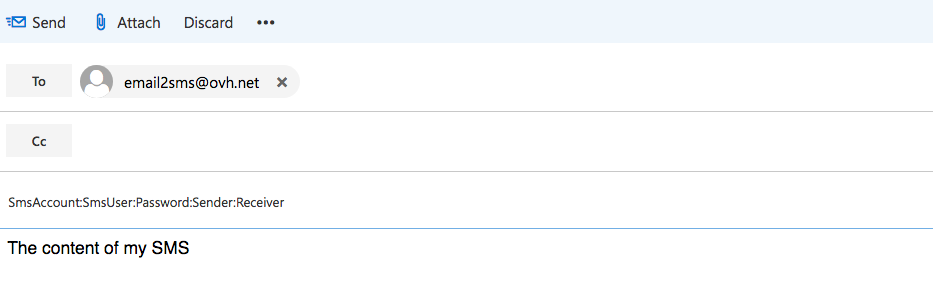
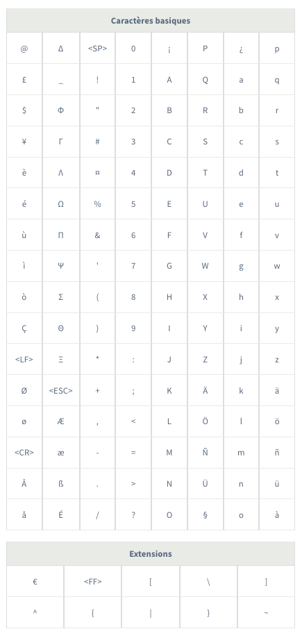

**Última actualización: 21/11/2019**

## Objetivo

Las cuentas de SMS de OVHcloud permiten enviar mensajes desde una dirección de correo electrónico, independientemente del remitente.

## Requisitos

- Disponer de una cuenta de SMS en OVHcloud con saldo de SMS.
- Disponer de una cuenta de correo electrónico, independientemente del proveedor.


## Procedimiento

Es posible utilizar cualquier webmail o cliente de correo para enviar SMS.

La dirección del destinatario del mensaje de correo electrónico será la siguiente: email2sms@ovh.net.

El asunto tendrá que incluir el identificador de su cuenta de SMS y los parámetros del SMS, tales como el remitente y el número de teléfono del destinatario.

El cuerpo del texto debe incluir el mensaje que quiere enviar por SMS. No hay límite de caracteres. Sin embargo, recuerde que el número máximo de caracteres en un SMS con codificación de 7 bits son 160 caracteres.

Si el texto supera este límite, el mensaje se dividirá en varios SMS.

- 1 SMS -> 160 caracteres en total (160 por SMS)
- 2 SMS -> 306 caracteres en total (153 por SMS)
- 3 SMS -> 459 caracteres en total (153 por SMS)

Asegúrese de que dispone del crédito suficiente de SMS antes de realizar en envío.

> [!primary]
>
Tenga en cuenta que, si el texto contiene 2 saltos de línea (doble /n) o si escribe el parámetro «--end», todo lo que añada a continuación no se incluirá en el envío.
Si quiere enviar un SMS con estos elementos, deberá hacerlo desde el área de cliente o a través de las API.
>

Para más información sobre los caracteres autorizados con codificación de 7 bits, consulte el [anexo](https://docs.ovh.com/es/sms/enviar-sms-desde-una-dirección-de-correo-electrónico/#anexo_1) que encontrará al final de esta guía.

### 1. Campos obligatorios

Abra el webmail o el cliente de correo y cree un nuevo mensaje de correo electrónico. 

Introduzca la siguiente dirección en el destinatario: email2sms@ovh.net

El asunto deberá tener el siguiente formato: 


```
CuentaSMS:UsuarioSMS:Contraseña:Remitente:Destinatario
```


- CuentaSMS = Cuenta de SMS que quiere utilizar (p. ej.: sms-ab1234-1).

- UsuarioSMS = Usuario de SMS que quiere utilizar en la cuenta asociada.

- Contraseña = Contraseña del usuario.

- Remitente = Uno de los remitentes declarados en su cuenta de SMS.

- Destinatario = Número de teléfono del destinatario del mensaje.

Deberá obtener un resultado similar al de la imagen siguiente. Por defecto, una vez enviado el correo, el SMS se enviará de inmediato.


{.thumbnail}

> [!primary]
>**Solo para las cuentas de OVHcloud Francia:**
>
Si quiere utilizar un número corto que permita la respuesta, indique «senderForResponse=1» como remitente.
>

Para más información sobre los usuarios de SMS, consulte la siguiente guía: [Usuarios de SMS](https://docs.ovh.com/fr/sms/tout_savoir_sur_les_utilisateurs_sms/)


### 2. Campos adicionales

Es posible añadir campos adicionales en el asunto, como los que se muestran a continuación:


```
CuentaSMS:UsuarioSMS:Contraseña:Remitente:Destinatario1,Destinatario2:FechaEnvio:ClaseSMS:smsCoding:NoStop
```


- Destinatario1 = Número de teléfono del destinatario del mensaje. Es posible añadir más de un destinatario, separándolos por comas («,»).

- FechaEnvio: = Permite definir una fecha de envío diferida, en formato hhmmddMMAAAA (p. ej.: 183019112019 para un envío el 19/11/2019 a las 18:30) 

- ClaseSMS = Tipo de clase de SMS, en formato N = 1 cifra. Para más información, consulte la primera nota informativa que aparece a continuación.

- smsCoding = Tipo de codificación de SMS, en formato N = 1 cifra. Para más información, consulte la segunda nota informativa que aparece a continuación.

- NoStop = Para no mostrar «STOP al XXXX» al final del mensaje para un SMS de carácter no comercial, en formato N = 1 cifra (p. ej.: NoStop=1 para no mostrarlo).

A continuación, puede consultar un ejemplo de correo electrónico con campos opcionales:

{.thumbnail}

Existen dos formas de declarar los diferentes elementos del asunto:

- En el orden establecido más arriba, con los diferentes elementos separados por dos puntos («:») o punto y coma («;»).
- En cualquier otro orden, pero declarando cada elemento, separado por dos puntos («:») o punto y coma («;»). Account=; Login=; Password=; From=; To=; Deferred=; Class=.

> [!primary]
>
> **Distintos tipos de *class***
> 
> *Clase 0:* El mensaje aparece directamente en la pantalla del móvil del usuario, pero no se guarda en la memoria del teléfono ni en la tarjeta SIM, sino que se borra una vez que el usuario confirma su visualización.
> 
> *Clase 1:* El mensaje se guarda en la memoria del teléfono y, si la memoria está llena, se almacena por defecto en la tarjeta SIM.
> 
> *Clase 2:* El mensaje se guarda en la tarjeta SIM.
> 
> *Clase 3:* El mensaje se transfiere a un dispositivo externo conectado al móvil (PDA, ordenador portátil...).
>

> [!primary]
>
> **Distintos tipos de *smsCoding***
> 
> *1* para codificación de 7 bits.
> 
> *2* para codificación Unicode.
> 
>Si utiliza la codificación Unicode, el tamaño máximo del SMS se reducirá a 70 caracteres, frente a los 160 de la codificación de 7 bits.
>

### 3. Gestionar los destinatarios del SMS

Existen distintas formas de gestionar los destinatarios del mensaje:


- o bien incluyendo los números en formato internacional en el asunto del mensaje de correo electrónico enviado;

- o bien añadiendo al correo, como archivo adjunto, un archivo de texto (formato .TXT) llamado «contacto», en el que se incluyan los números de teléfono de los destinatarios, en formato internacional (p. ej.: +34xxxxxxxxx, en España), con un número por línea en el archivo.


### 4. Analizar el informe de envío

Una vez realizado el envío, recibirá por correo electrónico un informe. El siguiente informe indica que el envío se ha realizado correctamente:

{.thumbnail}

Si se ha producido un error, este aparecerá recogido en el informe, tal y como se muestra a continuación:

{.thumbnail}

## Anexo

Las tablas que aparecen a continuación incluyen los caracteres autorizados con codificación de 7 bits. Los caracteres de la tabla «Extensiones» cuentan como dobles. 

El tamaño máximo de un SMS es de 160 caracteres con codificación de 7 bits (norma GMS 03.38).

Si utiliza caracteres no incluidos en estas tablas, la codificación pasará a Unicode y el tamaño máximo del SMS se reducirá a 70 caracteres.

{.thumbnail}

## Más información

Interactúe con nuestra comunidad de usuarios en [ovh.es/community](https://community.ovh.com).
