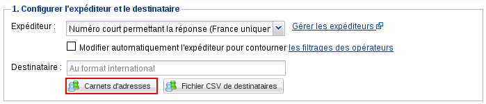
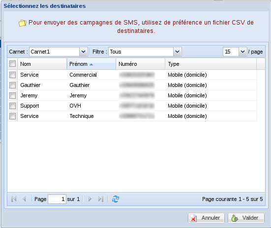
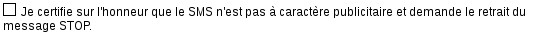
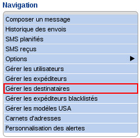
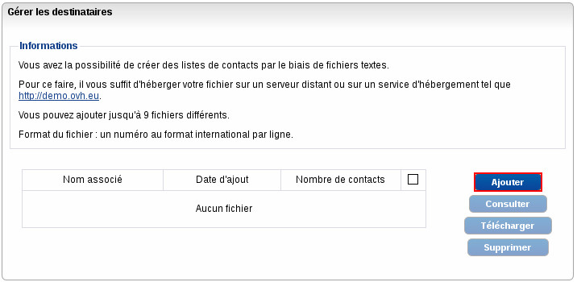
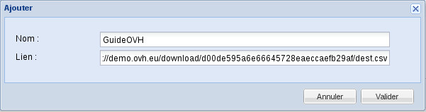
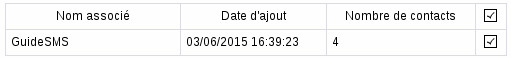
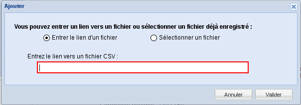
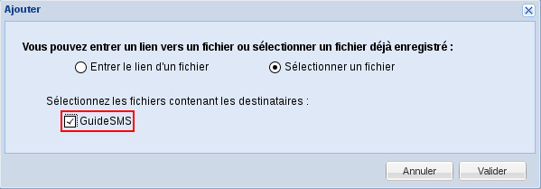

**Préambule**

Depuis le Manager, il est possible d'envoyer un SMS à plusieurs destinataires. Plus communément appelée "Campagne SMS", cette fonctionnalité permet par exemple d'envoyer un SMS commercial à votre carnet de contacts.

Voyons comment mettre en place cette fonctionnalité.

**Sommaire**

Niveau : Débutant

------------------------------------------------------------------------

### Envoi grâce au carnet d'adresses {#envoi-grâce-au-carnet-dadresses}

Rendez-vous dans la partie "**SMS**" du Manager.

Par défaut, en arrivant dans le Manager SMS, vous êtes déjà sur la page de composition d'un SMS. Sinon, cliquez sur "**Composer un message**" dans le menu de navigation :

{.thumbnail}

Dans un premier temps, choisissez l'**expéditeur** que vous souhaitez utiliser pour l'envoi de votre SMS.

Par défaut, l'expéditeur choisi est "Numéro court permettant la réponse". Le SMS sera donc envoyé avec, pour expéditeur, un numéro court auquel il sera possible de répondre. La réponse apparaîtra alors dans "**SMS reçus**" dans le menu de **Navigation**.

Cliquez sur "**Carnets d'adresses**" (Pour savoir comment renseigner votre carnet d'adresses, suivez ce guide) :

{.thumbnail}

Sélectionnez les contacts de votre carnet d'adresses à qui vous souhaitez envoyer le SMS puis cliquez sur "**Valider**" :

{.thumbnail}

**Rédigez votreMessage**.

Dans le cas d'un SMS à caractère commercial, il est obligatoire le laisser la case décochée. Sinon, cochez cette case.

{.thumbnail}

Enfin, cliquez simplement sur "**Envoyer**". Le SMS sera envoyé instantanément.

------------------------------------------------------------------------

### Envoi grâce à un fichier CSV de destinataires {#envoi-grâce-à-un-fichier-csv-de-destinataires}

#### Rédaction du fichier de destinataires {#rédaction-du-fichier-de-destinataires}

Ouvrez sur votre ordinateur un éditeur de texte tel que le Bloc Note sous Windows, VIM sous Unix ou TextEdit sous MacOS.

Remplissez ce fichier avec les destinataires de votre SMS. Vous devez renseigner le numéro d'un destinataire par ligne, au format international : +33...

Exemple :

    +33610203040 +33611223344 +33688888888 +33699999999

Enregistrez votre fichier en lui donnant un nom sans accent et avec l'extension ".csv".

Puis, pour importer votre fichier, rendez-vous dans la partie "**SMS**" du Manager.

Cliquez sur "**Gérer les destinataires**" :

{.thumbnail}

Cliquez sur "**Ajouter**" :

{.thumbnail}

S'affiche alors une fenêtre vous invitant à renseigner le nom du fichier CSV de destinataires ainsi que son lien direct :

{.thumbnail}

Après validation, un bref tableau récapitulatif s'affiche :

{.thumbnail}

#### Envoi du SMS avec fichier de destinataires {#envoi-du-sms-avec-fichier-de-destinataires}

Cliquez sur "**Composer un message**" :

{.thumbnail}

Dans un premier temps, choisissez l'**expéditeur** que vous souhaitez utiliser pour l'envoi de votre SMS.

Par défaut, l'expéditeur choisi est "Numéro court permettant la réponse". Le SMS sera donc envoyé avec pour expéditeur un numéro court auquel il sera possible de répondre. La réponse apparaîtra alors dans "**SMS reçus**" dans le menu de **Navigation**.

Cliquez sur "**Fichier CSV de destinataires**" :

{.thumbnail}

Deux possibilités s'offrent à vous :

-   Entrer le lien du fichier de destinataires. Dans ce cas, renseignez directement le lien du fichier dans le champ :

{.thumbnail}

-   Sélectionner un fichier déjà présent dans le Manager. Sélectionnez alors le nom du fichier enregistré :

{.thumbnail}

Quel que soit votre choix, vous devez cliquer sur "Valider" pour pouvoir passer à l'étape suivante.

Pour finir,**Rédigez votreMessage.**

Dans le cas d'un SMS à caractère commercial, il est obligatoire de laisser la case décochée. Sinon, cochez cette case.

{.thumbnail}

Enfin, cliquez simplement sur "**Envoyer**". Le SMS sera envoyé instantanément.

