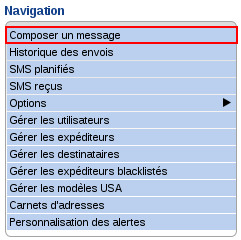
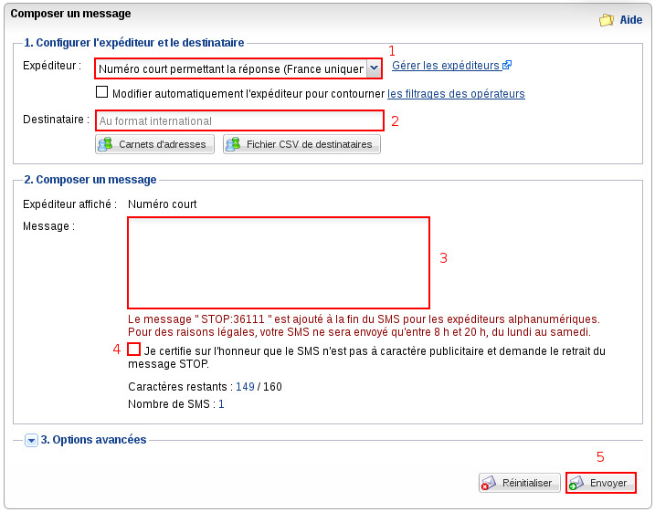
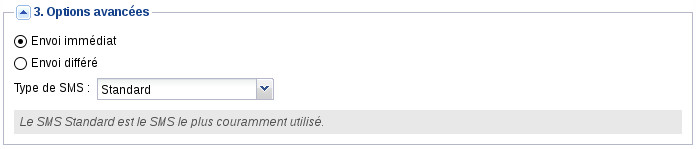

**Préambule**

Vous avez souscrit à un pack SMS et souhaitez simplement envoyer un SMS à un destinataire sans passer par les API ou une fonctionnalité avancée.

Nous verrons dans ce guide comment réaliser cette action.

**Sommaire** :

Niveau : Débutant

------------------------------------------------------------------------

### Prérequis {#prérequis}

Pour utiliser le service, vous devez :

-   disposer d'un crédit de SMS suffisant ;
-   disposer d'un expéditeur valide.

------------------------------------------------------------------------

### Envoyer un SMS {#envoyer-un-sms}

Rendez-vous dans la partie "**SMS**" du Manager.

Par défaut, en arrivant dans le Manager SMS, vous êtes déjà sur la page de composition d'un SMS. Sinon, cliquez sur "**Composer un message**" dans le menu de Navigation :

{.thumbnail}

Dans un premier temps, choisissez l'**expéditeur** (1) que vous souhaitez utiliser pour l'envoi de votre SMS.

Par défaut, l'expéditeur choisi est "Numéro court permettant la réponse". Le SMS sera donc envoyé avec pour expéditeur un numéro court auquel il sera possible de répondre. La réponse apparaîtra alors dans "**SMS reçus**" dans le menu de **Navigation**.

Ensuite, indiquez le numéro de votre **destinataire** (2) au format international (+33...).

**Rédigez votreMessage** (3).

Dans le cas d'un SMS à caractère commercial, il est obligatoire de laisser la case (4) décochée. Sinon, cochez cette case (4).

Enfin, cliquez simplement sur "**Envoyer**" (5).

{.thumbnail}

Le SMS sera envoyé instantanément.

------------------------------------------------------------------------

### Options avancées {#options-avancées}

{.thumbnail}

-   **Envoi immédiat** : Le SMS est envoyé immédiatement après avoir cliqué sur "Envoyer".
-   **Envoi différé** : Le SMS est envoyé à la date et l'heure que vous aurez définies dans les champs "Date" et Heure".
-   **Type de SMS** : S*tandard : Le message est enregistré dans la mémoire du téléphone et si cette mémoire est pleine, sur la carte SIM par défaut.Flash : Le message est directement affiché à l’utilisateur sur l’écran du mobile à la réception. Le message n’est enregistré ni dans la mémoire du téléphone ni sur la carte SIM. Il est effacé dès que l’utilisateur en a validé la visualisation.SIM : Le message est enregistré sur la carte SIM.*

