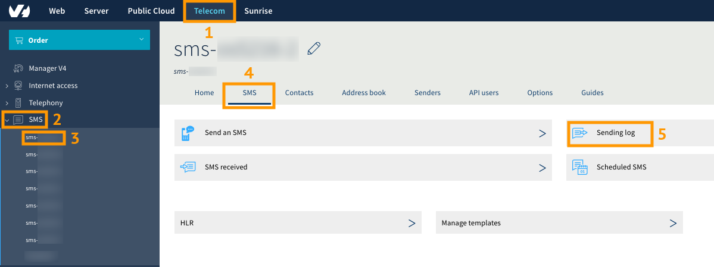
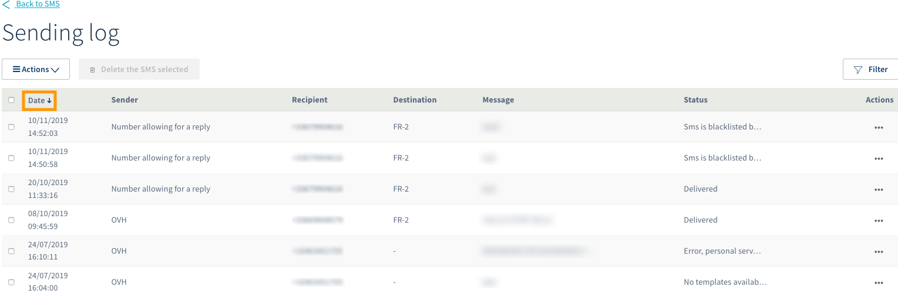
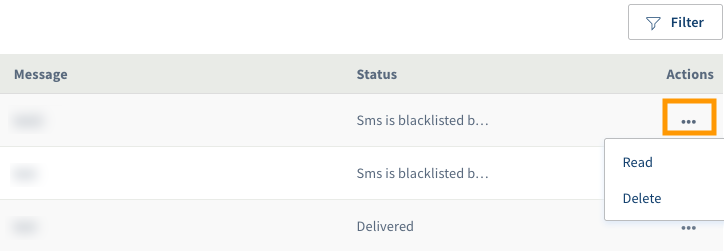
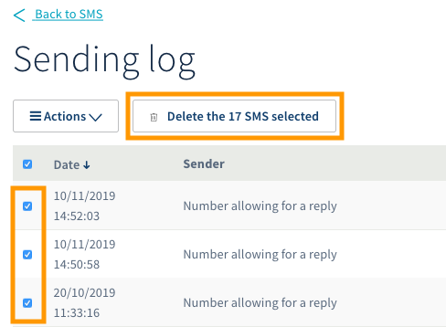
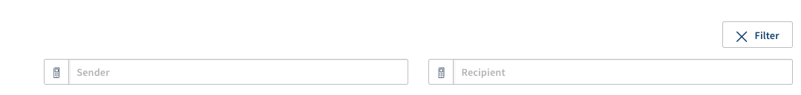
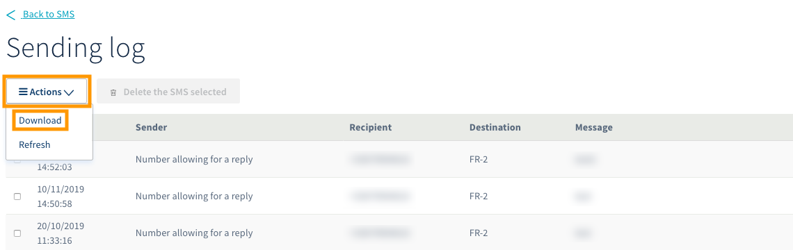

**Última actualización: 19/11/2019**

## Objetivo
Esta guía explica cómo consultar y descargar el historial de SMS enviados desde el área de cliente de OVHcloud.

## Requisitos

- Tener acceso a su cuenta de OVHcloud.
- Tener una cuenta de SMS de OVHcloud con la que haya enviado al menos un SMS.

## Procedimiento

El historial de envíos incluye información sobre la fecha, el remitente, el destinatario y el contenido del SMS enviado.

> [!primary]
>
> El área de cliente solo permite consultar los últimos seis meses del historial de envío. Para consultar los SMS anteriores a esta fecha, vaya al paso [2. Descargar el historial de sus SMS en CSV](https://docs.ovh.es/sms/gestionar-el-historial-de-envios/#2-descargar-el-historial-de-sus-sms-en-csv).
>

### 1. Consultar el historial en el área de cliente

Conéctese al [área de cliente de OVHcloud](https://www.ovh.com/auth/?action=gotomanager) y haga clic en `Telecom`{.action} (1). A continuación, haga clic en `SMS`{.action} en la columna izquierda (2) y seleccione su cuenta de SMS (3).

Acceda a la sección `SMS`{.action} (4) y, a continuación, seleccione `Historial de envíos`{.action} (5).

{.thumbnail}

Para filtrar el historial de SMS por fecha de envío, haga clic sobre la palabra «Fecha» en la primera columna a la izquierda.

{.thumbnail}

Para consultar o eliminar un SMS, haga clic en el icono con forma de tres puntos (`...`{.action}) en la columna «Acciones».

{.thumbnail}

Para eliminar varios SMS a la vez, selecciónelos marcando las casillas correspondientes y haga clic en el botón `Eliminar el SMS seleccionado`{.action}.

{.thumbnail}
 
El botón `Filtrar`{.action} permite filtrar la búsqueda por remitente (si hubiera más de uno) o por destinatario.

{.thumbnail}
 
### 2. Descargar el historial de sus SMS en CSV
 
Para descargar el historial de los SMS enviados en formato «.CSV», haga clic en el botón `Acciones`{.action} en la esquina superior izquierda y seleccione `Descargar`{.action}. 
 
{.thumbnail}
 
También puede consultar el historial desde un programa de hojas de cálculo. La información aparecerá como se muestra a continuación:

{.thumbnail}

Detalles de la información incluida en el historial:

|  Título  |  Descripción  |
|  :-----          |  :-----          |
|  id |  Identificador único en nuestros servidores del SMS enviado |
|  date | Fecha y hora de envío del SMS  |
|  sender |  Remitente desde el que se ha enviado el SMS |
|  receiver |  Número del móvil destinatario del SMS |
|  ptt |  Código de respuesta con el estado del SMS |
|  operatorCode |  Identificador de red del operador móvil al que se le ha transmitido el SMS |
|  descriptionDlr |  Descripción del código ptt recibido y estado del SMS |
|  tag |  Etiqueta que se atribuye manualmente a través de las API (a uno o varios SMS) o automáticamente a través de nuestros servidores a cada uno de los SMS (o a cada campaña de SMS) enviados |
|  message |  Contenido del SMS |

Para más información sobre los códigos ptt y los diferentes ID del DLR, consulte la última sección de la guía [Usuarios de la API](https://docs.ovh.com/es/sms/usuarios-de-sms/#5-especificar-una-url-de-callback).
 
## Más información

Interactúe con nuestra comunidad de usuarios en [ovh.es/community](https://community.ovh.com).