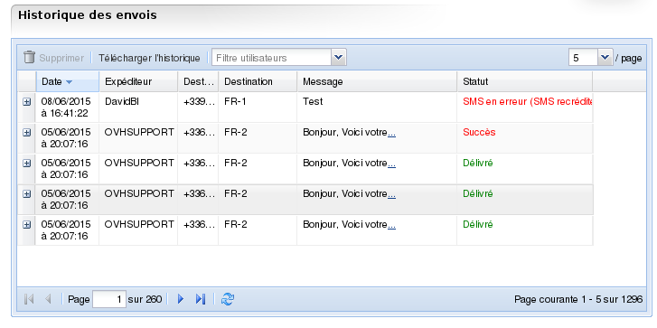

### Préambule {#préambule}

L'historique des SMS envoyés est disponible dans le Manager ou bien peut être téléchargé en CSV.

Vous trouverez dans cet historique la **date**, **l'heure**, **l'expéditeur**, **le destinataire**et le **message** envoyé.

**Sommaire :**

Niveau : Débutant

------------------------------------------------------------------------

### Prérequis {#prérequis}

-   Un accès à l'espace client SMS

-   Un compte SMS avec au moins 1 SMS envoyé

------------------------------------------------------------------------

### Historique des SMS dans le Manager {#historique-des-sms-dans-le-manager}

Pour accéder à l'interface présentant l'historique des SMS envoyés, suivez ces étapes :

-   Connectez vous à votre espace client : <https://www.ovhtelecom.fr/espaceclient/login/>.
-   Cliquez sur "**Administrez vos services de téléphonie via l'ancienne interface**".
-   Cliquez sur l'icône "**SMS**".
-   Dans le menu "**Navigation**", cliquez sur l'onglet "**Historique des envois**".

Vous accédez à l'historique de vos SMS envoyés. Vous pouvez cliquer sur les catégories du tableau pour pouvoir les trier selon vos préférences ou critères.

{.thumbnail}

Vous pouvez également effacer les messages de votre choix via le bouton "**Supprimer**".

Pour supprimer plusieurs lignes à la fois, il suffit de sélectionner vos SMS avec la touche **CTRL** ou bien avec la touche **MAJ** pour sélectionner continuellement plusieurs lignes. Une fois sélectionnés et colorés en bleus, cliquez sur "**Supprimer**" pour effacer les SMS de l'historique.

Le champ "**Filtreutilisateurs**" vous permet de lister uniquement les SMS envoyés via l'utilisateur défini. (Dans le cadre d'une utilisation avec [API]({originalUrl}/display/CRSMSFAX/API+SMS), [HTTP2SMS]({originalUrl}/display/CRSMSFAX/Envoyer+des+SMS+par+HTTPS) ou [Mail2SMS]({originalUrl}/display/CRSMSFAX/Envoyer+des+SMS+par+E-mail).)

------------------------------------------------------------------------

### Historique des SMS en CSV {#historique-des-sms-en-csv}

Si vous préférez télécharger l'historique au format CSV, c'est possible depuis votre espace client :

-   Connectez vous à votre Espace Client : <https://www.ovhtelecom.fr/espaceclient/login/>.
-   Cliquez sur "**Administrez vos services de téléphonie via l'ancienne interface**".
-   Cliquez sur l'icône "**SMS**".
-   Dans le menu "**Navigation**", cliquez sur l'onglet "**Historique des envois**".
-   Cliquez sur le bouton "**Télécharger l'historique**".

Votre navigateur vous proposera alors de télécharger le fichier CSV. Le tableau contient les informations dans le format suivant :

    date;sender;receiver;message;status "20141129122543";"OVH";"+336xxxxxxxx";"Mon
        message";"sent"

Le fichier se limite aux 2000 derniers SMS envoyés.

