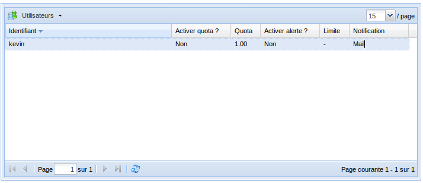
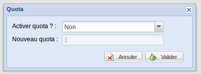
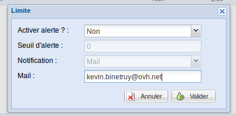

### Préambule {#préambule}

Afin de gérer au mieux votre crédit SMS, il est possible de fixer une limite et un quota à vos utilisateurs SMS pour les APIs ou les envois par [Mail]({originalUrl}/display/CRSMSFAX/Envoyer+des+SMS+par+E-mail)/[HTTP]({originalUrl}/display/CRSMSFAX/Envoyer+des+SMS+par+HTTPS).

La différence ? Le quota est la quantité de SMS disponibles pour l’utilisateur et la limite est le seuil minimum de crédits SMS restants avant réception de l'alerte pour recharger, ou pas, le nombre de ces crédits.

**Sommaire :**

Niveau : Débutant

------------------------------------------------------------------------

### Configurer le quota {#configurer-le-quota}

Pour configurer le quota d'un utilisateur, rendez-vous dans votre Manager :

-   Connectez-vous à votre Espace Client OVH : <https://www.ovhtelecom.fr/espaceclient/>.
-   Cliquez sur le lien "**Administrez vos services de téléphonie via l'ancienne interface**".
-   Cliquez sur l'icône "**SMS**".
-   Cliquez sur l'onglet "**Gérer les utilisateurs**" dans le menu "**Navigation**".
-   La gestion du quota s'effectue sur l'interface de gestion des utilisateurs :

{.thumbnail}

-   Sélectionnez l'utilisateur à modifier et cliquez sur le bouton "**Utilisateurs**" puis sur "**Quota**".

{.thumbnail}

-   Les paramètres à modifier sont :
    -   **Activer quota ? :**Vous permet de définir si **oui** ou **non**l'utilisateur est soumis à un quota.
    -   **Nouveau quota :** Définit le quota de l'utilisateur. Passé ce quota, l'envoi sera bloqué pour cet utilisateur.
-   Cliquez simplement sur le bouton "**Valider**" pour confirmer les modifications.

------------------------------------------------------------------------

### Configurer la limite {#configurer-la-limite}

Pour configurer la limite d'un utilisateur, rendez-vous dans votre Manager :

-   Connectez-vous à votre Espace Client OVH : <https://www.ovhtelecom.fr/espaceclient/>.
-   Cliquez sur le lien "**Administrez vos services de téléphonie via l'ancienne interface**".
-   Cliquez sur l'icône "**SMS**".
-   Cliquez sur l'onglet "**Gérer les utilisateurs**" dans le menu "**Navigation**".
-   La gestion de la limite s'effectue sur l'interface de gestion des utilisateurs :

{.thumbnail}

-   Sélectionnez l'utilisateur à modifier et cliquez sur le bouton "**Utilisateurs**" puis sur "**Limite**".

{.thumbnail}

-   Les paramètres à modifier sont :
    -   **Activer l'alerte ?** : Permet de définir si l'alerte de limite est activée.
    -   **Seuil d'alerte :** Définit le niveau à partir duquel la notification est envoyée.
    -   **Notification :** Permet de choisir le type de notification : e-mail, SMS ou les deux.

Si vous envoyez une notification SMS, celle-ci sera déduite de votre crédit SMS.

-   -   **Mail :** Entrez l'adresse à notifier.
    -   **Numéro :** Entrez le numéro de téléphone à notifier au format international.
-   Cliquez simplement sur le bouton "**Valider**" pour confirmer ces modifications.

