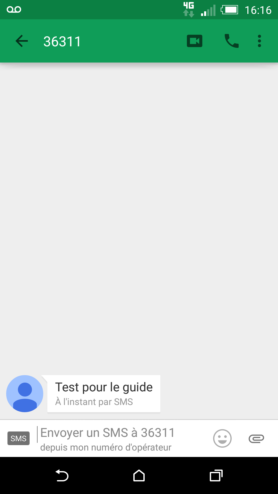

### Préambule {#préambule}

Le service de SMS avec réponse vous permet d'envoyer un SMS avec comme expéditeur un numéro court permettant au destinataire d'y répondre. Vous pouvez ainsi gérer un service via un échange de réponse (programmation RDV médical, jeux, etc.).

L'utilisation du numéro court est inclus dans votre offre SMS et la réponse n'est pas surtaxée pour le destinataire. L'envoi d'une réponse à votre destinataire est par contre débitée de votre compte SMS.

**Sommaire :**

Niveau : Expert

------------------------------------------------------------------------

### Prérequis {#prérequis}

Pour utiliser ce service, il vous faut :

-   un compte SMS crédité ;
-   un destinataire (un mobile français) ;
-   accès au Manager.

------------------------------------------------------------------------

### Principe de fonctionnement et limitations {#principe-de-fonctionnement-et-limitations}

Les réponses sont possibles depuis les opérateurs mobiles français (Orange, SFR, Bouygues, Free et MNVO associés). C'est-à-dire que seuls les numéros géolocalisés en France métropolitaine associés à un abonnement chez un de ces opérateurs utilisent des SMS compatibles et verront leurs réponses traitées.

Le fonctionnement du service de réponse par SMS est très simple :

{.thumbnail}

Le service permet au destinataire de répondre au SMS reçu dans un délai de 48 heures. Passé ce délai, la réponse ne sera pas prise en compte.

La réponse (si vous l'activez) peut être ensuite :

-   **Automatique** et **unique** : vous définissez une réponse dans le Manager qui sera systématiquement envoyée.
-   **Dynamique** : vous faites appel à un script qui gère la réponse.

### Utilisation depuis le Manager et configuration {#utilisation-depuis-le-manager-et-configuration}

Pour envoyer un SMS permettant la réponse depuis le Manager :

-   Connectez vous à votre Espace Client : <https://www.ovhtelecom.fr/espaceclient/login/>.
-   Cliquez sur "**Administrez vos services de téléphonie via l'ancienne interface**".
-   Cliquez sur l'icône "**SMS**".
-   Cliquez sur "**Composer un message**".

Vous accédez alors au formulaire d'envoi :

{.thumbnail}

-   **Expéditeur :** Sélectionnez dans la liste "**Numéro court permettant la réponse (France uniquement)**"
-   **Destinataire :** Indiquez le numéro au format international.
-   **Message :**Entrez le message à envoyer.
-   Bouton **Envoyer:** Cette action envoie le SMS.

Le SMS reçu aura cette forme :

{.thumbnail}

Pour configurer la réponse du SMS :

-   connectez vous à votre Espace Client : <https://www.ovhtelecom.fr/espaceclient/login/> ;
-   cliquez sur "**Administrez vos services de téléphonie via l'ancienne interface**" ;
-   cliquez sur l'icône "**SMS**" ;
-   cliquez sur l'onglet "**Options**" ;
-   cliquez sur l'onglet "**Options des réponses**".

Vous accédez à ce formulaire :

{.thumbnail}

-   Cliquez sur le bouton "**Gérer**" pour accéder à la modification du formulaire.

Ce formulaire permet de configurer les réponses automatiques aux SMS. Les champs et fonctions sont :

-   -   **Action à effectuer :** permet de choisir le type de réponse qui sera envoyée.
        -   **Aucun :** Aucune réponse ne sera envoyée.
        -   **Appeler un CGI :** Permet d'appeler un script pour envoyer le SMS de votre choix.
        -   **Répondre à un texte prédéfini :** Envoie un SMS automatiquement à chaque réponse reçue.

Lorsqu'une réponse est apportée, un crédit SMS est décompté.

-   -   **Notification de réception :** permet de recevoir un mail ou un SMS lors de la réception d'une réponse.
        -   Pour activer la notification, cliquez sur le bouton "**Ajouter**".
        -   Dans le champ "**Média**" : sélectionnez le type de réception : **SMS** ou **e-mail**.
        -   Dans le champ "**Expéditeur**" : entrez l'expéditeur SMS ou l’adresse e-mail d'expédition.
        -   Dans le champ "**Adresse mail**" entrez l'e-mail destinataire de la notification **OU** dans le champ "**Numéro**", entrez le numéro du destinataire de la notification au **format international**.

Lorsqu'une notification est envoyée, un crédit SMS est décompté.

