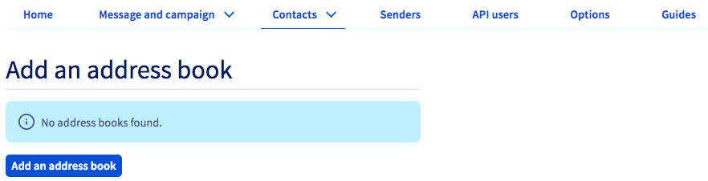
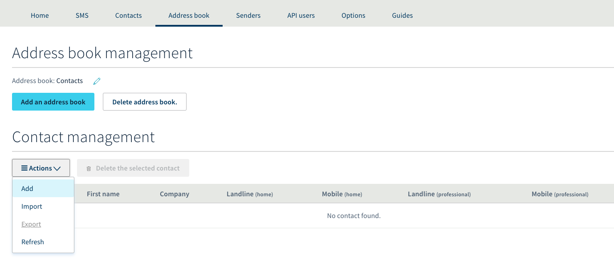
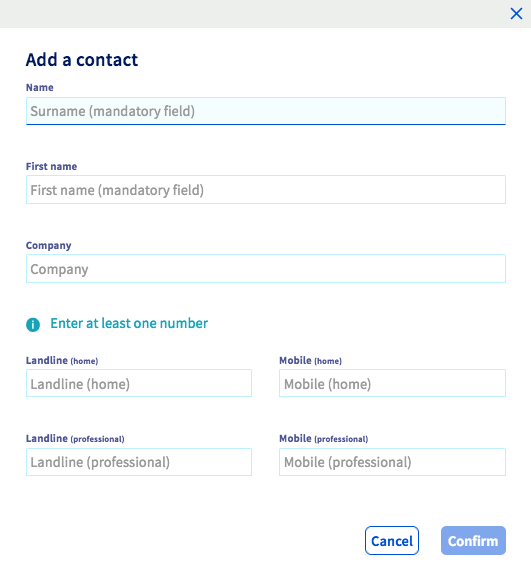
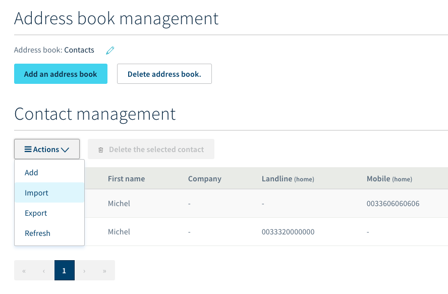
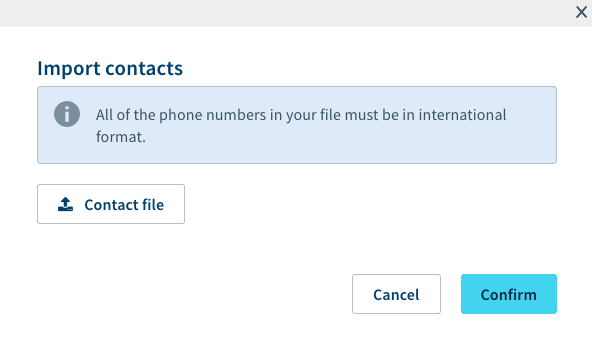
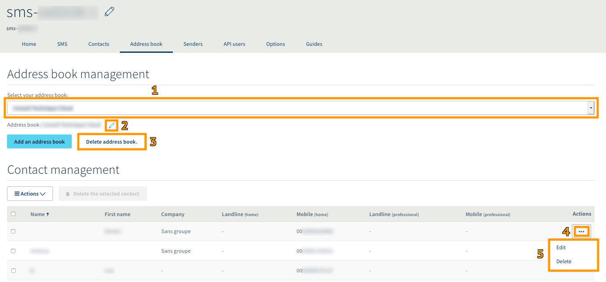

**Última actualización: 21/11/2019**

## Objetivo

Todas las cuentas de SMS de OVHcloud permiten utilizar una o varias agendas de contactos. Esta guía explica cómo gestionar las agendas de contactos desde el área de cliente de OVHcloud.

## Requisitos

- Disponer de una cuenta de SMS en OVHcloud.
- Tener acceso al área de cliente de OVHcloud.
- Tener un programa de hojas de cálculo o un editor de texto.

## Procedimiento

### 1. Crear una agenda de contactos en el área de cliente

Conéctese al [área de cliente de OVH](https://www.ovh.com/auth/?action=gotomanager), en la pestaña `Telecom`{.action}. A continuación, haga clic en `SMS`{.action} en la columna izquierda

y seleccione su cuenta de SMS.

{.thumbnail}

Acceda a la sección `Agenda de contactos`{.action}.

A continuación, haga clic en `Añadir una agenda de contactos`{.action} y asígnele un nombre a la nueva agenda.

{.thumbnail}

### 2. Añadir contactos a la agenda

Una vez creada la agenda de contactos, es posible añadir contactos de diferentes formas.

### Añadir un contacto desde el área de cliente

Haga clic en `Acciones`{.action} y seleccione la opción `Añadir`{.action}.

{.thumbnail}

A continuación, introduzca la información del contacto que desea añadir.

{.thumbnail}

Rellene los campos solicitados y haga clic en `Aceptar`{.action} para guardar los cambios. El contacto se añadirá a su agenda. Realice esta misma operación para añadir más contactos.

### Añadir múltiples contactos mediante un archivo de contactos

#### Preparar el archivo en una hoja de cálculo

Si quiere utilizar o crear un documento en formato de hoja de cálculo, este último deberá tener la siguiente estructura y estar en formato «.CSV» para poder ser exportado.

{.thumbnail}

La mayoría de los documentos de hojas de cálculo no son compatibles con el formato internacional de los números de teléfono y faxes (+34xxxxxxxxx), por lo que deberá modificar el formato de las celdas que incluyan estos números (workPhone, workMobile, ...). Para ello, seleccione las columnas correspondientes y aplique el formato «Texto».

{.thumbnail}

Una vez que tenga listo el documento, puede guardarlo en formato de hoja de cálculo para modificarlo posteriormente si fuera necesario.

Asimismo, guárdelo o expórtelo en formato «.CSV» para poder importarlo.

> [!primary]Recomendaciones
>
>El archivo de hoja de cálculo debe guardarse en formato «.CSV» (utilizando el punto y coma como separador).
>
>Los archivos «.CSV» no aceptan caracteres especiales como los acentos, por lo que los contactos que incluyan este tipo de caracteres no podrán ser importados.
>
>Respete el formato internacional +34xxxxxxxxx en sus números.
>
>Es recomendable que las agendas de contactos no superen los 2000 contactos.
>
>Todos los contactos deben estar en la misma hoja.
>
>

#### Importación del archivo en el área de cliente

Haga clic en `Acciones`{.action} y seleccione la opción `Importar`{.action}.

{.thumbnail}

En la ventana que aparece, haga clic en `Archivo de contactos`{.action} y seleccione el archivo «.CSV». Haga clic en `Aceptar`{.action} para importar el archivo.

{.thumbnail}

Espere unos segundos hasta que el archivo se cargue en su área de cliente.

### 3. Editar o eliminar una agenda de contactos

Si quiere modificar el nombre de una agenda de contactos, selecciónela en el menú desplegable (1) y haga clic en el icono con forma de lápiz (2) que aparece junto a la agenda. 

Para eliminar una agenda, selecciónela en el menú desplegable (1) y haga clic en `Eliminar la agenda de contactos`{.action} (3). 

Para editar o eliminar un contacto, haga clic en el icono con forma de tres puntos (`...`{.action}) que aparece en la columna «Acciones» (4), junto al contacto correspondiente. Podrá elegir entre realizar cualquiera de estas dos acciones (5).

{.thumbnail}

## Más información

Interactúe con nuestra comunidad de usuarios en [ovh.es/community](https://www.ovh.es/community/).