## 
Connectez-vous à votre [espace client](https://www.ovhtelecom.fr/espaceclient/login/), rubrique Telecom. Sélectionnez ensuite SMS dans les menus de gauche.

Cliquez ensuite sur le compte SMS désiré.

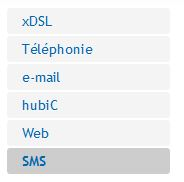{.thumbnail}

## 
Rendez vous sur la partie Carnet d'adresses dans la navigation.

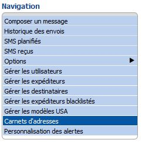{.thumbnail}
Cliquez sur Carnet d'adresses puis sur Nouveau.
Nommez alors votre nouveau carnet.

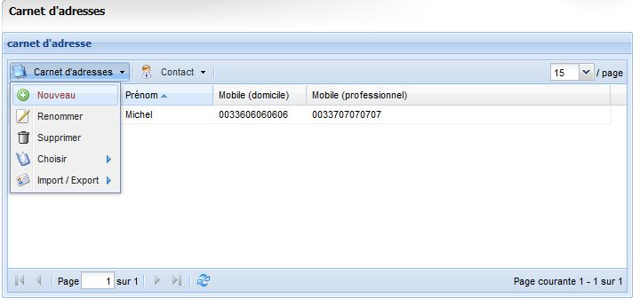{.thumbnail}
Cliquez sur Contact puis sur Nouveau.

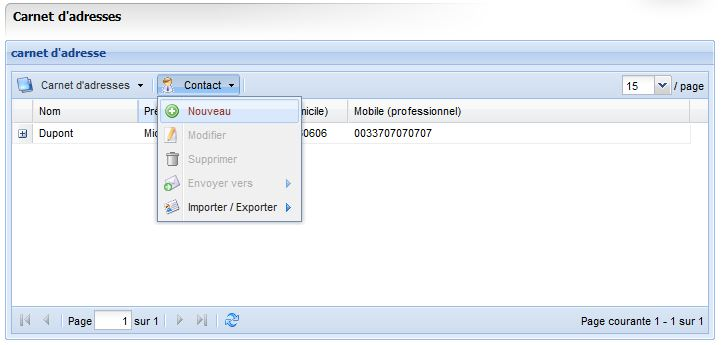{.thumbnail}
Remplissez les champs requis.

{.thumbnail}

## Prérequis
Enregistrez votre fichier tableur au format .csv (séparateur: point-virgule).

Les caractères spéciaux comme les accents ne sont pas acceptés dans l'import du fichier .csv. Les contacts comprenant ce type de caractères ne seront pas importés.

Respectez la forme internationale +33xxxxxxxxx pour vos numéros.

Nous conseillons des carnets d'adresses ne dépassant pas 2000 contacts. 

Tous vos contacts devront être sur la même feuille de votre tableur.

## En pratique 

### Format du tableur
Si vous souhaitez intégrer un fichier .csv existant, ce dernier devra avoir la forme ci-contre dans un tableur.

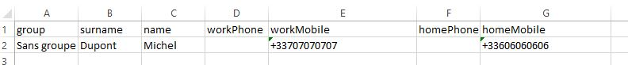{.thumbnail}
Si vous ouvrez ce fichier .csv avec le bloc-notes vous aurez la forme ci-contre.

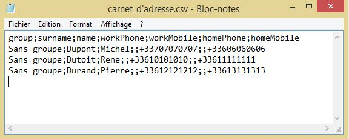{.thumbnail}
Configurez en format texte les colonnes dans lesquelles vous renseignerez des chiffres, afin que le tableur n’y effectue aucun calcul automatique.

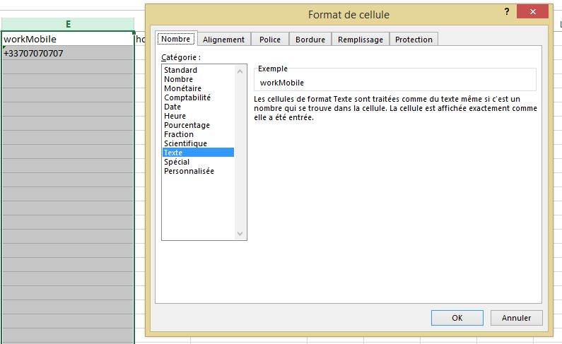{.thumbnail}
Vous avez également la possibilité d'exporter un carnet d'adresses déjà créé depuis l'espace client afin de disposer d'un patron.

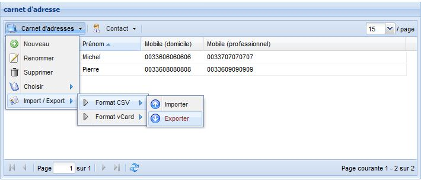{.thumbnail}
Lors de l'ouverture dans un tableur du fichier .csv exporté, il vous faudra le convertir afin de faire apparaître correctement les différentes colonnes.

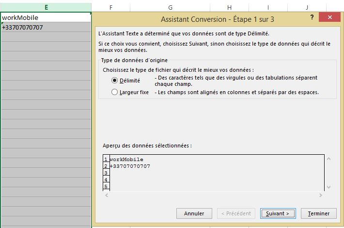{.thumbnail}
La méthode de séparation d'un .csv est communément la virgule ou le point-virgule.

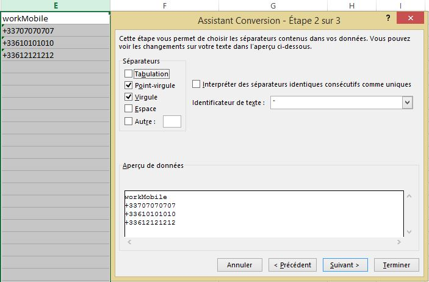{.thumbnail}
Une fois que vous aurez complété votre tableur, enregistrez-le au format .csv.

### Importation dans l'espace client
Afin d'effectuer un import de votre fichier .csv, cliquez sur Carnet d'adresses puis sur import/export, Format CSV, Importer.

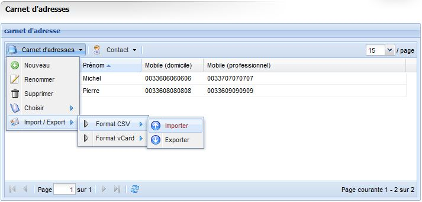{.thumbnail}
Cliquez sur l'icône d'exploration de fichier, puis allez chercher votre fichier .csv sur votre ordinateur.

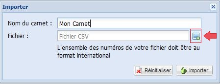{.thumbnail}
Importez ensuite votre fichier.

Vous avez la possibilité de créer des listes de destinataires sans passer par le carnet d'adresses.

### Depuis un fichier .csv
Rendez vous dans la partie Gérer les destinataires.

Cliquez ensuite sur Ajouter.

Vous aurez préalablement hébergé votre fichier sur un [service adapté](https://plik.root.gg).

{.thumbnail}
Votre fichier csv devra contenir une colonne number pour être compatible.

### Depuis un fichier texte
Vous pouvez aussi importer au même endroit dans l'espace client un fichier .txt

Nommez simplement ce dernier numbers.txt.

Renseignez à la forme internationale (+33612345678) votre liste de numéros avec un numéro par ligne.

{.thumbnail}