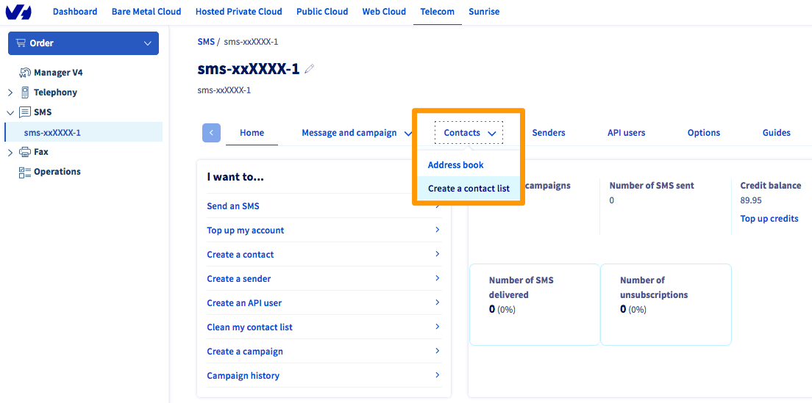
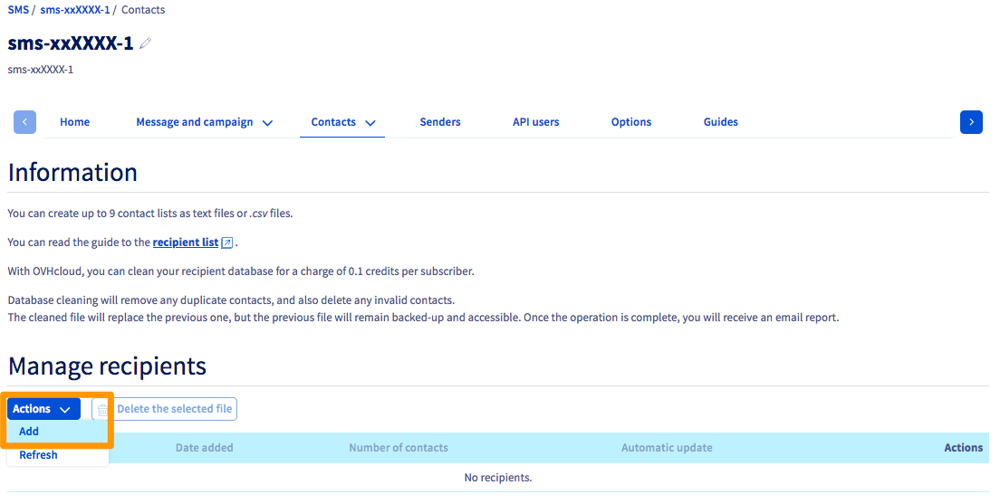

> [!primary]
> Esta traducción ha sido generada de forma automática por nuestro partner SYSTRAN. En algunos casos puede contener términos imprecisos, como en las etiquetas de los botones o los detalles técnicos. En caso de duda, le recomendamos que consulte la versión inglesa o francesa de la guía. Si quiere ayudarnos a mejorar esta traducción, por favor, utilice el botón «Contribuir» de esta página.
>

**Última actualización: 05/08/2022**

## Objetivo

Para enviar una campaña de SMS a múltiples contactos, puede importar una o más listas de destinatarios en su área de cliente de OVHcloud.

**Esta guía explica cómo crear una lista de destinatarios de SMS a través de una hoja de cálculo o un editor de texto e importarla en el área de cliente de OVHcloud.**

## Requisitos

- Disponer de una cuenta de SMS en OVHcloud.
- Tener un programa de hojas de cálculo o un editor de texto.
- Haber iniciado sesión en el [área de cliente de OVHcloud](https://www.ovh.com/auth/?action=gotomanager&from=https://www.ovh.es/&ovhSubsidiary=es){.external}, en la sección `Telecom`{.action}{.action} > `SMS`{.action}.

{.thumbnail}

## Procedimiento

### 1. Crear una lista de destinatarios

#### En una hoja de cálculo

Es posible crear una lista de destinatarios en una hoja de cálculo desde cero o reutilizando una lista existente. Para ello, la lista debe estar en formato .CSV y tener el siguiente apariencia en la hoja de cálculo:

{.thumbnail}

> [!warning]
> Para que la hoja de cálculo no realice ningún cálculo automático en sus números, debe personalizar el formato de su columna `number`.
>
> En Microsoft Excel, seleccione su columna `number` completo, haga clic derecho y haga clic en `Formato de celda`{.action}. Haga clic en `Personalizado`{.action} e introduzca el siguiente valor en el campo `Tipo`: ```[>0]+0;Standard```.
>
> {.thumbnail}
>
> En LibreOffice, seleccione su columna `number` completo, haga clic derecho y haga clic en `Formatear celdas`{.action}. Introduzca el siguiente valor en el campo `Descripción del formato`: ```[>0]+0;Standard```
>
> {.thumbnail}
>

Una vez que el archivo se haya guardado en formato .CSV, si lo abre con un bloc de notas, debería ser similar a:

{.thumbnail}

Para que el área de cliente de OVHcloud reconozca la lista de destinatarios, esta debe cumplir los siguientes requisitos:

- Todos los contactos deben estar en la misma hoja, en una columna llamada «**number**».
- La lista no debe contener caracteres especiales (como acentos). De lo contrario, no será posible importar el archivo .CSV al área de cliente.
- Los números deben tener formato internacional. Por ejemplo, un número español tendrá el siguiente formato: +34123456789.
- El archivo debe guardarse en formato .CSV (utilizando el punto y coma como separador).

#### Con un editor de texto

También es posible crear una lista de destinatarios mediante un archivo .TXT desde un editor de texto o bloc de notas.

- Escriba «**number**» en la primera línea.
- A continuación, introduzca un número de teléfono en cada línea en formato internacional (+34123456789).

El resultado debería ser como el siguiente:

{.thumbnail}

### 2. Importar la lista en el área de cliente de OVHcloud

Conéctese al [área de cliente de OVHcloud](https://www.ovh.com/auth/?action=gotomanager&from=https://www.ovh.es/&ovhSubsidiary=es) y haga clic en la sección `Telecom`{.action}. A continuación, haga clic en `SMS`{.action}.

Seleccione su cuenta de SMS y haga clic en la pestaña `Contactos`{.action} y en `Crear una lista de contactos`{.action}.

{.thumbnail}

Puede crear hasta 9 listas de contactos.

Para ello, haga clic en `Acciones`{.action} y seleccione `Añadir`{.action}.

{.thumbnail}

Asigne un nombre al archivo de destinatarios e importe el archivo local desde el área de cliente.

{.thumbnail}

### 3. Enviar un SMS a su lista de destinatarios

Una vez importada la lista, puede seguir las instrucciones de nuestra guía [Enviar SMS desde el área de cliente](https://docs.ovh.com/es/sms/enviar-sms-desde-el-area-de-cliente/) para enviar un SMS a los destinatarios de esta lista.

## Más información

[Enviar SMS desde el área de cliente](https://docs.ovh.com/es/sms/enviar-sms-desde-el-area-de-cliente/)

[Agenda de contactos de SMS](https://docs.ovh.com/es/sms/agenda-de-contactos-de-sms/)

Interactúe con nuestra comunidad de usuarios en [https://community.ovh.com/en/](https://community.ovh.com/en/).
