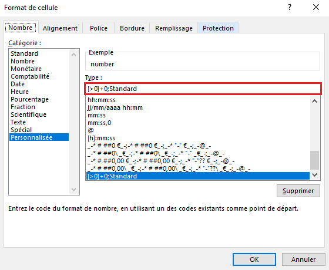
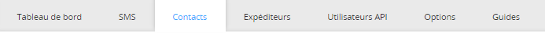
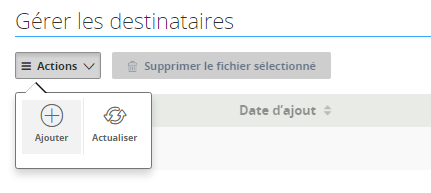
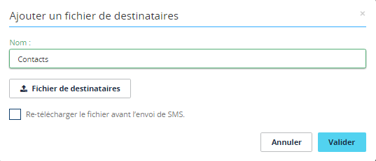

## Prérequis
Enregistrez votre fichier tableur au format .csv (séparateur: point-virgule).

Les caractères spéciaux comme les accents ne sont pas acceptés dans l'import du fichier .csv.

Respectez la forme internationale pour vos numéros (+33612345678).

Tous vos contacts devront être sur la même feuille de votre tableur dans une colonne number.

## Format du tableur
Si vous souhaitez intégrer un fichier .csv existant, ce dernier devra avoir la forme ci-contre dans un tableur.

{.thumbnail}
Si vous ouvrez ce fichier .csv avec le bloc-notes vous aurez la forme ci-contre.

{.thumbnail}
Afin que le tableur n’effectue aucun calcul automatique sur vos numéros, configurez le format de votre cellule number dans le champ Personnalisée et en y renseignant manuellement : [>0]+0;Standard.

{.thumbnail}

## 
Créez simplement un fichier .txt.

Indiquez en première ligne number.

Renseignez à la forme internationale (+33612345678) votre liste de numéros avec un numéro par ligne.

{.thumbnail}

## Connexion à l'interface
Connectez-vous à votre [espace client](https://www.ovhtelecom.fr/espaceclient/login/), rubrique Telecom. Sélectionnez ensuite SMS dans les menus de gauche.

Cliquez ensuite sur le compte SMS désiré.

{.thumbnail}

## Import
Rendez-vous dans l'onglet contacts.

{.thumbnail}
Vous avez la possibilité de créer jusqu’à 9 listes de contacts par le biais de fichiers textes.
Il vous suffit pour cela de vous rendre dans le champ Actions et de sélectionner Ajouter.

{.thumbnail}
Nommez votre ficher de destinataires et importer votre fichier local dans l'espace client.

{.thumbnail}

