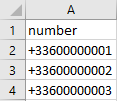

## Objectif

Tous les comptes SMS OVH peuvent utiliser une ou plusieurs listes de destinataires. Ce guide décrit la méthode de création d'une liste de destinataires.

## Prérequis
- Disposer d’un compte SMS OVHcloud
- Disposer d'un outil de type tableur ou éditeur de texte

## En pratique

### Étape 1 : Créer votre votre liste de destinataires

#### Méthode par tableur

Vous pouvez créer une liste de destinataires via un tableur ou réutiliser une liste déjà existante. Celle-ci doit alors être au format .csv et doit avoir la forme ci-dessous dans un tableur :

{.thumbnail}

Si vous ouvrez ce fichier .csv avec un bloc-notes, il devrait être similaire à ceci :

{.thumbnail}

Les points suivants sont indispensables pour que votre liste de destinataires soit prise en compte sur votre espace client OVHcloud:

- Tous vos contacts devront être sur la même feuille de votre tableur dans une colonne number.
- Les caractères spéciaux comme les accents doivent être supprimés car ils ne seront pas acceptés lors de l’import du fichier .csv sur l'espace client.
- Respectez le format international pour vos numéros (exemple pour un numéro français : +33612345678).
- Enregistrez votre fichier au format .csv (séparateur : point-virgule).

Afin que le tableur n’effectue aucun calcul automatique sur vos numéros, configurez le format de votre cellule number dans le champ Personnalisée et en y renseignant manuellement : [>0]+0;Standard.

{.thumbnail}

#### Méthode par éditeur de texte

Une méthode alternative consiste à créer simplement un fichier .txt depuis un éditeur de texte ou ou bloc-notes.

- Indiquez « number » en première ligne.
- Renseignez vos numéros au format international (+33612345678) avec un numéro par ligne.

Vous devriez obtenir le résultat ci-dessous

{.thumbnail}

### Étape 2 : Connexion à l'interface

Connectez-vous à votre [espace client OVHcloud](https://www.ovhtelecom.fr/espaceclient/login/) puis sélectionnez `Telecom`{.action}. Sélectionnez ensuite `SMS`{.action} dans les menus de gauche.

Cliquez enfin sur le compte SMS désiré.

{.thumbnail}

### Étape 3 : Importer votre liste de destinataires

Sélectionnez l'onglet `Contacts`{.action}.

{.thumbnail}

Vous avez la possibilité de créer jusqu’à 9 listes de contacts.

Il vous suffit pour cela de cliquer sur `Actions`{.action} puis de cliquer sur `Ajouter`{.action}.

{.thumbnail}

Nommez votre ficher de destinataires et importez votre fichier local dans l'espace client.

{.thumbnail}

## Aller plus loin

Échangez avec notre communauté d'utilisateurs sur <https://community.ovh.com>