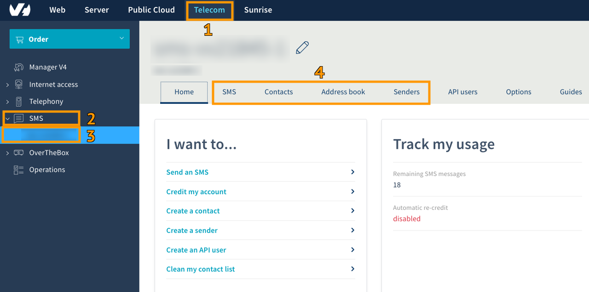
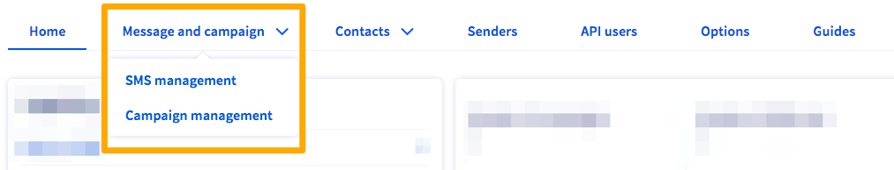
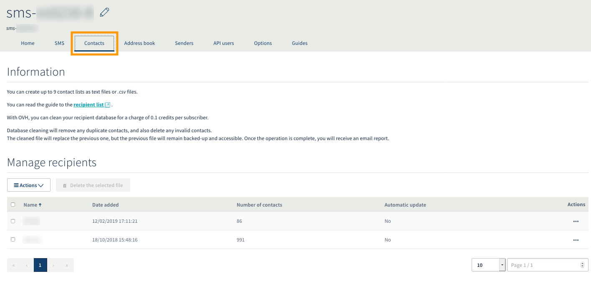
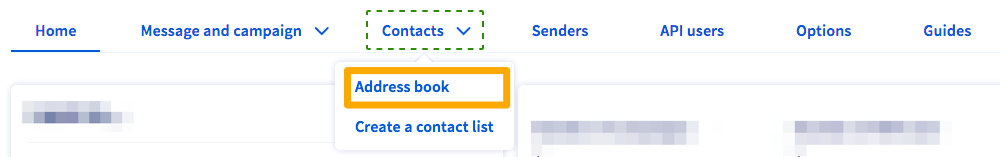
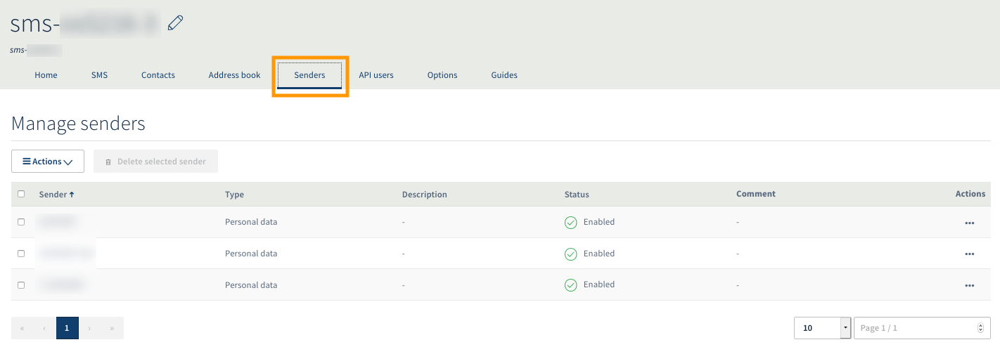

**Última actualización: 15/11/2019**

## Objetivo

OVHcloud ofrece una serie de herramientas, disponibles en el área de cliente, que permiten enviar SMS.

**Esta guía explica cómo utilizar esas herramientas para crear una campaña de envío de SMS.**

## Requisitos

- Disponer de una cuenta de SMS en OVHcloud con saldo de SMS.

## Procedimiento

Conéctese al [área de cliente de OVHcloud](https://www.ovhtelecom.fr/manager/) y haga clic en `Telecom`{.action} (1). A continuación, haga clic en `SMS`{.action} en la columna izquierda (2) y seleccione su cuenta de SMS (3).

Utilice las diferentes pestañas (4) para acceder a las principales funcionalidades que permiten crear y enviar una campaña de SMS.

{.thumbnail}

### 1. Enviar SMS

La pestaña `SMS`{.action} permite acceder a las distintas opciones de envío, así como consultar el historial de mensajes enviados y recibidos y el estado de los SMS programados.

{.thumbnail}

Para enviar un SMS desde el área de cliente, consulte [esta guía](https://docs.ovh.com/es/sms/enviar-sms-desde-el-area-de-cliente/).

Si desea más información sobre el historial de SMS, consulte [esta guía](https://docs.ovh.com/es/sms/gestionar-el-historial-de-envios/).

### 2. Añadir una lista de destinatarios

Desde la pestaña `Contactos`{.action} es posible enviar SMS a una o más listas de destinatarios. Para añadir una lista de destinatarios, puede importar un archivo .CSV o .TXT.

{.thumbnail}

En [esta guía](https://docs.ovh.com/es/sms/lista-de-destinatarios-sms) se explica cómo hacerlo.

### 3. Añadir una agenda de contactos

Desde la pestaña `Agenda de contactos`{.action} es posible crear varias agendas de contactos a las que enviar SMS. A diferencia de las listas de destinatarios, en las agendas de contactos es posible asignar un nombre a los contactos para identificarlos fácilmente con el fin de realizar campañas segmentadas.

{.thumbnail}

Para más información sobre las agendas de contactos, consulte [esta guía](https://docs.ovh.com/es/sms/gestionar-la-agenda-de-contactos-de-sms).

### 4. Crear un remitente

Por defecto, el envío de SMS desde una cuenta de OVHcloud se realiza desde un número que permite responder (funcionalidad solo disponible en Francia). Sin embargo, en algunos casos puede ser más apropiado utilizar un remitente alfanumérico (que se crea desde la pestaña `Remitentes`{.action}) para que el SMS se envíe a nombre de su empresa u organización.

{.thumbnail}

Para ello, consulte el apartado de la guía «[Enviar SMS desde el área de cliente](https://docs.ovh.com/es/sms/enviar-sms-desde-el-area-de-cliente/#3-elegir-el-remitente-del-sms)» relativo a la elección de remitentes.

## Más información

Interactúe con nuestra comunidad de usuarios en [ovh.es/community](https://www.ovh.es/community/).
