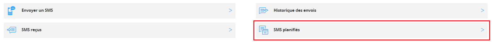

## 
Connectez-vous à votre [espace client](https://www.ovhtelecom.fr/manager/), rubrique Telecom. Sélectionnez ensuite SMS dans les menus de gauche.

Cliquez ensuite sur le compte SMS désiré.

{.thumbnail}

## Liste de destinataires
Il est possible d'effectuer différentes importations d'une liste de destinataires.
Vous pouvez consulter le guide suivant pour plus de détails concernant la mise en place du fichier .csv ou d'un fichier .txt : .

## Nettoyer de la liste de destinataires
La fonctionnalité HLR vous permet de nettoyer une liste de destinataires en supprimant les numéros de téléphones inactifs.
Vous pouvez consulter le guide suivant pour plus de détails concernant les fonctionnalités HLR : .

## Composer un message
Une fois votre liste de destinataires nettoyée, rendez vous dans la partie Envoyer un SMS.
Sélectionnez Gérer les destinataires et sélectionnez votre fichier nettoyé.

{.thumbnail}
Composez votre message et programmez un envoi différé dans les options avancées.

{.thumbnail}
Vous pouvez consulter ce guide pour plus de détails concernant les envois de SMS depuis votre espace client : 

## Suivre une campagne programmée
Une fois votre campagne programmée, vous pouvez vérifier cette dernière dans la partie SMS planifiés.

{.thumbnail}
Vous avez également la possibilité d'annuler cette planification si vous souhaitez appliquer des modifications avant l'envoi.

## 
Une fois votre campagne envoyée, vous avez la possibilité de contrôler l'historique de vos envois.

{.thumbnail}
Vous y verrez certaines informations comme le statut des SMS envoyés (délivrés ou non) ou encore l'opérateur des destinataires.

