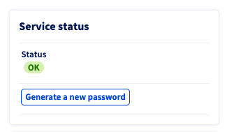
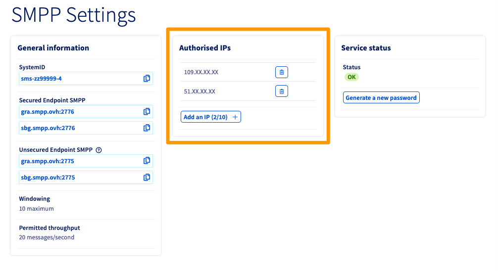

**Dernière mise à jour le 09/02/2023**

## Objectif

L'espace client OVHcloud vous permet de retrouver vos identifiants SMPP, modifier votre mot de passe, gérer les accès au service et transférer des crédits SMS.

**Découvrez comment gérer les paramètres d'un compte SMS SMPP depuis l'espace client OVHcloud.**

> [!primary]
>
> Nous vous recommandons de prendre connaissance des [spécifications techniques de l'offre SMPP OVHcloud](/pages/telecom/sms/smpp-specification).

## Prérequis

- Disposer d’un [compte SMS SMPP OVHcloud](https://www.ovhcloud.com/fr/sms/api-sms/).
- Être connecté à votre [espace client OVHcloud](https://www.ovh.com/auth/?action=gotomanager&from=https://www.ovh.com/fr/&ovhSubsidiary=fr) dans la partie `Télécom`{.action} puis `SMS`{.action}.

## En pratique

Sélectionnez votre compte SMPP. De par son nom, il se distingue des autres comptes SMS OVHcloud. En effet, il commence par `smpp-` au lieu de `sms-` pour les comptes SMS classiques.

{.thumbnail}

### Informations d'identification

Le cadre `Informations générales` vous permet de retrouver les identifiants nécessaires à l'utilisation de votre service. Utilisez le bouton à droite de chaque champ pour copier son contenu.

{.thumbnail}

En cas d'oubli du mot de passe SMPP, utilisez le bouton `Générer un nouveau mot de passe`{.action}. Un nouveau mot de passe sera alors envoyé à l'adresse e-mail de contact de votre compte OVHcloud, celle-ci vous étant alors affichée. 

Cliquez sur `Envoyer`{.action} pour confirmer cette action.

{.thumbnail}

### Gestion des accès

Cliquez sur l'onglet `Options`{.action} puis sur `Paramètres SMPP`{.action}.

{.thumbnail}

Le cadre `IP autorisées` liste les adresses IP de vos clients SMPP qui sont autorisées à accéder au serveur SMPP.

Cliquez sur le bouton `Ajouter une IP`{.action} pour ajouter des adresses IP à cette liste.

{.thumbnail}

### Gestion des expéditeurs et des crédits

Consultez nos guides sur la [gestion des expéditeurs](/pages/telecom/sms/envoyer_des_sms_depuis_mon_espace_client#etape-3-choisir-votre-expediteur-sms) et sur la [gestion des crédits SMS et la recharge automatique](/pages/telecom/sms/activer_la_recharge_automatique_du_credit_sms).

## Aller plus loin

Consultez [notre guide dédié à la gestion de l'historique des SMS](/pages/telecom/sms/gerer_l_historique_des_sms).

[Les spécifications techniques de l'offre SMPP OVHcloud](/pages/telecom/sms/smpp-specification).

Échangez avec notre communauté d'utilisateurs sur <https://community.ovh.com>
