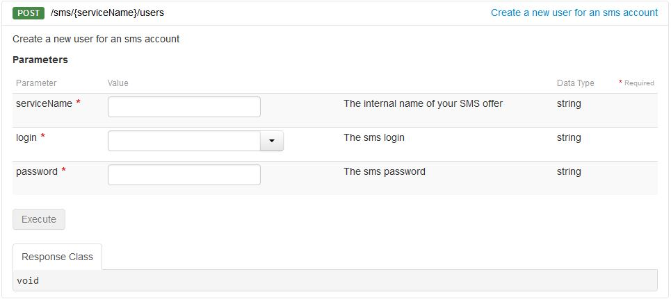

## 
Un utilisateur SMS API peut être utile sur plusieurs niveaux.

{.thumbnail}

- D'une part, il permet au propriétaire du compte SMS de sécuriser ses accès lors d'un envoi de SMS via une API externe.

En effet, le script appelant ne connaît que l'identifiant de l'utilisateur et son mot de passe, et non la session de l'identifiant client du propriétaire.

- D'autre part, la création de plusieurs utilisateurs API peut être utile dans une entreprise, notamment pour une meilleure traçabilité. 

Un utilisateur API qui envoie des SMS de manière abusive peut de suite être décelé par le propriétaire du compte.
Pout terminer un utilisateur API peut être soumis à des restrictions (quotas) dans ses crédits SMS. 
Ainsi il est possible pour le propriétaire du compte SMS de diviser ses crédits sur ses différents comptes utilisateurs API.

## Connexion à l'interface
Connectez-vous à votre [espace client](https://www.ovhtelecom.fr/manager/), rubrique Telecom. Sélectionnez ensuite SMS dans les menus de gauche.

Cliquez ensuite sur le compte SMS désiré.

{.thumbnail}

## Ajout de l'utilisateur SMS
Cliquez sur l'onglet Utilisateurs API.

{.thumbnail}
Cliquez ensuite sur Actions puis sur Ajouter.

{.thumbnail}
Le mot de passe d'un utilisateur doit se composer de 8 caractères alphanumériques et l'identifiant doit avoir entre 6 et 10 caractères alphanumériques.

## Connexion à l'interface
Connectez-vous à la page [API.OVH.com](https://api.ovh.com/console/#/sms) et identifiez-vous.

{.thumbnail}

## Ajout de l'utilisateur
Utilisez ensuite l'API POST /sms/{serviceName}/users

-serviceName : votre compte SMS (ex : sms-ab1234-1)
-login : l'identifiant de votre utilisateur
-password : le mot de passe de votre utilisateur

{.thumbnail}
Pour plus d'informations sur les API SMS, vous pouvez consulter les guides suivants :

- .
- .
- .
- .
- .

## 
Plusieurs options sont disponibles pour les utilisateurs API.

Afin d'en disposer cliquez sur la droite au niveau des Actions.

{.thumbnail}

## Quota
Le quota attribué à chaque utilisateur vous permet de contrôler la consommation en SMS.

Par défaut le quota est désactivé.

{.thumbnail}
Appliquez un nouveau quota après l'activation de la fonction.

Vous ne pouvez pas attribuer un quota supérieur au crédit total du compte SMS.

Vous pouvez récupérer les crédits alloués à un utilisateur à tout moment.
Après validation, chaque envoi de la part de l'utilisateur décrémentera son quota restant. Une fois à 0, l'utilisateur ne pourra plus envoyer de SMS.

## Limite
Si vous souhaitez être alerté d'un seuil de quota d'un utilisateur par email et/ou par SMS, passez par l'option limite.

L'envoi d'un SMS pour une alerte est facturé au coût d'un envoi standard.

{.thumbnail}

## Restriction par IP pour http2sms
Il est possible de sécuriser la fonction http2sms en appliquant des restrictions pas IP.

Vous pouvez renseigner jusque 5 adresses IP différentes pour les envois de vos requêtes https.

{.thumbnail}

## URL de callback
Pour un suivi personnalisé des accusés de réception SMS (dlr), il est possible de spécifier une URL dite de CallBack.

{.thumbnail}
Lorsque le statut d'envoi du SMS est mis à jour, nous appelons l'URL spécifiée. Les valeurs suivantes sont automatiquement insérées dans la querystring :

- id : numéro d'identification du SMS
- ptt : code qui correspond à un état du SMS. Les états possibles sont les suivants :

|1|Notification d'état intermédiaire que le message n'a pas encore été livré en raison d'un problème de téléphone, mais est en cours de nouvel essai (Intermediate state notification that the message has not yet been delivered due to a phone related problem but is being retried).|
|2|Utilisé pour indiquer que le message n'a pas encore été livré en raison d'un problème d'opérateur, mais est en cours de nouvel essai au sein du réseau (Used to indicate that the message has not yet been delivered due to some operator related problem but is being retried within the network).|
|3|Utilisé pour indiquer que le message a été accepté par l'opérateur (Used to indicate that the message has been accepted by the operator).|
|4|Le message a été livré (The message was delivered).|
|5|Le message a été confirmé comme non livré, mais aucune information détaillée relative à l'échec n'est connue (The message has been confirmed as undelivered but no detailed information related to the failure is known).|
|6|Impossible de déterminer si le message a été livré ou a échoué en raison d'un manque d'information de livraison de la part de l'opérateur (Cannot determine whether this message has been delivered or has failed due to lack of final delivery state information from the operator).|
|8|Utilisé quand un message a expiré (ne pouvait pas être livré dans la durée de vie du message) au sein de l'opérateur SMSC, mais non associé à une raison de l'échec (Used when a message expired (could not be delivered within the life time of the message) within the operator SMSC but is not associated with a reason for failure).|
|20|Utilisé quand un message n'est pas livrable dans sa forme actuelle (Used when a message in its current form is undeliverable).|
|21|Utilisé uniquement lorsque l'opérateur accepte le message avant d'effectuer la vérification de crédit de l'abonné. Si manque de crédit l'opérateur retente l'envoi jusqu'à ce qu'il y ait assez de crédit ou que le message expire. Si le message epire et que la dernière raison de l'échec est lié au crédit, alors ce code d'erreur sera utilisé (Only occurs where the operator accepts the message before performing the subscriber credit check. If there is insufficient credit then the operator will retry the message until the subscriber tops up or the message expires. If the message expires and the last failure reason is related to credit then this error code will be used).|
|23|Utilisé lorsque le message est non distribuable en raison d'une incorrecte / invalide / liste noire / exlcusion permanente MSiSDN pour cet opérateur. Cette MSISDN ne doit pas être utilisé à nouveau pour les soumissions de message à cet opérateur(Used when the message is undeliverable due to an incorrect / invalid / blacklisted / permanently barred MSISDN for this operator. This MSISDN should not be used again for message submissions to this operator).|
|24|Utilisé quand un message est non distribuable parce que l'abonné est temporairement absent, par exemple leur téléphone est éteint, ils ne peuvent pas être situés sur le réseau (Used when a message is undeliverable because the subscriber is temporarily absent, e.g. their phone is switch off, they cannot be located on the network).|
|25|Utilisé lorsque le message a échoué en raison d'un état temporaire dans le réseau de l'opérateur. Cela pourrait être lié à la couche SS7, la passerelle ou SMSC (Used when the message has failed due to a temporary condition in the operator network. This could be related to the SS7 layer, SMSC or gateway).|
|26|Utilisé lorsque le message a échoué en raison d'un erreur temporaire du téléphone, par exemple la carte SIM est pleine, PME occupée, mémoire dépassée etc. Cela ne signifie pas que le téléphone est incapable de recevoir ce type de message / contenu (voir code d'erreur 27) (Used when a message has failed due to a temporary phone related error, e.g. SIM card full, SME busy, memory exceeded etc. This does not mean the phone is unable to receive this type of message/content (refer to error code 27)).|
|27|Utilisé lorsqu'un combiné est définitivement incompatible ou incapable de recevoir ce type de message (Used when a handset is permanently incompatible or unable to receive this type of message).|
|28|Utilisé si un message échoue ou est rejeté en raison de soupçons de SPAM sur le réseau de l'opérateur. Cela pourrait indiquer dans certaines zones géographiques que l'opérateur n'a aucune trace de la MO obligatoire requis pour un MT (Used if a message fails or is rejected due to suspicion of SPAM on the operator network. This could indicate in some geographies that the operator has no record of the mandatory MO required for an MT).|
|29|Utilisé lorsque ce contenu spécifique n'est pas autorisé sur le réseau / shortcode (Used when this specific content is not permitted on the network / shortcode).|
|33|Utilisé lorsque l'abonné ne peut pas recevoir un contenu pour adultes en raison d'un verrouillage parental (Used when the subscriber cannot receive adult content because of a parental lock).|
|39|Nouvelle panne de l'opérateur (New operator failure).|
|73|Le message a échoué car les combinaisons portés sont inaccessibles (The message was failed due to the ported combinations being unreachable).|
|74|Le message a échoué car la MSISDN est en itinérance (The message was failed due to the MSISDN being roaming).|
|76|Le message a échoué car les combinaisons portées sont bloquées pour le client (le client a été mis liste noire de la destination) (The message was failed due to the ported combinations being blocked for client (the client has been blacklisted from the ported destination)).|
|202|Le message a échoué en raison des combinaisons portées bloquées pour le client. Contactez le support client pour plus d'informations (The message was failed due to the ported combinations being blocked for the client. Please contact Client Support for additional information).|

- date : date du "dlr"
- description : id du dlr qui correspond à la description ci-dessous
- descriptionDlr : description du status du dlr

|0|En création ou en attente (Creating or pending)|
|1|Succès (Success)|
|2|Echoué (Failed)|
|4|En attente (Waiting)|
|8|Tampon (Buffered)|
|16|En erreur / non facturé (Error / not billed)|

