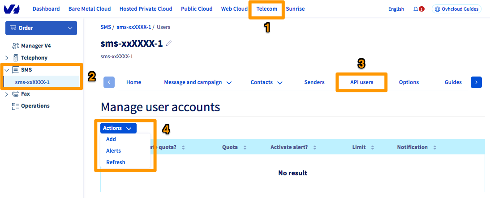
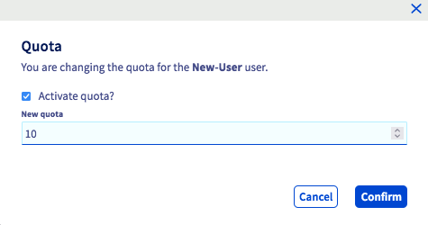
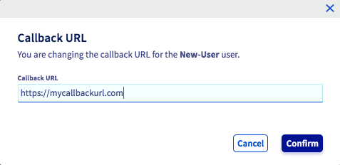

> [!primary]
> Questa traduzione è stata generata automaticamente dal nostro partner SYSTRAN. I contenuti potrebbero presentare imprecisioni, ad esempio la nomenclatura dei pulsanti o alcuni dettagli tecnici. In caso di dubbi consigliamo di fare riferimento alla versione inglese o francese della guida. Per aiutarci a migliorare questa traduzione, utilizza il pulsante "Modifica" di questa pagina.
>

**Ultimo aggiornamento: 05/08/2022** 

## Obiettivo

Questa guida ti mostra come creare e aggiungere utenti API.

## Prerequisiti

- Disporre di un account SMS OVHcloud attivo
- Avere accesso allo [Spazio Cliente OVHcloud](https://www.ovh.com/auth/?action=gotomanager&from=https://www.ovh.it/&ovhSubsidiary=it){.external}, sezione `Télécom`{.action} > `SMS`{.action}

{.thumbnail}

## Procedura

{.thumbnail}

Disporre di un utente SMS API può essere utile per varie ragioni:

- Consente al proprietario dell’account SMS di rendere sicuri gli accessi durante l’invio di SMS tramite un’API esterna.
Infatti, lo script che effettua la chiamata conosce soltanto l’identificativo dell’utente e la sua password, e non la sessione dell’identificativo cliente del proprietario.

- In un’azienda, la creazione di diversi utenti API potrebbe rivelarsi utile soprattutto per una migliore tracciabilità.
Un utente API che invia SMS in modo abusivo può essere immediatamente identificato dal proprietario dell’account.

- I crediti SMS di un utente API possono essere soggetti a restrizioni (quote).
In questo modo, il proprietario dell’account SMS può ripartire i suoi crediti tra i diversi account di utenti API.

Per gestire al meglio il saldo del tuo account SMS, puoi fissare un limite e una quota agli utenti API. 

- La **quota** è la quantità di crediti SMS a disposizione dell’utente API.

- Il **limite** è la soglia minima di crediti SMS di cui dispone un utente API prima di ricevere un alert per ricaricare o meno il numero dei crediti.

### Step 1: crea un utente API

Accedi allo [Spazio Cliente OVHcloud](https://www.ovh.com/auth/?action=gotomanager&from=https://www.ovh.it/&ovhSubsidiary=it) e seleziona `Telecom`{.action}. Poi clicca su `SMS`{.action} e seleziona il tuo account SMS.

Infine clicca sulla scheda `Utenti API`{.action}. Per aggiungere un utente, clicca sul pulsante `Azioni`{.action} e poi su `Aggiungi`{.action}.

{.thumbnail}

Assegna un nome all’utente API. La password utente dell’utente API deve essere composta da 8 caratteri alfanumerici.

### Step 2: attribuisci una quota a un utente API

È possibile gestire le quote dalla scheda `Utente API`{.action}. Clicca sui tre puntini `...`{.action}in corrispondenza dell’utente API e seleziona`Quota`{.action}.

{.thumbnail}

A questo punto, è possibile effettuare due operazioni:

- **Attivare la quota?**: consente di stabilire se l’utente è soggetto a una quota.
- **Nuova quota**: consente di impostare la quota dell’utente. Una volta raggiunta la quota, l’invio di SMS verrà bloccato per questo utente.

{.thumbnail}

> [!primary]
>
> L’assegnazione di una quota a un utente API ridurrà dello stesso importo il credito totale dell’account SMS.
>
> Ad esempio: un account SMS dispone di un totale di 200 crediti. L’assegnazione di 150 crediti a un utente API andrà a dedurre 150 crediti dall’account SMS che, a quel punto disporrà, quindi di soli 50 crediti.
>

### Step 5: attribuisci un limite a un utente API

Per configurare un limite a un utente clicca sui tre puntini `...`{.action} e poi su `Limite`{.action}.

A questo punto saranno disponibili le seguenti impostazioni:

- **Attiva l’alert?**: consente di attivare un alert al raggiungimento della soglia.
- **Soglia di alert**: consente di impostare il livello di crediti SMS rimanenti che farà scattare la notifica.
- **Notifica**: consente di scegliere il tipo di notifica: email (inserisci il tuo indirizzo email), SMS (inserisci il tuo numero nel formato internazionale) o entrambi.

> [!warning]
>
> L’invio di una notifica via SMS sarà detratto dal tuo credito SMS.
>

{.thumbnail}

### Step 4: definisci una restrizione IP per la funzione hhtp2sms

È possibile rendere sicura la funzione http2sms applicando alcune restrizioni IP per ciascun utente API.

Per farlo, clicca sui tre puntini `...`{.action} a destra dell’utente e poi su `Restrizioni`{.action}.

Per l’invio delle richieste https, è possibile inserire fino a 5 diversi indirizzi IP pubblici.

{.thumbnail}

Per maggiori informazioni sulla funzione http2sms, consulta la guida [Inviare SMS da un URL](../inviare_sms_da_un_url_http2sms/).

### Step 5: specifica un URL di Callback

Per realizzare un follow-up personalizzato degli avvisi di ricevimento via SMS (Delivery reporting o DLR), è possibile specificare un URL chiamato Callback. Per farlo, clicca sui tre puntini `...`{.action} a destra in corrispondenza dell'utente e poi su `Callback`{.action}.

{.thumbnail}

Una volta aggiornato lo stato di invio dell’SMS, il servizio effettua una chiamata all’URL indicato. I seguenti valori sono automaticamente inseriti nella querystring:

- id: numero di identificazione dell’SMS
- ptt: codice che indica lo stato dell’SMS I diversi codici ptt sono riportati nella tabella qui di seguito.
- data: data del DLR
- descrizione : ID del DLR. I diversi ID sono riportati nella tabella qui di seguito.
- descriptionDIR: descrizione dello stato del DLR

#### I diversi codici ptt

Per ottenere la descrizione di un codice ptt specifico, utilizza questa API:

> [!api]
>
> @api {GET} /sms/ptts
>

Per maggiori informazioni sull'utilizzo delle API OVHcloud, consulta la nostra guida [Iniziare a utilizzare le API OVHcloud](https://docs.ovh.com/it/api/first-steps-with-ovh-api/).

Nella tabella seguente è riportato un elenco non esaustivo dei codici ptt principali.

|Codici|Descrizione|
|---|---|
|1|Stato intermedio che indica che il messaggio non è stato ancora consegnato a causa di un problema relativo al telefono, ma che è in corso un nuovo tentativo di invio (Intermediate state notification that the message has not yet been delivered due to a phone related problem but is being retried).|
|2|Il messaggio non è stato ancora consegnato a causa di un problema dell’operatore, ma è in corso un nuovo tentativo all’interno della rete (Used to indicate that the message has not yet been delivered due to some operator related problem but is being retried within the network).|
|3|Il messaggio è stato accettato dall’operatore (Used to indicate that the message has been accepted by the operator).|
|4|Il messaggio è stato consegnato (The message was delivered).|
|5|Il messaggio è stato confermato come non consegnato, ma non sono presenti informazioni dettagliate sul mancato invio (The message has been confirmed as undelivered but no detailed information related to the failure is known).|
|6|Impossibile determinare se il messaggio è stato consegnato o se si è verificato un errore nell’invio, per via della mancanza di informazioni sulla consegna da parte dell’operatore (Cannot determine whether this message has been delivered or has failed due to lack of final delivery state information from the operator).|
|8|Il messaggio è scaduto (non poteva essere consegnato entro il suo periodo di validità) presso l'operatore SMSC, ma non viene indicato il motivo del mancato invio. (Used when a message expired (could not be delivered within the life time of the message) within the operator SMSC but is not associated with a reason for failure).|
|20|Il messaggio non può essere consegnato nella sua forma attuale (Used when a message in its current form is undeliverable).|
|21|Questo codice è utilizzato soltanto quando l’operatore accetta il messaggio prima di verificare il credito dell’abbonato. Se il saldo è sufficiente, l’operatore tenta nuovamente l’invio del messaggio finché il saldo è sufficiente o prima che il messaggio scada. Se il messaggio è scaduto e l’ultimo motivo del mancato invio è legato al credito, verrà utilizzato questo codice di errore (Only occurs where the operator accepts the message before performing the subscriber credit check. If there is insufficient credit then the operator will retry the message until the subscriber tops up or the message expires. If the message expires and the last failure reason is related to credit then this error code will be used).|
|23|Il messaggio non può essere inviato a causa di un MSISDN errato/non valido/sulla ista nera/definitivamente vietato per questo operatore. Questo MSISDN non deve essere utilizzato nuovamente per le richieste di messaggi a questo operatore (Used when the message is undeliverable due to an incorrect / invalid / blacklisted / permanently barred MSISDN for this operator. This MSISDN should not be used again for message submissions to this operator).|
|24|Il messaggio non può’ essere inviato perché l’abbonato è temporaneamente assente. Ad esempio, se il suo telefono è spento o non può essere localizzato sulla rete (Used when a message is undeliverable because the subscriber is temporarily absent, e.g. their phone is switch off, they cannot be located on the network).|
|25|L’invio del messaggio non è riuscito a causa di uno stato temporaneo sulla rete dell’operatore. Questo può essere dovuto allo strato SS7, al gateway o al SMSC (Used when the message has failed due to a temporary condition in the operator network. This could be related to the SS7 layer, SMSC or gateway).|
|26|L’invio del messaggio non è riuscito a causa di un errore temporaneo del telefono. Ad esempio: carta SIM piena, PME occupato, memoria piena, ecc. Questo non significa che il telefono non è in grado di ricevere questo tipo di messaggi/contenuto (vedi codice errore 27) (Used when a message has failed due to a temporary phone related error, e.g. SIM card full, SME busy, memory exceeded etc. This does not mean the phone is unable to receive this type of message/content (refer to error code 27)).|
|27|Il telefono è definitivamente incompatibile o non è in grado di ricevere questo tipo di messaggi (Used when a handset is permanently incompatible or unable to receive this type of message).|
|28|L’invio del messaggio non è riuscito a causa di sospetto SPAM sulla rete dell’operatore.  In alcune zone geografiche potrebbe indicare che l’operatore non ha alcuna traccia del MO obbligatorio richiesto per un MT (Used if a message fails or is rejected due to suspicion of SPAM on the operator network. This could indicate in some geographies that the operator has no record of the mandatory MO required for an MT).|
|29|Il contenuto specifico non è autorizzato nella rete/shortcode (Used when this specific content is not permitted on the network / shortcode).|
|33|L’abbonato non è in grado di ricevere un contenuto per adulti a causa di un blocco parentale (Used when the subscriber cannot receive adult content because of a parental lock).|
|39|Errore dell’operatore (New operator failure).|
|73|L’invio del messaggio non è riuscito perché il numero portato non è disponibile (The message was failed due to the ported combinations being unreachable).|
|74|L’invio del messaggio non è riuscito poiché il MSISDN è in roaming (The message was failed due to the MSISDN being roaming).|
|76|L’invio del messaggio non è riuscito perché il numero portato è bloccato per il cliente (il cliente è stato messo nella lista nera per la destinazione portata) (The message was failed due to the ported combinations being blocked for client).|
|202|L’invio del messaggio non è riuscito perché il numero portato è bloccato per il cliente. Per maggiori informazioni, contatta l’assistenza clienti (The message was failed due to the ported combinations being blocked for the client.   Please contact Client Support for additional information).|

#### I diversi ID del DRL

|ID|Descrizione|
|---|---|
|0|Creazione in corso o in attesa (Creating or pending)|
|1|Inviato (Success) |
|2|Non inviato  (Failed) |
|4|In attesa (Waiting)|
|8|Buffer (Buffered)|
|16|Errore/non addebitato (Error / not billed)|

## Per saperne di più

Contatta la nostra Community di utenti all’indirizzo <https://community.ovh.com/en/>
