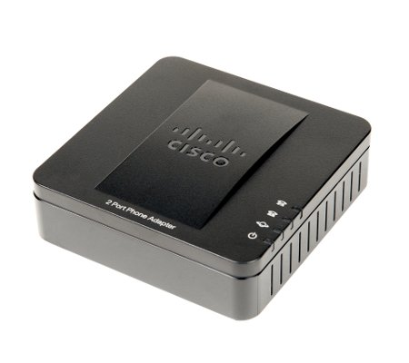

[{.thumbnail}](https://www.ovhtelecom.fr/telephonie/telephones/cisco_spa112/){.external-link}

### Fiche technique : {#fiche-technique}

**Description :**

L'adaptateur Cisco SPA 112 permet l'accès à un service de téléphonie sur IP (voice over IP) offrant de nombreuses fonctions de haute qualité via votre connexion Internet haut débit. Branchez-le simplement à votre routeur et utilisez l'un des deux ou les deux ports téléphoniques standards pour la connexion de vos téléphones analogiques ou utilisez un des ports pour votre fax (connectique RJ11). Chaque port téléphonique fonctionne indépendamment, avec des services et des numéros de téléphone séparés, comme si vous aviez deux lignes téléphoniques. Vous avez une réception téléphonique claire et des connexions fax fiables, même lorsque vous utilisez Internet en même temps. ****

**Caractéristiques techniques :**

-   2 ports vocaux (RJ-11) pour les téléphones analogiques ou les fax, avec 2 numéros de téléphone indépendants
-   1 port réseau RJ-45 10/100, 2 ports de téléphone standard RJ-11, 1 port d’alimentation, 1 bouton de réinitialisation
-   Prise en charge du DHCP (Dynamic Host Configuration Protocol)
-   Prise en charge du SIP (Session Initiation Protocol)
-   Prise en charge des normes de la compression vocale multiple : G.711 et G.729
-   Prise en charge de la détection et de la génération de tonalité DTMF
-   Accès et configuration protégés par mot de passe
-   Prise en charge de l’approvisionnement en services automatique via des mises à niveau de micrologiciels à distance
-   Normes IEEE 802.3 (10BaseT), IEEE 802.3u (100BaseTX)
-   Dimensions : 101 x 101 x 28 mm
-   Poids : 153 g

**Configuration requise :**

-   Connexion Internet haut débit
-   Service de téléphonie sur IP activé
-   Routeur ou modem pour partager la connexion Internet

**Points forts :**

-   Permet d'appeler et de recevoir des appels par la ligne téléphonique classique ou gratuitement par Internet sans changer de téléphone
-   2 ports RJ11 pour téléphones traditionnels ou fax avec 2 n° de téléphone indépendants
-   1 port RJ-45 pour connexions Ethernet 10/100 Mbits
-   Compatibilité avec toutes les fonctions de votre téléphone

