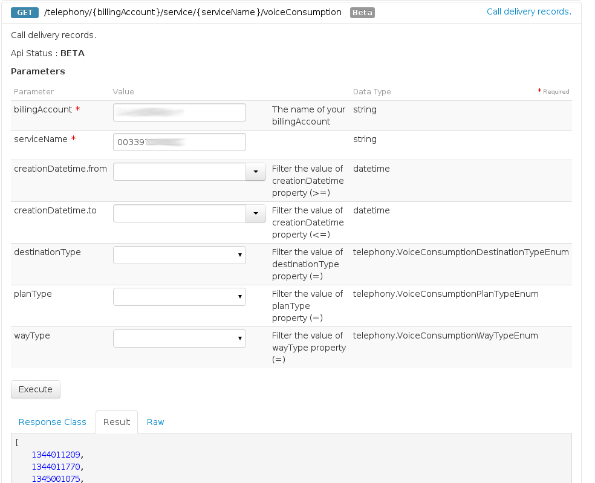
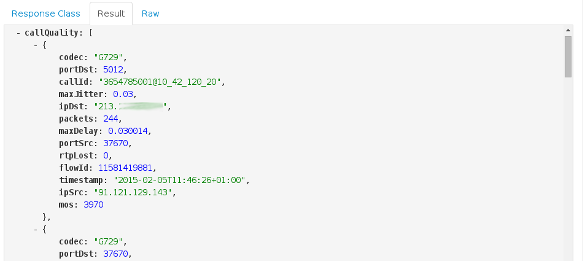
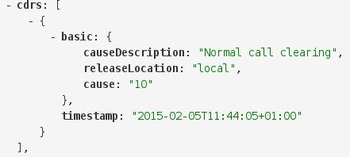

## 
Pour connaitre les bases de notre API :
[Bases de l'API](https://docs.ovh.com/fr/api/api-premiers-pas/)


## 
La plus grande partie des informations relatives à un appel est accessible via l'API :

```
/telephony/{billingAccount}/service/{serviceName}/voiceConsumption/{consumptionId}/callDiagnostics
```


## 
A la suite d'un appel, notez son horodatage et retrouvez l'identifiant de l'appel :

```
/telephony/{billingAccount}/service/{serviceName}/voiceConsumption
```


Saisissez l'id pour retrouver le bilan d'un appel :

```
/telephony/{billingAccount}/service/{serviceName}/voiceConsumption/{consumptionId}/callDiagnostics
```


{.thumbnail}


## 
Le bilan d'un appel se décompose en trois élements :


- Le MOS (Mean Opinion Score) de l'appel, qui caractèrise la qualité de la voix et de la paquetisation.
- Les tickets d'appel de notre infrastructure, qui caractèrise les codes de retours SS7 ISUP d'un appel.
- Les paquets SIP, pour une analyse avancée à un niveau protocolaire.


## MOS
Les informations sur la qualité d'un appel se fait de manière bi-latérale. Chaque sens est caractérisé par 
une IP source et de destination distincte.


- codec : Est le codec négocié au moment de l'appel
- ipSrc,portSrc : Le couple {ip,port} source
- ipDst,portDst : Le couple {ip,port} de destination
- callId : L'identifiant Sip de l'appel
- maxJitter : Le jitter maximal de l'appel
- packets : Le nombre de paquets transité pendant l'appel.
- maxDelay : Le délais maximum entre deux paquets lors de l'appel.
- rtpLost : Le nombre de paquet RTP perdu.
- mos : La valeur du MOS (entre 0 et 5000). Plus il est élevé, plus la qualité est optimale.


Un mauvais appel peut se caractériser avec les valeurs de métrique suivantes :

* Dans le cas d'un "maxJitter" > 1 et d'un nombre de paquets > 100, 
* Dans le cas d'un Mos < 1000,

Dans ces cas précis, assurez-vous que votre connexion ADSL possède une bande passante suffisante
et qu'aucun télechargement ou installation (courant porteur, etc ...) n'altère votre débit.

{.thumbnail}


## Tickets
Un ticket d'appel est géneré à chaque re-routage de celui-ci sur notre réseau. Celui-ci envoie une 
"cause" qui est un code héxadécimal permettant de déterminer si l'appel a été routé avec succès. 
Celui-ci est spécifique à la RFC 3398. La "releaseLocation" permet de savoir si l'appel a été 
terminé depuis OVH (en cas d'échec), depuis l'appelant ou l'appelé.

Voici quelques cas typiques de code de retour :

- cause 1, Le numéro n'est pas assigné,
- cause 10, l'appel s'est terminé normalement.
- cause 11, le numéro est occupé,
- cause 12 ou 13, pas de réponse de la part de l'utilisateur,
- cause 14, abonné absent,
- cause 15, appel rejeté,
- cause 1b, La ligne OVH n'est pas joignable (échec d'enregistrement ou poste non connecté, etc ...),
- cause 29, echec temporaire, souvent lié à une mauvaise négociation des codecs.


## Headers
Les "headers" sont l'ensemble des paquets SIP échangé au cours d'un appel SIP. Elles permettent entre autre de vérifier :

- Ou ce situe retransmissions liées à des paquets non transmis.
- Les entêtes des paquets échangés.


{.thumbnail}

