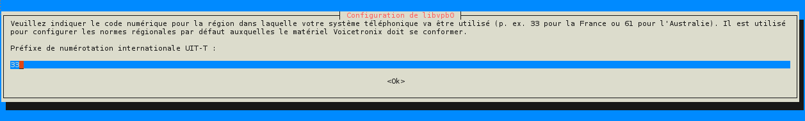
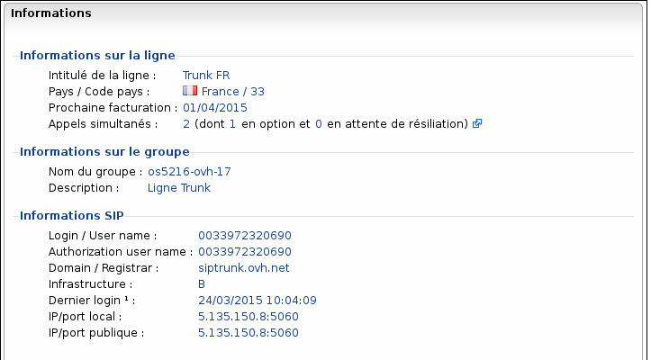

> [!warning]
> 
> OVH met à votre disposition des services dont la configuration, la gestion et la responsabilité vous incombent. Il vous revient de ce fait d'en assurer le bon fonctionnement.
>
> Nous mettons à votre disposition ce guide afin de vous accompagner au mieux sur des tâches courantes. Néanmoins, nous vous recommandons de faire appel à un prestataire spécialisé et/ou de contacter l'éditeur du service si vous éprouvez des difficultés. En effet, nous ne serons pas en mesure de vous fournir une assistance. Plus d'informations dans la section « Aller plus loin » de ce guide.
>

## Préambule {#préambule}

Asterisk est un IPBX Software gratuit et disponible sur Linux. Cet IPBX très puissant vous permet de gérer votre téléphonie d'entreprise et de créer des services personnalisés. Vous trouverez dans ce guide les étapes pour bien démarrer en configurant votre ligne [**SIP Trunk**](https://www.ovhtelecom.fr/telephonie/sip_trunk/){.external-link}, la **présentation** de vos **numérosAlias** et le **routage** des appels selon le **numéroappelé**.

**Sommaire :**

Niveau : Expert

------------------------------------------------------------------------

## Prérequis {#prérequis}

Pour réaliser les étapes proposées dans ce guide, il faut :

-   Un serveur avec Debian d'installé et un accès Internet.
-   Deux alias configurés en **[redirection DDI]({legacy}7536740)** vers le trunk.
-   Une ligne SIP Trunk. Pour en commander une : **<https://www.ovhtelecom.fr/telephonie/sip_trunk/>**

    (La configuration de gestion des numéros appelés ne fonctionne pas sur une ligne SIP.)

    Il faut également activer l'amélioration de la présentation du numéro sur le trunk via ces étapes :

<!-- -->

-   Connectez-vous à votre Espace Client OVH : <https://www.ovhtelecom.fr/espaceclient/>
-   Cliquez sur le lien "**Accéder à l'ancienne interface**".
-   Cliquez sur l'icône "**Téléphonie**".
-   Cliquez sur votre trunk.
-   Cliquez sur "**Téléphone**" dans le menu "**Navigation**".
-   Cliquez sur "**Codecs**".
-   Cliquez sur "**Gérer**".
-   Cochez la case "**Amélioration de la présentation du numéro appelé**".
-   Cliquez sur "**Valider**" pour confirmer la configuration.

{.thumbnail}

------------------------------------------------------------------------

## Installation {#installation}

Votre serveur est déjà installé. Dans ce guide, nous utilisons Debian 7 et partons du principe que vous avez déjà suivi et appliqué les recommandations de la partie **[sécurisation.](#Asterisk:configurationetutilisation-sécurisation)**

Pour installer Asterisk :

-   **Mettez à jour le cache des dépôts :**apt-get update
-   **Lancez l'installation d'Asterisk :**apt-get install asterisk

<!-- -->

```
root@vps123:~#apt-get update 
Réception de : 1 http://debian.mirrors.ovh.net wheezy Release.gpg [1 655 B] 
Réception de : 2 http://debian.mirrors.ovh.net wheezy Release [168 kB] 
Réception de : 3 http://debian.mirrors.ovh.net wheezy/main Sources [5 971 kB] 
Réception de : 4 http://debian.mirrors.ovh.net wheezy/main amd64 Packages [5 841 kB]
Réception de : 5 http://security.debian.org wheezy/updates Release.gpg [836 B] 
Réception de : 6 http://security.debian.org wheezy/updates Release [102 kB]
Réception de : 7 http://security.debian.org wheezy/updates/main Sources [169 kB] 
Réception de : 8 http://security.debian.org wheezy/updates/main amd64 Packages [293 kB]
Réception de : 9 http://security.debian.org wheezy/updates/main Translation-en [165 kB] 
Réception de : 10 http://debian.mirrors.ovh.net wheezy/main Translation-fr [751 kB] 
Réception de : 11 http://debian.mirrors.ovh.net wheezy/main Translation-en [3 848 kB] 
17,3 Mo réceptionnés en 7s (2 423 ko/s) 
Lecture des listes de paquets... Fait 

root@vps123:~#apt-get install asterisk
Lecture des listes de paquets... Fait 
Construction de l'arbre des dépendances 
Lecture des informations d'état... Fait 
Les paquets supplémentaires suivants seront installés : asterisk-config [...] 
0 mis à jour, 99 nouvellement installés, 0 à enlever et 0 non mis à jour. Il est nécessaire de prendre 71,6 Mo dans les archives. Après cette opération, 167 Mo d'espace disque supplémentaires seront utilisés. Souhaitez-vous continuer [O/n] ? O
```

Lors de l'installation, il vous est demandé d'**entrer** votre **préfixedenumérotation** : il faut **définir** le **préfixeinternational**. Par exemple, pour la **France**, le préfixe est **33**.

{.thumbnail}

L'installation terminée. Vérifiez le bon fonctionnement en lançant la **consoleAsterisk** via la commande **rasterisk** :

```
root@vps123:~# rasterisk 
Asterisk 1.8.13.1~dfsg1-3+deb7u3, Copyright (C) 1999 - 2012 Digium, Inc. and others.
Created by Mark Spencer <markster@digium.com> 
Asterisk comes with ABSOLUTELY NO WARRANTY; type 'core show warranty' for details. This is free software, with components licensed under the GNU General Public License version 2 and other licenses; you are welcome to redistribute it under certain conditions. Type 'core show license' for details.
========================================================================= 
Connected to Asterisk 1.8.13.1~dfsg1-3+deb7u3 currently running on vps131223 (pid = 13945) vps123*CLI>
```

------------------------------------------------------------------------

## Enregistrement de votre ligne {#enregistrement-de-votre-ligne}

La configuration de la ligne s'effectue dans le fichier **sip.conf** localisé dans **/etc/asterisk**.

Dans ce guide, nous partons d'un fichier vierge. Il est recommandé de sauvegarder le fichier d'origine afin de pouvoir revenir en arrière en cas de modifications.

-   Pour copier votre fichier : **cp /etc/asterisk/sip.conf /etc/asterisk/sip.conf.bak**
-   Pour ouvrir votre fichier sip.conf : **vim /etc/asterisk/sip.conf**

**Le fichier sip.conf utilisé :**

**sip.conf**

```ini 
[general] 
defaultexpiry=1800 ; Temps de register de la ligne. 
context=trunk-ovh ; Nom du context pour le trunk dans sip.conf 
bindport=5060 ; Port d'ecoute. 
bindaddr=0.0.0.0 ; Adresse d'ecoute. 
srvlookup=no ; Autoriser les appels via noms DNS 
register => 0033972320690:password@siptrunk.ovh.net ; Authentfication du trunk. La syntaxe est username:password@domain.tld 
disallow=all ; Gestion des codecs pour autoriser que le G7111 
allow=ulaw   ; Gestion des codecs pour autoriser que le G7111 
allow=alaw   ; Gestion des codecs pour autoriser que le G7111  

[trunk-ovh]  
type=friend ; Definit le type d'appels : peer = appels sortants / user = appels entrants / friend = les deux. 
host=siptrunk.ovh.net ; Nom du serveur SIP du trunk. 
context=ovh-sip ; Nom du contexte pour le trunk dans extensions.conf et gérer les appels entrants. 
language=fr ; Langue de la ligne. 
insecure=invite,port
username=0033972320690 ; Username du trunk. 
secret=password ; Mot de passe du trunk.
```

Pour vérifier que votre trunk est bien enregistré :

-   Entrez la commande **sip show registry** dans l'invite de commande Asterisk :

```
vps123*CLI> sip show registry 
Host                    dnsmgr  Username        Refresh State       Reg.Time 
siptrunk.ovh.net:5060   N       003397232069    1785    Registered  Tue, 24 Mar 2015 09:20:24
1 SIP registrations.
```

-   Vous pouvez vérifiez également dans le Manager :
    -   Connectez-vous à votre Espace Client OVH : <https://www.ovhtelecom.fr/espaceclient/>
    -   Cliquez sur le lien "**Accéder à l'ancienne interface**".
    -   Cliquez sur l'icône "**Téléphonie**".
    -   Cliquez sur votre "**Trunk**".
    -   Cliquez sur "**Gestion**" dans le menu "**Navigation**".
    -   Cliquez sur "**Informations générales**".

Vous obtenez alors l'information du REGISTER :

{.thumbnail}

------------------------------------------------------------------------

## Création et configuration des utilisateurs {#création-et-configuration-des-utilisateurs}

Dans ce guide, nous allons créer deux utilisateurs : **330** et **520**. Les utilisateurs sont à créer dans le fichier **sip.conf** :

**sip.conf**

```ini
[330] ; Numero de l'extension. 
username=330 ; Username pour l'auth. 
type=friend ; Definit le type d'appels : peer = appels sortants / user = appels entrants / friend = les deux. 
secret=password ; Mot de passe de l'extension. 
callerid="0033366725520" <0033366725520> ; Numero du DDI à présenter 
nat=yes ; L'extension est utilisee derriere un routeur utilisant le NAT. 
host=dynamic ; L'extension s'enregistre elle meme.
context=sortant-ovh ; Context a utiliser qui sera definit dans extensions.
conf language=fr ; Langue de l'extension.
        
[520]
username=520 
type=friend 
secret=password 
callerid="0033185450330" <0033185450330> 
nat=yes
host=dynamic 
context=sortant-ovh 
language=fr
```

Dans cette partie du fichier, l'utilisateur est créé et le numéro présenté est défini.

------------------------------------------------------------------------

### Configuration du dialplan {#configuration-du-dialplan}

Le dialplan est une partie importante : la stratégie de gestion des appels entrants et sortants y est définie. Par sécurité, dans le dialplan des appels sortants, seul les numéros de fixes (01 à 05 et 09) peuvent êtres appelés, ainsi que les numéros de mobiles. Le fichier contenant le dialplan est **extensions.conf** :

**extensions.conf**

```ini
[general] 
static=yes 
writeprotect=no 
autofallthrough=yes 
clearglobalvars=no
priorityjumping=no 

[globals] 

CONSOLE=Console/dsp 
IAXINFO=guest 
TRUNK=Zap/g2 
TRUNKMSD=1 

[sortant-ovh] ; Si un appel arrive sur 330 => Ca fait sonner l'extension 330. 
exten => 330,1,Dial(SIP/330,10,tr) 
exten => 330,2,HangUp() ; Si un appel arrive sur 520 => Ca fait sonner l'extension 520.
exten => 520,1,Dial(SIP/520,10,tr) 
exten => 520,2,HangUp() ; Sortir avec le trunk. On autorise que les appels sur les 01 > 07 et 09. 
exten => _0[1-7]XXXXXXXX,1,Dial(SIP/${EXTEN}@trunk-ovh) 
exten => _09XXXXXXXX,1,Dial(SIP/${EXTEN}@trunk-ovh) 

[ovh-sip] ;Redirection de l'alias 0366725520 vers l'extension 520. 
exten => 0366725520,1,Ringing(1) 
exten => 0366725520,2,Dial(SIP/520,10,tm) ;Redirection de l'alias 0185450330 vers l'extension 330. 
exten => 0185450330,1,Ringing(1) 
exten => 0185450330,2,Dial(SIP/330,10,tm) 
exten => s,1,Ringing(1) ; Attendre une seconde en faisant retentir la sonnerie du telephone de l'apellant 
exten => s,2,Dial(SIP/330,25,tm) ; L'appel est transfere sur le poste 330. Sans reponse apres 25 secondes il passe a l'Étape suivante 
exten => s,3,Hangup(16) ; La communication est termine
```

## Aller plus loin

Échangez avec notre communauté d'utilisateurs sur <https://community.ovh.com>.
