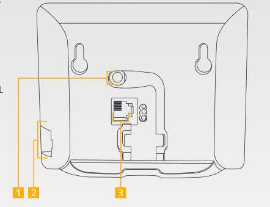
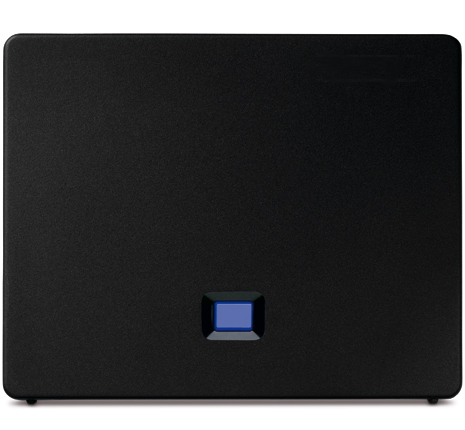
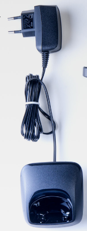

### Branchements sur la base DECT {#branchements-sur-la-base-dect}

La base des téléphones Gigaset doit être raccordée :

-   Électriquement grâce à l'alimentation fournie. (Repère **1**)
-   En Ethernet vers votre routeur (Repère **2**)
-   Optionnel : la base peut être raccordée sur une ligne analogique via le port RJ11. (Repère **3**)

{.thumbnail}

Pour vérifier que votre base est bien connectée au réseau et électriquement le bouton centrale de la base s'allume en **Bleu**.

{.thumbnail}

### Branchements sur la base de chargement {#branchements-sur-la-base-de-chargement}

La base de chargement des combinés se branche simplement sur une prise électrique. Il suffit de poser le combiné dessus pour que celui-ci se mette en charge.{.thumbnail}

