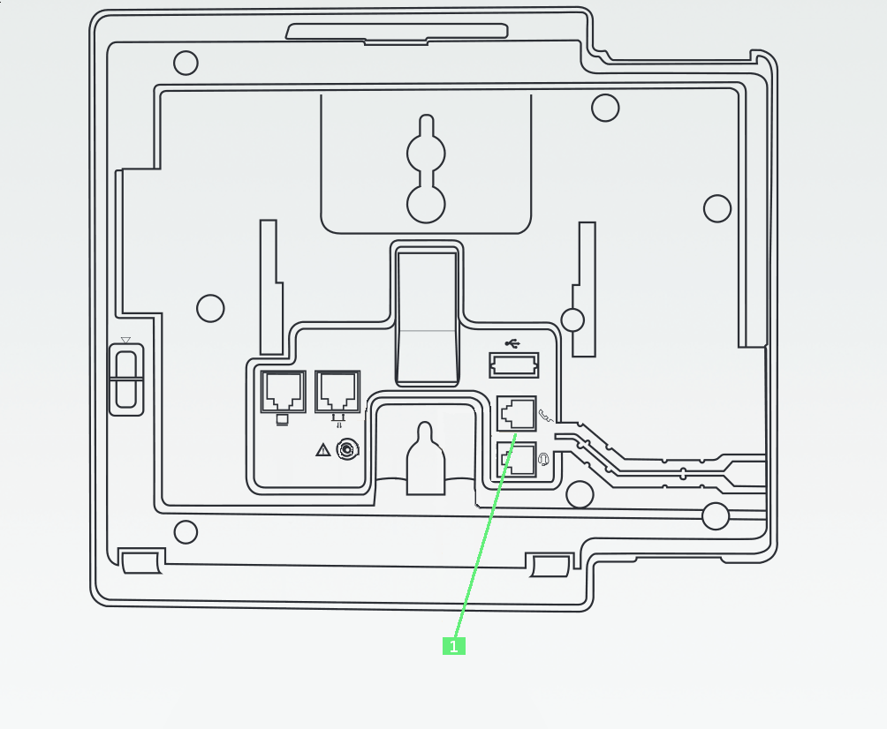

------------------------------------------------------------------------

**Sommaire :**

------------------------------------------------------------------------

### Branchements du poste {#branchements-du-poste}

*{.thumbnail}*1- Ce port RJ445 sert à brancher le poste sur votre réseau. Il faut brancher le câble Ethernet venant de votre box sur ce port.

2- Sur ce port branchez l'alimentation électrique du poste.

------------------------------------------------------------------------

### Branchement du combiné {#branchement-du-combiné}

{.thumbnail}

La prise RJ9 du combiné se branche sur le port identifié "**1**" sur le schéma.

------------------------------------------------------------------------

### Branchement d'une extension de touche {#branchement-dune-extension-de-touche}

{.thumbnail}

L'extension de touche se raccorde sur le port 12 Broches situé sur le côté du téléphone, représenté par un "**1**" sur le schéma.

