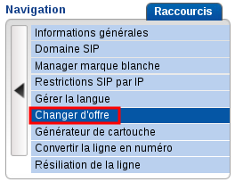
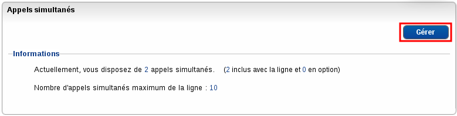
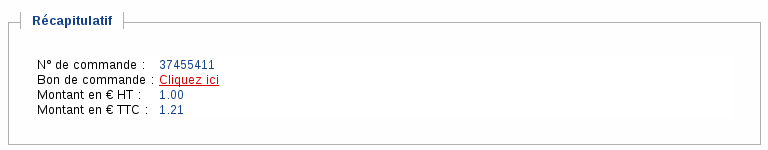

### Préambule {#préambule}

Il est possible de modifier à votre convenance les options de votre ligne VoIP ainsi que l'offre souscrite.

Le changement d'offre et les différentes options possibles sont décrits ci-dessous.

**Sommaire :**

Niveau : Débutant

------------------------------------------------------------------------

### Changer d'offre VoIP {#changer-doffre-voip}

Votre forfait ne convient plus à vos besoins ? Vous souhaitez ajouter ou retirer une option d'appel incluse vers les mobiles ? Ceci est possible en seulement quelques clics via le Manager Téléphonie.

-   Sélectionnez la ligne dont vous souhaitez modifier le forfait puis cliquez sur "**Gestion**" :

{.thumbnail}

-   Cliquez ensuite sur "**Changerd'offre**" :

{.thumbnail}

-   Cliquez sur "**Modifier**" :

{.thumbnail}

S'ouvre alors le menu permettant de choisir l'offre vers laquelle vous pouvez migrer votre ligne.

-   Après avoir fait votre choix parmi les offres disponibles, il vous suffit de cliquer sur "**J'ai lu et j'accepte les contrats OVH avant de valider**" puis de cliquer sur "**Valider**".

{.thumbnail}

Le changement d'offre sera effectif lors du prochain renouvellement de la ligne. Le renouvellement se fait automatiquement à chaque début de mois lors de la facturation.

Une offre Entreprise ne peut évoluer vers une offre Individuelle.

### Changer le nombre d'appels simultanés {#changer-le-nombre-dappels-simultanés}

Vos besoins en nombre d'appels simultanés ont changé, vous souhaitez en ajouter ou en supprimer ? Rendez-vous alors sur votre Manager Téléphonie puis sélectionnez la ligne dont vous souhaitez modifier le nombre d'appels simultanés.

-   Cliquez sur "**Gestion des appels**" :

{.thumbnail}

-   Cliquez sur "**Appels simultanés**" :

{.thumbnail}

-   Puis sur "**Gérer**" :

{.thumbnail}

S'ouvre alors la fenêtre permettant de choisir le nombre d'appels simultanés dont vous souhaitez disposer sur la ligne. Pour choisir, ajustez simplement le curseur sur la ligne horizontale.

-   Après avoir fait votre choix, il vous suffit de cliquer sur "**J'ai lu et j'accepte les contrats OVH**" avant de valider puis de cliquer sur "**Commander**".

{.thumbnail}

L'ajout d'un appel simultané est facturé 1 € HT par mois. De ce fait, lors de l'ajout d'appels simultanés, un bon de commande est généré et requiert un paiement manuel. Cliquez alors sur "**Cliquezici**" afin d'afficher le bon de commande et de le régler.

{.thumbnail}

L'option ne sera prise en compte qu'après validation du paiement dudit bon de commande.

Le retrait d'appel simultané supplémentaire est bien entendu gratuit.

------------------------------------------------------------------------

