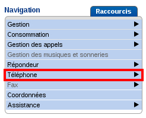
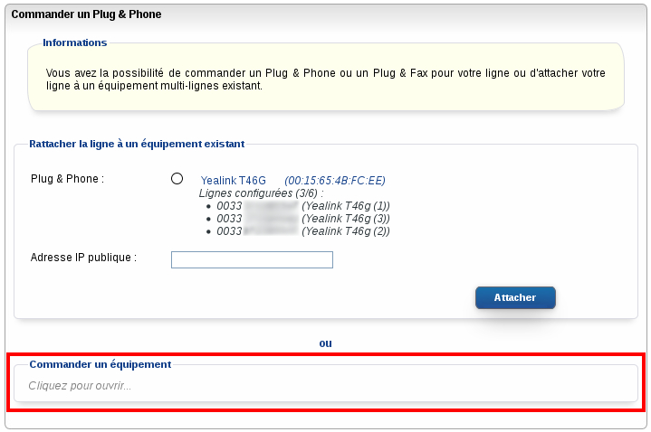
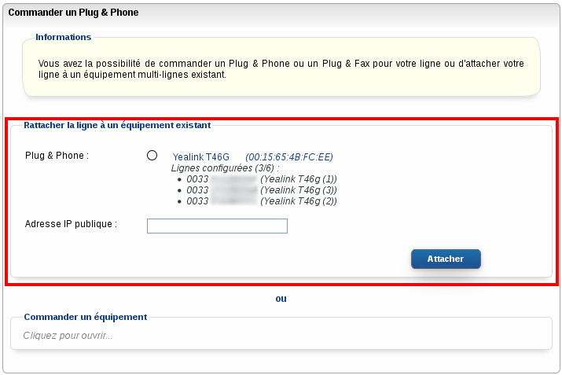

Préambule

Votre téléphone ne correspond plus à vos besoins ? Vous souhaitez en changer, le rendre ou encore commander un téléphone pour l'associer à une ligne qui ne disposait d'aucun terminal auparavant ?

Voyons comment mettre cela en œuvre dans ce guide.

**Sommaire :**

Niveau : Débutant

------------------------------------------------------------------------

### Commander un téléphone {#commander-un-téléphone}

L'opération se déroule sur le Manager Téléphonie.

Sélectionnez dans la liste la ligne pour laquelle vous souhaitez disposer d'un téléphone, puis cliquer sur "**Téléphone**" dans le menu de Navigation :

{.thumbnail}

Cliquez ensuite sur "**Commander un Plug & Phone**", puis en-dessous de "**Commander un équipement**", cliquez sur "**Cliquez pour ouvrir...**"

{.thumbnail}

{.thumbnail}

Sélectionnez le téléphone que vous souhaitez commander puis cliquez sur "**Suivant**".

L'envoi est facturé 9.99 € HT. Il vous faut maintenant choisir le mode d'expédition.

{.thumbnail}

**Un envoi par DHL** utilisera l'adresse de livraison située dans la section "Livraison". Par défaut, il s'agit de l'adresse du nic-handle de connexion au Manager.

**Un envoi par Mondial Relay** déroulera un plan de votre ville et affichera la liste des points relais les plus proches.

Sélectionnez alors votre point relais et cliquez sur "**Suivant**".

Un résumé s'affiche, précisant le choix de votre téléphone, le choix du mode de livraison ainsi que le coût.

En cochant "**J'ai lu et j'accepte le contrat**" puis en cliquant sur "**Valider**", la commande sera prise en compte et le téléphone sera expédié sous 24 heures ouvrées.

{.thumbnail}

------------------------------------------------------------------------

### Changer un téléphone {#changer-un-téléphone}

L'opération se déroule sur le Manager Téléphonie.

Sélectionnez dans la liste la ligne pour laquelle vous souhaitez disposer d'un téléphone et cliquez sur "**Téléphone**" dans le menu de Navigation :

{.thumbnail}

Cliquez ensuite sur "**Changer de téléphone Plug & Phone**".

{.thumbnail}

Sélectionnez le téléphone que vous souhaitez commander et cliquez sur "**Suivant**".

{.thumbnail}

L'envoi est facturé 9.99 € HT. Il vous faut maintenant choisir le mode d'expédition.

{.thumbnail}

**Un envoi par DHL** utilisera l'adresse de livraison située dans la section "Livraison". Par défaut, il s'agit de l'adresse du nic-handle de connexion au Manager.

**Un envoi par Mondial Relay** déroulera un plan de votre ville et affichera la liste des points relais les plus proches.

Sélectionnez alors votre point relais et cliquez sur "**Suivant**".

Un résumé s'affiche, précisant le choix de votre téléphone, du mode de livraison ainsi que le coût.

En cochant "**J'ai lu et j'accepte le contrat**" puis en cliquant sur "**Valider**", la commande sera prise en compte et le téléphone sera expédié sous 24 heures ouvrées.

{.thumbnail}

------------------------------------------------------------------------

### Associer une ligne à un téléphone {#associer-une-ligne-à-un-téléphone}

Certains téléphones permettent d'y associer plusieurs lignes. Pour associer une ligne à un téléphone, il faut au préalable que la ligne ne soit associée à aucun téléphone.

Pour ce faire, rendez-vous dans le Manager Téléphonie puis cliquez sur "**Téléphone**".

{.thumbnail}

Cliquez ensuite sur "**Commander un Plug & Phone**" :

{.thumbnail}

Si l'un de vos téléphones est compatible avec la fonction, il s'affichera dans la partie haute de l'écran suivant. Sélectionnez alors le téléphone.

Son IP publique s'affichera automatiquement suite à la sélection.

{.thumbnail}

Une fenêtre de confirmation s'affiche, cliquez alors sur "**Valider**".

{.thumbnail}

L'opération sera réalisée dans les 5 minutes après avoir cliqué sur "**Valider**".

------------------------------------------------------------------------

