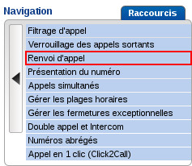
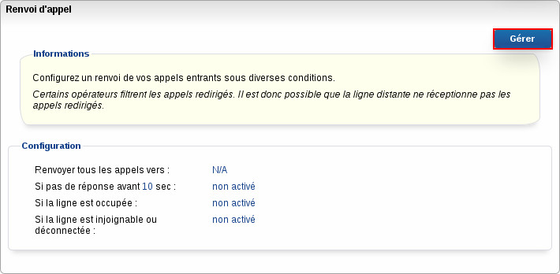

**Préambule**

Voyons dans ce guide comment configurer les renvois d'appels et s'assurer ainsi de ne jamais perdre d'appel.

**Sommaire :**

****

****

Niveau : Débutant

------------------------------------------------------------------------

### Procédure {#procédure}

Rendez-vous dans le **Manager**.

Sélectionnez la ligne que vous souhaitez configurer.

Cliquez sur "**Gestion des appels**".

{.thumbnail}

Cliquez sur "**Renvoi d'appels**" puis sur "**Gérer**".

{.thumbnail}

{.thumbnail}

Faites votre choix parmi les quatre types de renvois disponibles :

{.thumbnail}

-   **Renvoyer tous les appels vers** : lorsque cette option est cochée, l'intégralité des appels sont renvoyés.
-   **Si pas de réponse avant X sec** : lorsque cette option est cochée, les appels sont renvoyés en cas de non réponse sur le téléphone appelé.
-   **Si la ligne est occupée** : lorsque cette option est cochée, les appels sont renvoyés si la ligne est occupée, dans le cas où vous êtes déjà en communication et qu'un deuxième, voire un troisième appel sonne sur la ligne.
-   **Si la ligne est injoignable ou déconnectée** : lorsque cette option est cochée, les appels sont renvoyés dans le cas où notre serveur de téléphonie ne détecte aucune connexion de la ligne, dans le cas d'une coupure de connexion internet par exemple.

Puis, après avoir fait votre choix de renvoi, sélectionnez le service vers lequel renvoyer l'appel :

{.thumbnail}

-   **Messagerie** : il s'agit de la boîte vocale. Vous pouvez choisir la boîte vocale de la ligne en question ou d'une autre ligne présente dans votre parc téléphonique.
-   **Fax** : il s'agit du service fax. Cette fonctionnalité est réservée aux offres fax.
-   **Numéro** : cette fonctionnalité permet de renvoyer l'appel vers une autre ligne parmi les lignes de votre parc téléphonique.

Dans le cadre d'un forfait illimité vers les mobiles, les appels renvoyés vers un numéro mobile seront considéré hors forfait.

Si, en revanche, vous disposez d'un forfait de X heures vers les mobiles, les appels renvoyés vers un numéro mobile seront décomptés du forfait

Validez ensuite en cliquant sur "**Valider**". Votre configuration sera alors prise en compte dans la minute qui suit.

{.thumbnail}

------------------------------------------------------------------------

