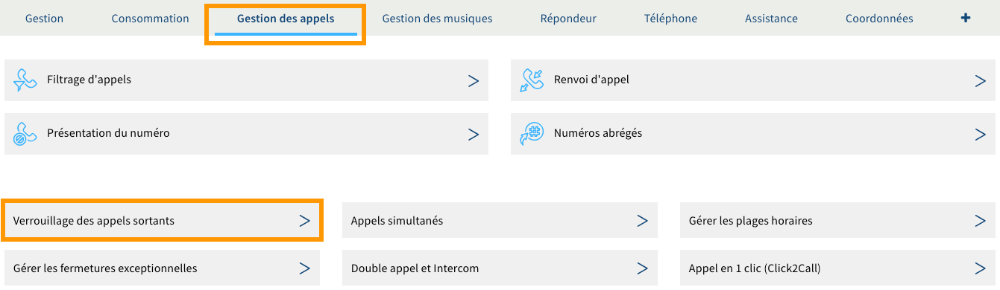

**Dernière mise à jour le 21/06/2022**

## Objectif

Votre ligne SIP OVHcloud vous permet de recevoir et d'émettre des appels. Pour diverses raisons, comme vos disponibilités, vous pouvez être amené à devoir filtrer et/ou renvoyer les appels entrants et sortants. Ceci passe par la mise en place de trois solutions : le verrouillage des appels sortants, les renvois d'appel et le filtrage d'appels.

**Découvrez comment filtrer et renvoyer les appels entrants et sortants de votre ligne SIP OVHcloud.**

## Prérequis

- Disposer d'une [ligne SIP OVHcloud](https://www.ovhtelecom.fr/telephonie/voip/){.external}.
- Disposer d'un accès à la gestion de la ligne SIP concernée depuis votre [espace client OVHcloud](https://www.ovh.com/auth/?action=gotomanager&from=https://www.ovh.com/fr/&ovhSubsidiary=fr){.external}, partie `Télécom`{.action}.

{.thumbnail}

## En pratique

Il existe trois solutions pour filtrer et renvoyer les appels entrants et sortants de votre ligne SIP :

|Solutions|Description|
|---|---|  
|Verrouillage des appels sortants|Restreint l'utilisation de votre ligne aux appels entrants uniquement ; ceci verrouille la possibilité de passer un appel sortant. L'utilisation d'un code vous permettra de passer outre ce blocage en cas de nécessité. Les appels d'urgence restent bien évidemment accessibles, même si le verrouillage est actif.|
|Renvoi d'appel|Met en place un renvoi d'appel, dont vous pourrez définir le déclenchement ainsi que la destination.|
|Filtrage d'appels|Définit des listes blanches ou noires, afin d'autoriser uniquement certains correspondants à vous joindre ou, au contraire, de rejeter automatiquement les appels en provenance de certains numéros.|

Poursuivez la lecture de cette documentation en fonction de la solution que vous souhaitez activer.

- [Activer le verrouillage des appels sortants](#verrouillage)
- [Activer le renvoi d'appel](#renvoi)
- [Activer le filtrage d'appels](#filtrage)

### Activer le verrouillage des appels sortants 

Pour démarrer la manipulation, connectez-vous à votre [espace client OVHcloud](https://www.ovh.com/auth/?action=gotomanager&from=https://www.ovh.com/fr/&ovhSubsidiary=fr){.external}, partie Télécom. Cliquez sur `Téléphonie`{.action} puis sélectionnez la ligne SIP concernée.

Positionnez-vous sur l'onglet `Gestion des appels`{.action} et cliquez sur `Verrouillage des appels sortants`{.action}.

{.thumbnail}

Sur la page qui s'affiche, cochez la case `Activer le verrouillage`{.action} et renseignez un code à 4 chiffres. Celui-ci vous permettra d'émettre tout de même des appels sortants depuis la ligne que vous verrouillez.

Vous avez la possibilité d'appliquer ce verrouillage à plusieurs lignes grâce au bouton `Appliquer à plusieurs lignes`{.action}. Cliquez finalement sur le bouton `Valider`{.action} pour appliquer la nouvelle configuration.

{.thumbnail}

### Activer le renvoi d'appel 

> [!warning]
> Le renvoi d'appel est différent du transfert d'appel. Ce dernier consiste à transférer un appel en cours vers un autre destinataires. Pour connaître les méthodes de transfert d'appel, consultez la documentation constructeur de votre téléphone.

> [!primary]
>
> Si vous souhaitez renvoyer les appels **en fonction de plages horaires**, consultez notre guide « [Configurer des plages horaires et des fermetures exceptionnelles sur une ligne](../configurer-plages-horaires-fermetures-exceptionnelles-ligne/)».
>

Pour démarrer la manipulation, connectez-vous à votre [espace client OVHcloud](https://www.ovh.com/auth/?action=gotomanager&from=https://www.ovh.com/fr/&ovhSubsidiary=fr){.external}, partie Télécom. Cliquez sur `Téléphonie`{.action} puis sélectionnez la ligne SIP concernée.

Positionnez-vous sur l'onglet `Gestion des appels`{.action} et cliquez sur `Renvoi d'appel`{.action}.

{.thumbnail}

Sur la page qui s'affiche, vous avez la possibilité de mettre en place un renvoi d'appel selon quatre configurations :

|Configurations|Description|
|---|---|  
|Renvoi de tous les appels|L'intégralité des appels est renvoyée de façon inconditionnelle.|
|Renvoi quand il n'y a pas de réponse|Les appels sont renvoyés en cas de non-réponse sur le téléphone contacté. Vous devez définir le temps avant que l'appel ne soit renvoyé.|
|Renvoi quand la ligne est occupée|Les appels sont renvoyés si la ligne est occupée (c'est-à-dire lorsque tous vos appels simultanés sont en cours).|
|Renvoi quand la ligne est injoignable ou déconnectée|Les appels sont renvoyés dans le cas où notre serveur de téléphonie ne détecte aucune connexion vers votre ligne (par exemple, lors d'une interruption de votre connexion internet).|

Pour activer une configuration, cochez la case à côté de cette dernière puis sélectionnez où renvoyer l'appel ainsi que le numéro correspondant.

|Renvoyer vers un|Description|
|---|---|  
|Fax|Il s'agit du service fax. Cette fonctionnalité est réservée aux offres Fax.|
|Numéro hors OVHcloud|Permet de renvoyer l'appel vers un numéro hors OVHcloud. Sachez que les communications vers un numéro non enregistré chez OVHcloud seront décomptées de votre forfait ou facturées selon le [forfait auquel vous avez souscrit](https://www.ovhtelecom.fr/telephonie/voip/){.external} (voir la note en bas de page) et [les tarifs en vigueur](https://www.ovhtelecom.fr/telephonie/decouvrez/tarifs_telephonie.xml){.external}.|
|Répondeur|Permet de renvoyer l'appel vers la boîte vocale d'une des lignes présentes dans votre parc téléphonique.|
|Téléphone|Permet de renvoyer l'appel vers une autre ligne présente dans votre parc téléphonique.|

Vous avez la possibilité d'appliquer vos choix de configuration à plusieurs lignes, grâce au bouton `Appliquer à plusieurs lignes`{.action}. Cliquez enfin sur le bouton `Valider`{.action} pour terminer l'opération.

> [!primary]
>
> Si vous disposez d'un grand nombre de lignes et/ou de numéros, vous avez la possibilité de réduire les résultats qui s'affichent dans les champs de recherche. Pour cela, appliquez un filtrage via la section « Filtrer les numéros » à droite de la page.
>

{.thumbnail}

### Activer le filtrage d'appels 

Pour démarrer la manipulation, connectez-vous à votre [espace client OVHcloud](https://www.ovh.com/auth/?action=gotomanager&from=https://www.ovh.com/fr/&ovhSubsidiary=fr){.external}, partie Télécom. Cliquez sur `Téléphonie`{.action} puis sélectionnez la ligne SIP concernée.

Positionnez-vous sur l'onglet `Gestion des appels`{.action} et cliquez sur `Filtrage d'appels`{.action}.

{.thumbnail}

Sur la page qui s'affiche, vous avez la possibilité de mettre en place un filtrage s'appliquant aux appels entrants et/ou sortants selon cinq configurations :

|Configurations|Description|
|---|---|  
|Filtrage appel entrant|Permet de filtrer les appels reçus sur votre ligne selon une liste blanche ou noire que vous devez configurer.|
|Filtrage appel sortant|Permet de filtrer les appels émis depuis votre ligne selon une liste blanche ou noire que vous devez configurer.|
|Rejet des appels anonymes|Permet de rejeter automatiquement les appels entrants provenant d'un correspondant anonyme.|
|Ne pas déranger|Permet de bloquer automatiquement la réception des appels entrants sur votre ligne et d'indiquer aux interlocuteurs qui vont contactent que vous ne souhaitez pas être dérangé par le biais d'un message vocal (du type : « votre correspondant ne souhaite pas être dérangé, merci de le rappeler ultérieurement »).|
|Abonné absent|Permet de bloquer automatiquement la réception des appels entrants sur votre ligne et d'indiquer aux interlocuteurs qui vont contactent que vous êtes absent par le biais d'un message vocal (du type : « votre correspondant est momentanément absent, merci de le rappeler ultérieurement »).|

Pour activer ou désactiver une configuration parmi le « rejet des appels anonymes », « ne pas déranger » et l'« abonné absent », cochez ou décochez la case à côté de la configuration souhaitée.

Concernant le « filtrage appel entrant » et le « filtrage appel sortant », sélectionnez dans le menu déroulant si vous souhaitez filtrer les appels en fonction d'une liste blanche ou d'une liste noire. Le système des listes fonctionne de la manière suivante :

|Appel|Liste|Description|
|---|---|---|
|Lors d'un appel entrant|Liste blanche|Seuls les numéros ou les tranches de numéros inscrits dans la liste sont autorisés à vous contacter.|
|Lors d'un appel entrant|Liste noire|Les numéros ou les tranches de numéros inscrits dans la liste ne peuvent plus vous contacter.|
|Lors d'un appel sortant|Liste blanche|Seuls les numéros ou les tranches de numéros inscrits dans la liste peuvent être contactés depuis votre ligne.|
|Lors d'un appel sortant|Liste noire|Les numéros ou les tranches de numéros inscrits dans la liste ne peuvent plus être contactés depuis votre ligne.|

{.thumbnail}

Si vous avez décidé d'activer un filtrage d'appels entrants et/ou sortants, vous devez à présent configurer de nouveaux filtrages dans la ou les listes que vous avez sélectionnées. 

Pour cela, toujours sur la même page, reportez-vous aux parties « Configurer de nouveaux filtrages » et « Configuration actuelle ». La première vous permet d'ajouter de nouveaux filtrages à vos listes et la seconde de consulter la configuration actuellement en place dans ces dernières.

Concernant la configuration de nouveaux filtrages, trois moyens existent :

|Configurations|Description|
|---|---|  
|Ajout en mode manuel|Vous devrez remplir les informations demandées dans la partie « Configurer de nouveaux filtrages » selon ce que vous souhaitez mettre en place, puis cliquer sur le bouton `Ajouter`{.action}. Ce mode vous permet également de filtrer les « services OVHcloud » (tels que le service de messagerie).|
|Utiliser un assistant|L'assistant vous permet de créer des filtres sur des types de numéros (comme les numéros spéciaux). Ce filtre sera ajouté à la liste que vous avez sélectionnée lors de la complétion de l'assistant. Pour accéder à celui-ci, cliquez sur `Assistant`{.action}.|
|Importer un CSV|Vous devrez sélectionner sur votre propre machine le fichier CSV contenant les filtres que vous souhaitez importer. Pour accéder à l'import, cliquez sur `Import CSV`{.action}.|

Enfin, dans la partie « Configuration actuelle », vous pouvez visualiser les filtres en place sur vos listes mais aussi les supprimer. Pour cela, sélectionnez un ou plusieurs filtres puis cliquez sur le bouton `Supprimer le(s) filtre(s) sélectionné(s)`{.action}.

> [!warning]
>
> Lors de vos paramétrages, pensez à autoriser dans vos listes les « services OVHcloud » (tels que le service de messagerie) si vous souhaitez toujours y accéder.
>

{.thumbnail}

## Aller plus loin

[Configurer des plages horaires et des fermetures exceptionnelles sur une ligne](../configurer-plages-horaires-fermetures-exceptionnelles-ligne/)

Échangez avec notre communauté d'utilisateurs sur <https://community.ovh.com>.
