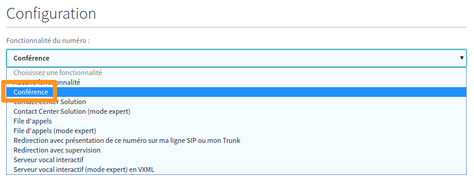
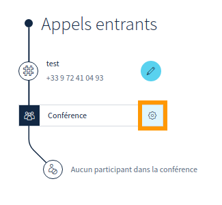
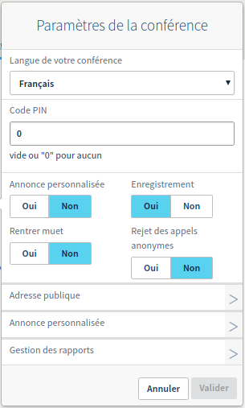
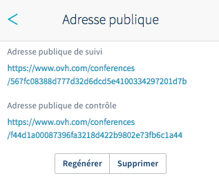
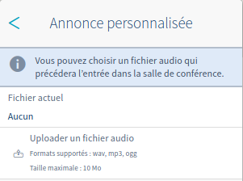
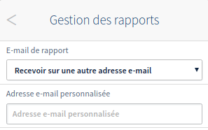

**Dernière mise à jour le 11/06/2018**

## Objectif

La conférence permet à toutes les personnes composant un numéro donné d’être en communication simultanément. Différentes fonctionnalités sont disponibles : protéger la conférence par un code, définir une annonce personnalisée, enregistrer les participants et recevoir un rapport par e-mail à la fin de celle-ci. Une interface spécifique vous propose également de suivre en temps réel les discussions des participants, mais aussi de gérer leur audio et leur micro.

**Ce guide vous explique comment créer et gérer des conférences téléphoniques.**

## Prérequis

- Être connecté à l'[espace client OVH](https://www.ovhtelecom.fr/manager/#/){.external} dans la partie `Téléphonie`{.action}.
- Avoir créé un [numéro](https://www.ovhtelecom.fr/telephonie/numeros/){.external} (un numéro porté ou un alias).

## En pratique

### Configurer la conférence

Une fois connecté dans l'[espace client OVH](https://www.ovhtelecom.fr/manager/#/){.external} partie `Téléphonie`{.action}, choisissez le numéro à configurer, puis `Configuration du numéro`{.action}. Choisissez ensuite `Modifier le type de numéro`{.action} et dans la liste déroulante, sélectionnez `Conférence`{.action}, puis validez.

{.thumbnail}

### Gérer la conférence

Toujours dans la section `Configuration du numéro`{.action}, vous verrez apparaître une conférence avec une roue crantée pour le paramétrage.

{.thumbnail}

- Fenêtre générale

{.thumbnail}

|Paramètre|Description|
|---|---|
|Langue de votre conférence|Permet de définir la langue des voix et des annonces dans la conférence (français, anglais, allemand, espagnol ou russe).|
|Code PIN|Permet de définir un code à entrer pour accéder à la conférence. Aucun code ne sera demandé si vous laissez ce champ vide.|
|Annonce personnalisée|Permet de jouer un son avant l’arrivée d'un contact dans la conférence ou la saisie du code PIN.|
|Enregistrement|Permet d’enregistrer la conférence (minimum deux participants). Vous recevrez le fichier d’enregistrement par e-mail avec le rapport de la conférence.|
|Rentrer muet|Permet d’arriver dans la chambre avec le micro désactivé.|
|Rejet des appels anonymes|Les appels anonymes vers cette conférence seront rejetés.|

- `Adresse publique`{.action}

{.thumbnail}

|Paramètre|Description|
|---|---|
|Adresse publique de suivi|Cette adresse permet d’accéder aux informations de la conférence (son code PIN, les numéros appelants, les lignes qui parlent et le temps de connexion).|
|Adresse publique de contrôle|Cette adresse permet de gérer la conférence : bloquer l’accès à celle-ci ou mettre en sourdine (couper le son d’un membre de la conférence, le rendre muet ou l'expulser).|
|Régénérer/Supprimer|Vous permet de générer à nouveau ou de supprimer les adresses de suivi.|

- `Annonce personnalisée`{.action}

Pensez à valider l’option `Activer l’annonce personnalisée`{.action}, expliquée précédemment dans « Fenêtre générale », pour prendre en compte le nouveau fichier.

{.thumbnail}

|Paramètre|Description|
|---|---|
|Fichier actuel|Vous donne le nom du fichier son actuellement en place.|
|Uploader un fichier audio|Vous permet de définir le fichier son de votre choix qui précédera l’entrée d'un membre dans la salle de conférence.|

- `Gestion des rapports`{.action}

{.thumbnail}

|Paramètre|Description|
|---|---|
|E-mail de rapport|Vous avez le choix entre ne recevoir aucun rapport, envoyer le rapport sur une adresse e-mail de votre choix ou bien sûr sur celle de votre identifiant client (contact administrateur).|
|Adresse mail personnalisée|Ce champ s’affiche lorsque vous choisissez de recevoir le rapport sur l’adresse de votre choix afin de préciser quelle adresse va recevoir le rapport.|

## Aller plus loin

Échangez avec notre communauté d'utilisateurs sur <https://community.ovh.com>.