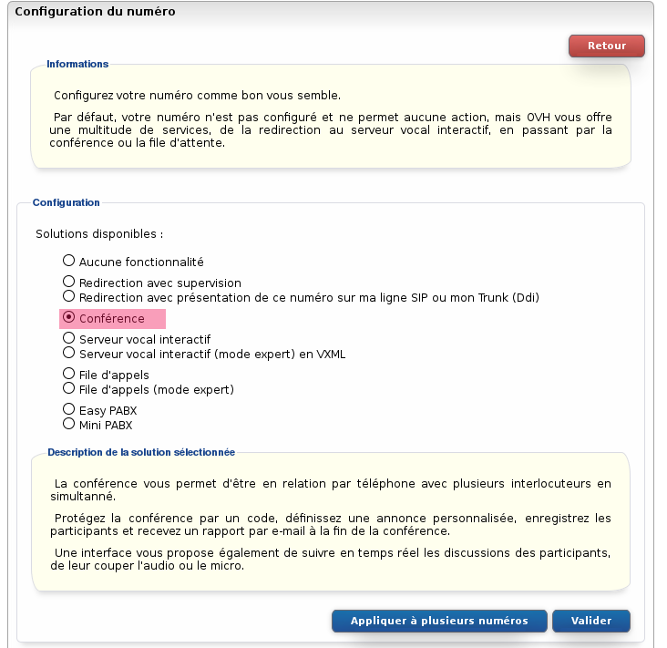
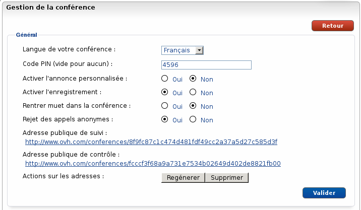
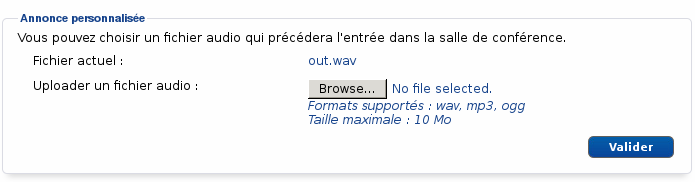
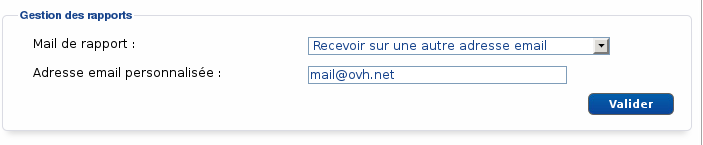

### Préambule {#préambule}

La conférence permet à toutes les personnes composant un numéro donné d'être en communication simultanément. Protégez la conférence par un code, définissez une annonce personnalisée, enregistrez les participants et recevez un rapport par e-mail à la fin de la conférence. Une interface vous propose également de suivre en temps réel les discussions des participants, de gérer leur audio et leur micro.

{.thumbnail}

**Sommaire :**

Niveau : Débutant

------------------------------------------------------------------------

### Prérequis {#prérequis}

La conférence nécessite **seulement** un numéro **alias** pour fonctionner.

------------------------------------------------------------------------

### Configurer {#configurer}

Pour configurer la conférence sur le numéro :

-   Connectez-vous à votre Espace Client OVH : <https://www.ovhtelecom.fr/espaceclient/>
-   Cliquez sur le lien "**Accéder à l'ancienne interface**".
-   Cliquez sur l'icône "**Téléphonie**".
-   Cliquez sur l'onglet "**Numéro**".
-   Cliquez sur le **numéro** à configurer.
-   Cliquez sur "**Configuration du numéro**" dans le menu "**Navigation**".
-   Cliquez sur "**Modifier le type de numéro**".
-   Cliquez sur le bouton "**Gérer**".
-   Sélectionnez dans la liste "**Conférence**".
-   Cliquez sur le bouton "**Valider**" pour appliquer la configuration.

{.thumbnail}

------------------------------------------------------------------------

### Utilisation {#utilisation}

Pour gérer la conférence :

-   Connectez-vous à votre Espace Client OVH : <https://www.ovhtelecom.fr/espaceclient/>
-   Cliquez sur le lien "**Accéder à l'ancienne interface**".
-   Cliquez sur l'icône "**Téléphonie**".
-   Cliquez sur l'onglet "**Numéro**".
-   Cliquez sur le **numéro** à configurer.
-   Cliquez sur "**Configuration du numéro**" dans le menu "**Navigation**".
-   Cliquez sur "**Conférence téléphonique**".

Dans la partie "**Général**" :

-   **Langue de votre conférence**: permet de définir la langue des voix et des annonces dans la conférence (français, anglais, allemand, espagnol ou russe).
-   **Code PIN**: permet de définir un code à entrer pour accéder à la conférence. Aucun code ne sera demandé si vous laissez le champ vide.
-   **Activer l'annonce personnalisée**: permet de jouer un son avant l'arrivée dans la conférence ou la saisie du code PIN.
-   **Activer l'enregistrement**: permet d'enregistrer la conférence (minimum deux participants). Vous recevrez le fichier d'enregistrement par mail avec le rapport de la conférence.

Les enregistrements sont disponibles à partir de **deux participants** dans la salle. La durée maximum d'un enregistrement est de **sept heures**.

-   **Rentrer muet dans la conférence**: permet d'arriver dans la chambre avec le micro désactivé.
-   **Rejet des appels anonymes**: Les appels anonymes vers cette conférence seront rejetés.
-   **Adresse publique de suivi**: Cette adresse permet d'accéder aux informations de la chambre (le code PIN de la chambre, les numéros appelants, les lignes qui parlent et le temps de connexion).
-   **Adresse publique de contrôle**: Cette adresse permet de gérer la conférence : bloquer l'accès à la chambre, mettre en sourdine (couper le son d'un membre de la conférence, rendre un membre muet ou expulser un membre).
-   **Actions sur les adresses**: Vous permet de générer à nouveau ou de supprimer les adresses de suivi.
-   .

{.thumbnail}

Dans la partie "**Annonce personnalisée**" :

Pensez à valider l'option "**Activer l'annonce personnalisée**" pour prendre en compte le nouveau fichier.

-   **Fichier actuel**: vous donne le nom du fichier son actuellement en place.
-   **Uploader un fichier audio :**vous permet de définir le fichier son de votre choix qui précédera l'entrée dans la salle de conférence.

{.thumbnail}

Dans la partie "Gestion des rapports" :

-   **Mail de rapport** : Vous avez le choix de ne recevoir aucun rapport, d'envoyer le rapport sur une adresse e-mail de votre choix ou bien sûr sur celle de votre NIC.
-   **Adresse mail personnalisée**: Ce champ s'affiche lorsque vous choisissez de recevoir le rapport sur l'adresse de votre choix.

{.thumbnail}

------------------------------------------------------------------------

### API {#api}

Des API sont disponibles pour le mode conférence. Vous trouverez le détail dans le guide des **[API Téléphonie]({legacy}7536730)**.

------------------------------------------------------------------------

