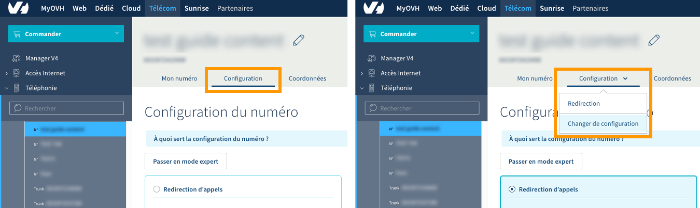
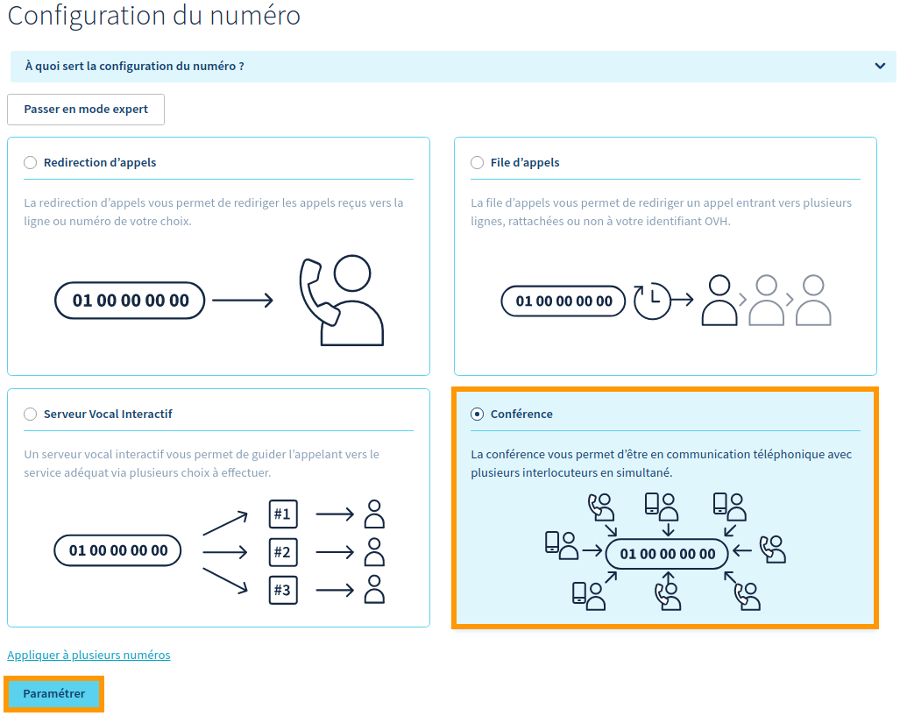
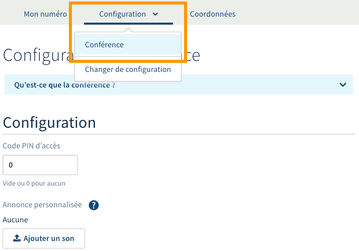
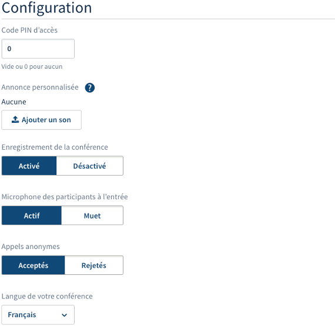
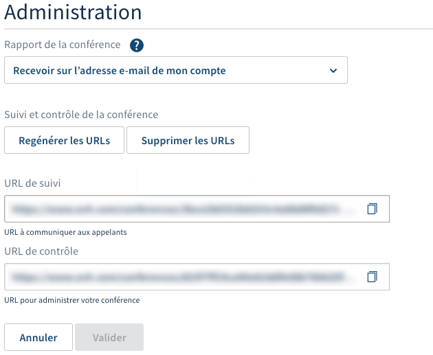

**Dernière mise à jour le 24/01/2019**

## Objectif

La conférence permet à toutes les personnes composant un numéro donné d’être en communication simultanément. Différentes fonctionnalités sont alors disponibles : protéger la conférence par un code, définir une annonce personnalisée, enregistrer les participants et recevoir un rapport par e-mail à la fin de celle-ci. Une interface spécifique vous propose également de suivre en temps réel les discussions des participants, mais aussi de gérer leur audio et leur micro.

**Apprenez à gérer des conférences téléphoniques avec votre numéro OVH.**

## Prérequis

- Avoir créé un [numéro](https://www.ovhtelecom.fr/telephonie/numeros/){.external} (porté ou un alias).
- Être connecté à l'[espace client OVH](https://www.ovhtelecom.fr/manager/#/){.external} dans la partie `Téléphonie`{.action}.

## En pratique

### Étape 1 : configurer le numéro en tant que conférence

Pour débuter la manipulation, connectez-vous à votre [espace client OVH](https://www.ovhtelecom.fr/manager/#/){.external} et assurez-vous de vous situer dans la partie « Télécom ». Cliquez sur `Téléphonie`{.action} dans la barre de services à gauche, puis sélectionnez parmi les numéros OVH qui s’affichent celui sur lequel vous souhaitez configurer la conférence.

Dès lors, deux possibilités existent selon la configuration du numéro concerné :

- **le numéro ne possède pas de configuration** : positionnez-vous alors sur l'onglet `Configuration`{.action}, puis suivez les instructions ci-dessous ;
- **le numéro possède déjà une configuration** : cliquez sur l'onglet `Configuration`{.action}, puis sur `Changer de configuration`{.action}. Suivez ensuite les instructions ci-dessous.

{.thumbnail}

Dans la nouvelle fenêtre qui apparaît, assurez-vous d’avoir coché la case `Conférence`{.action} et cliquez sur le bouton `Paramétrer`{.action} situé en bas de la page. Si vous changez de configuration pour une autre, vous devrez accepter de perdre celle actuellement en place.

{.thumbnail}

### Étape 2 : gérer les paramètres de la conférence

Maintenant que votre numéro est défini en tant que conférence, vous pouvez le paramétrer. Pour cela, assurez-vous d'être toujours bien positionné dans la partie « Configuration ».

Si ce n'est plus le cas, ou si vous souhaitez y accéder de nouveau, cliquez sur l'onglet `Configuration`{.action} puis sur `Conférence`{.action}.

{.thumbnail}

Vous avez la possibilité de configurer la conférence selon deux thématiques. Poursuivez cette documentation selon le ou les paramètres que vous souhaitez ajuster.

- [2.1 Configurer la conférence](./#21-configurer-la-conference){.external}.
- [2.2 Administrer la conférence](./#22-administrer-la-conference){.external}.

#### 2.1 Configurer la conférence

Dans la partie « Configuration », définissez vos paramètres.

|Paramètres|Description|
|---|---|
|Code PIN d’accès|Le code PIN défini devra être renseigné lorsqu'un participant rejoindra la conférence. Celui-ci doit être compris entre 1 et 8 numéros. Indiquez « 0 » ou laissez la case vide pour ne pas utiliser de code PIN.|
|Annonce personnalisée|Permet de personnaliser l'annonce d'entrée d'un nouveau participant dans la conférence. Pour cela, cliquez sur `Ajouter un son`{.action} puis suivez les étapes qui apparaissent.|
|Enregistrement de la conférence|Permet d'activer ou non l'enregistrement des conférences réalisées sur le numéro.|
|Microphone des participants à l’entrée|Permet d'activer ou de rendre muet le microphone des participants lorsqu'ils rejoignent la conférence.|
|Appels anonymes|Permet d'autoriser ou d'interdire l'accès à la conférence aux numéros anonymes.|
|Langue de votre conférence|Permet de définir la langue de la conférence parmi plusieurs options.|

Cliquez enfin sur le bouton `Valider`{.action} en bas de la page afin de confirmer les changements.

{.thumbnail}

#### 2.2 Administrer la conférence

Dans la partie « Administration », définissez également vos paramètres.

|Paramètres|Description|
|---|---|
|Rapport de la conférence|Permet de définir si vous souhaitez recevoir un rapport concernant l'activité de la conférence ; et si oui, l'adresse sur laquelle le recevoir.|
|Suivi et contrôle de la conférence|Permet d'activer des liens pour suivre et contrôler la conférence. Pour les activer, cliquez sur `Générer les URL`{.action}.   Si des URL sont déjà générés, vous avez la possibilité de :   - **Regénérer les URL** : permet de changer les URL existantes par d'autres ;  - **Supprimer les URL** : permet de désactiver le suivi et le contrôle de la conférence.|

Cliquez enfin sur le bouton `Valider`{.action} pour confirmer les changements.

{.thumbnail}

### Étape 3 : utiliser la conférence

Une fois votre conférence active et paramétrée, celle-ci est prête à être utilisée. Les participants peuvent donc appeler le numéro défini en tant que conférence, puis interagir selon la configuration que vous avez mise en place.

Les participants ont aussi la possibilité de se servir des raccourcis ci-dessous pendant une conférence :

|Raccourcis|Description|
|---|---|
|##|Quitter la conférence|
|00|Désactiver ou activer le mode muet|
|**|Désactiver ou activer le mode muet et sourd|

## Aller plus loin

Échangez avec notre communauté d'utilisateurs sur <https://community.ovh.com>.
