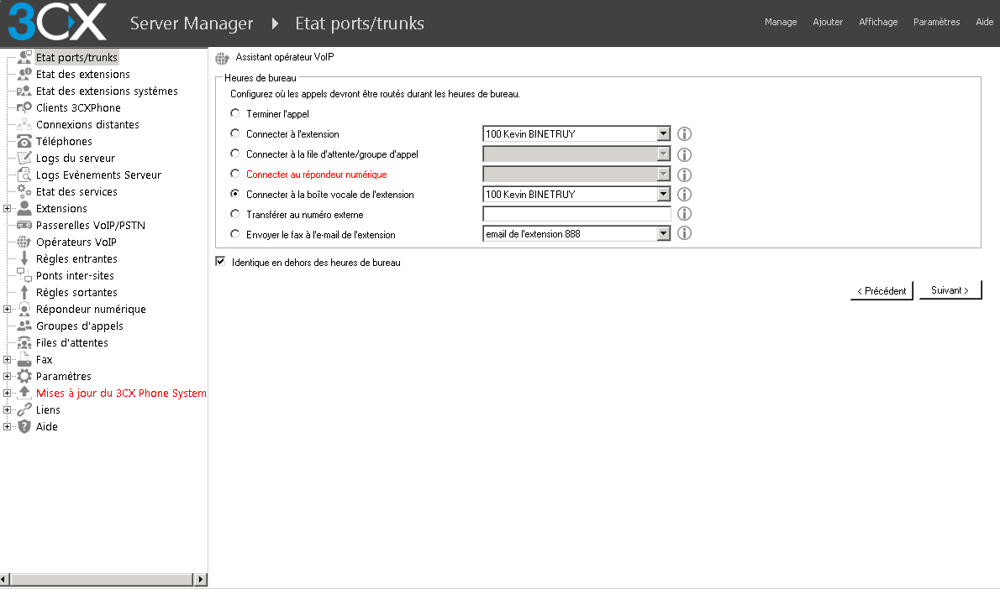
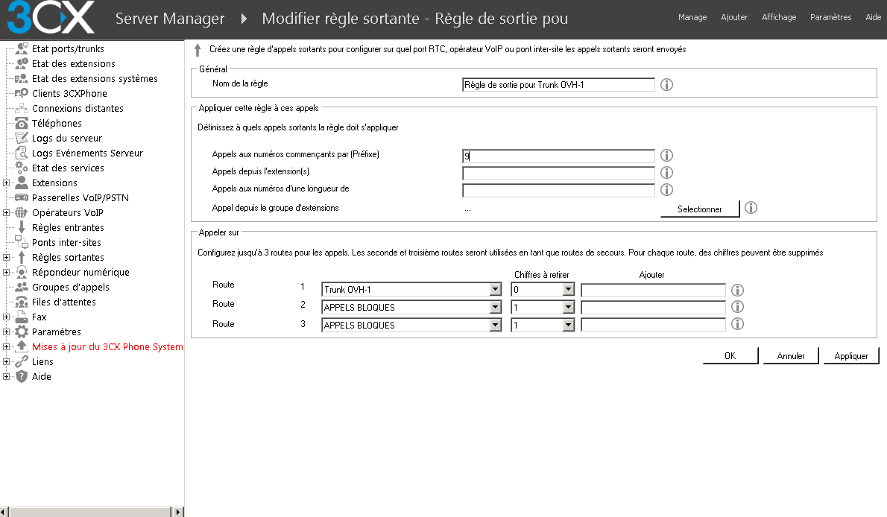
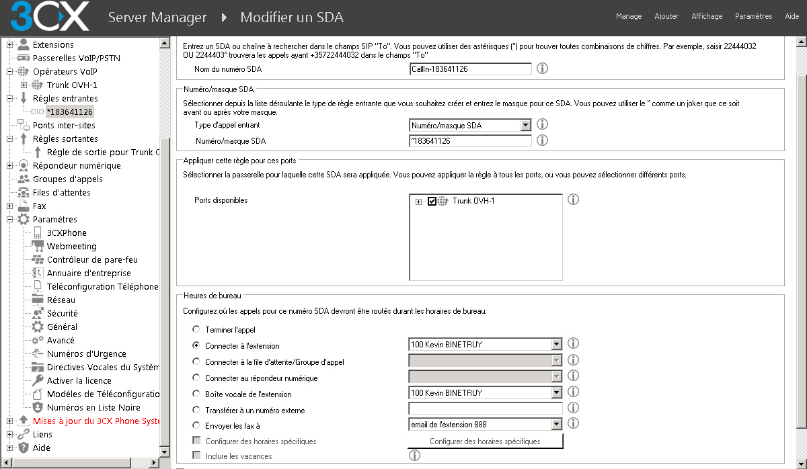

> [!warning]
> 
> OVH met à votre disposition des services dont la configuration, la gestion et la responsabilité vous incombent. Il vous revient de ce fait d'en assurer le bon fonctionnement.
>
> Nous mettons à votre disposition ce guide afin de vous accompagner au mieux sur des tâches courantes. Néanmoins, nous vous recommandons de faire appel à un [prestataire spécialisé](https://partner.ovhcloud.com/fr/) et/ou de contacter l'éditeur du service si vous éprouvez des difficultés. En effet, nous ne serons pas en mesure de vous fournir une assistance. Plus d'informations dans la section « Aller plus loin » de ce guide.
>

## Prérequis

Pour suivre ce guide il est important d’avoir les prérequis suivants : 

- Un SIP Trunk OVH
- Deux alias configurés en DDI (Redirection avec présentation du numéro)
- Un softphone ou un téléphone SIP
- 3CX Phone System installé, activé et à jour. 

Vous trouverez la version gratuite de 3CX Phone System via [ce lien. (3CX Phone System Free Edition)](http://www.3cx.com/ip-pbx/)

## 
Ce guide a pour objectif de vous appendre à configurer 3CX Phone System avec notre SIP Trunk et deux DDI. Le scénario est très simple : 

- 1 SIP Trunk : 09 72 32 06 90
- 2 DDI : 01 83 64 11 26 et 03 66 72 94 10
- 2 Extensions : 100 et 101

Les deux extensions peuvent passer des appels sortants via le trunk. 
L'extension 100 reçoit les appels du DDI 01 83 64 11 26 et présente ce DDI en appel sortant.
L'extension 101 reçoit les appels du DDI 03 66 72 94 10 et présente ce DDI en appel sortant.

Les appels reçus directement sur le numéro du trunk sont redirigés vers le répondeur de l'extension 100.

## Création du Trunk dans 3CX Phone System
Nous allons configurer à l'aide du Template le trunk sur 3CX. 

- Connectez-vous à l'interface d'administration de 3CX.

{.thumbnail}

- Cliquez sur "Opérateurs VoIP"

{.thumbnail}

- Cliquez sur "Ajouter un opérateur"

Complétez le formulaire pour sélectionner le template OVH. 

- Dans le champ "Nom de l'opérateur" mettez le nom de votre Trunk : par exemple "Trunk OVH-1"
- Dans "Pays" sélectionnez le pays de votre Trunk. Dans ce guide nous sélectionnons "FR"
- Dans "Fournisseur", sélectionnez "OVH" 
- Vérifiez les informations et cliquez sur "Suivant".

{.thumbnail}

- L'écran suivant est informatif, il indique les configurations du Trunk. (Proxy, ports etc). Cliquez simplement sur "Suivant"

{.thumbnail}
Veuillez saisir dans le formulaire suivant les informations d'authentification du trunk : 

- Dans les champs "Numéro Externe" et "Authentification ID (identifiant SIP)", saisissez le nom d'utilisateur de votre trunk. Dans notre exemple ce sera : 0033972320690
- Dans le champ "Mot de passe d'authentification" mettez le mot de passe SIP de votre trunk. 
- Le champ "ID d'authentification 3 Way" n'est pas à remplir.
- Dans le champ "Nombre d'appels simultanés maximum" saisissez la valeur correspondante à votre trunk. 
- Cliquez sur "Suivant" pour valider la configuration.

{.thumbnail}
Choisissez ensuite la terminaison des appels passés directement sur le trunk. Dans l'exemple de notre guide l'option "Connecter à la boite vocale de l'extension" est sélectionnée avec l'extension "100". Validez en cliquant sur "Suivant".

{.thumbnail}
Configurez ensuite la règle pour les appels sortants. Dans notre exemple la règle créée est la suivante : toutes les extensions peuvent appeler et les appels sortants sont réalisés sans préfixe. La configuration se fera en remplissant les deux champs suivants :

- Sur le champ "Nom de la règle" entrez le nom de la règle de sortie pour le trunk. Dans notre exemple : "Règle de sortie pour Trunk OVH-1". 
- Dans le champ "Appels aux numéros commençants par (Préfixe) : mettez "0". Dans ce cas, aucun préfixe ne sera demandé lors de la composition d’un numéro.

{.thumbnail}
En revanche, si vous souhaitez préfixer les appels sortants, il vous faut alors choisir un préfixe et le configurer comme suit :

Par exemple, configurez le préfixe 9 c’est à dire que pour  passer un  appel sortant vers le 09 72 10 10 10 il vous faudra saisir sur le téléphone 90972101010 :

- Dans le champ "Appel aux numéros commençants par (Préfixe)" mettez "9". 
- Dans l'encadré "Appeler sur" vous devez créer la route. Dans le champ "Route 1" sélectionnez le trunk : "Trunk OVH-1". Dans "Chiffres à retirer" sélectionnez "1". Enfin dans "Ajouter" laissez le champ vide. Cela signifie que le chiffre "9" dans notre cas, sera retiré et qu'il n’y-aura pas d'autre chiffre ajouté au numéro saisi. 
- Cliquez sur "Appliquer" pour sauvegarder la règle.

{.thumbnail}
Enfin, voici la dernière étape de configuration du trunk pour répondre au scénario de notre exemple. Le template OVH de 3CX utilise le champ SIP "Display Info" pour présenter un DDI, ce qui ne permet pas de répondre au besoin de changer le Caller ID du trunk et de nos extensions lors des appels sortants. 
Il faut donc modifier le trunk pour utiliser le champ "OutboundCallerID" et présenter correctement les DDI : 

- Dans l'interface d'administration de 3CX, rendez-vous sur la catégorie "Opérateurs VoIP"
- Sélectionnez votre trunk : "Trunk OVH-1" dans notre exemple.
- Cliquez sur l'onglet "Paramètres sortant". 
- Dans la partie "Contenu des champs SIP", sélectionnez dans la liste "Champ SIP" l'intitulé "From : User Part"
- Dans la liste de l'intitulé "Variable" sélectionnez "OutboundCallerID"
- Cliquez sur le bouton "Ajouter/Mettre à jour". 
- Cliquez sur "Appliquer" pour confirmer la modification.

{.thumbnail}
La configuration du trunk sur 3CX est maintenant terminée !

## Création et configuration des extensions
L'objectif de cette étape est de configurer les extensions 100 et 101.
Tout d’abord, configurez l’extension 100 pour lui permettre de présenter le DDI 01 83 64 11 26.  

- Dans l'interface d'administration de 3CX, rendez-vous sur la catégorie "État des extensions"
- Double cliquez sur l'extension "100"
- Cliquez sur l'onglet "Autres"
- Dans le champ "Identifiant d'appelant transmis" mettez le DDI à présenter. Dans notre cas : 0033183641126
- Cliquez sur "Appliquer" pour prendre en compte la modification.

{.thumbnail}
Créez et configurez maintenant l'extension 101 :

- Dans l'interface d'administration de 3CX, rendez-vous sur la catégorie "Extensions"
- Cliquez sur le bouton "Ajouter extension" 
- Dans le champ "Numéro de l'extension" mettez "101".
- Entrez ensuite les Nom, Prénom, Adresse mail et le numéro de mobile sur la fiche de création de l'extension. 
- Dans la partie "Authentification", vous avez l'identifiant SIP qui par défaut est le numéro de l'extension et son mot de passe dans le champ "Mot de passe".

{.thumbnail}

- Cliquez ensuite sur l'onglet "Autres"
- Dans le champ "Identifiant d'appelant transmis" mettez le DDI à présenter. Dans l'exemple du guide, il s'agit du 0033366729410
- Cliquez sur "Appliquer" pour prendre en compte la modification.

{.thumbnail}

## Création des règles entrantes pour les DDI.
Créez des règles d'appel entrant lorsque les DDI sont appelés. 

- Dans l'interface d'administration de 3CX, rendez-vous sur la catégorie "Règles Entrantes";
- Cliquez sur le bouton "Add DID";
- Dans le champ "Nom du numéro SDA" mettez le nom de la route. Dans notre cas nous mettons "Call-In-183641126";
- Dans le champ "Type d'appel entrant" sélectionnez "Numéro/masque SDA";
- Dans le champ "Numéro masque SDA" mettez votre DDI sans préfixe. Soit pour 01 83 64 11 26 : "*183641126";
- Dans la liste de "Ports disponibles" sélectionnez votre trunk auquel sont associés vos DDI;
- Dans la partie "Heure de bureau" (Dans ce guide les plages horaires de 3CX ne sont pas traitées. La case "Appliquer la même logique de routage hors des heures de bureau" est donc cochée.) Cochez "Connecter à l'extension" et dans la liste choisissez l'extension "100". 
- Cliquez sur "Appliquer" pour valider la configuration.

{.thumbnail}
Pour configurer le second DDI il vous faut appliquer la même procédure, à la différence que vous devez changer le DDI présenté et l'extension cible de l'appel.

## 
Le temps d’enregistrement minimum conseillé est de 1800 secondes. Pour modifier ce paramètre suivez ces étapes :

- Connectez-vous à l'interface d'administration de 3CX.

{.thumbnail}

- Cliquez sur "Opérateurs VoIP"

{.thumbnail}

- Cliquez sur votre trunk OVH puis sur le bouton "Modifier un opérateur"

{.thumbnail}

- Cliquez sur l'onglet "Avancé"

{.thumbnail}

- Modifiez la valeur "Temps entre chaque tentative d'enregistrement (en secondes)" par une valeur minimum à 1800 secondes.

{.thumbnail}

- Cliquez sur "Appliquer" pour confirmer la configuration.

## Aller plus loin

Échangez avec notre communauté d'utilisateurs sur <https://community.ovh.com>.
