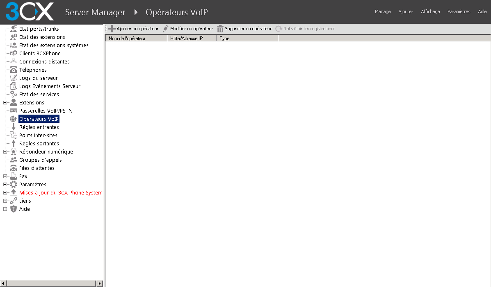

## Objectif

Ce guide a pour objectif de vous appendre à configurer 3CX Phone System avec notre SIP Trunk et deux DDI. Le scénario est très simple : 

- 1 SIP Trunk : 09 72 32 06 90
- 2 DDI : 01 83 64 11 26 et 03 66 72 94 10
- 2 Extensions : 1000 et 1001

Les deux extensions peuvent passer des appels sortants via le trunk. 
L'extension 100 reçoit les appels du DDI 01 83 64 11 26 et présente ce DDI en appel sortant.
L'extension 101 reçoit les appels du DDI 03 66 72 94 10 et présente ce DDI en appel sortant.

Les appels reçus directement sur le numéro du trunk sont redirigés vers le répondeur de l'extension 100.

## Prérequis

Pour suivre ce guide il est important d’avoir les prérequis suivants : 

- Un SIP Trunk OVH
- Deux alias configurés en DDI (Redirection avec présentation du numéro)
- Un softphone ou un téléphone SIP
- 3CX installé, activé et à jour. 

Vous trouverez la version gratuite de 3CX via ce lien. [(3CX Phone)](https://www.3cx.fr/pabx/download-pabx-ip/)

## En Pratique

> [!warning]
> 
> OVH met à votre disposition des services dont la configuration, la gestion et la responsabilité vous incombent. Il vous revient de ce fait d'en assurer le bon fonctionnement.
>
> Nous mettons à votre disposition ce guide afin de vous accompagner au mieux sur des tâches courantes. Néanmoins, nous vous recommandons de faire appel à un [prestataire spécialisé](https://partner.ovhcloud.com/fr/) et/ou de contacter l'éditeur du service si vous éprouvez des difficultés. En effet, nous ne serons pas en mesure de vous fournir une assistance. Plus d'informations dans la section « Aller plus loin » de ce guide.
>

### Création du Trunk dans 3CX Phone System

Nous allons configurer à l'aide du Template le trunk sur 3CX. 

- Connectez-vous à l'interface d'administration de 3CX.

{.thumbnail}

- Cliquez sur "Trunk SIP"

{.thumbnail}

- Cliquez sur "Ajouter un Trunk SIP"

{.thumbnail}

Complétez le formulaire pour sélectionner le template OVH. 

- Dans le champ "Choisir un Pays" sélectionnez le pays de votre Trunk. Dans ce guide nous sélectionnons "FR"
- Dans le champ "Sélectionner un opérateur de votre pays", sélectionnez "OVH" 
- Dans "Numéro principal", entrez le numéro de votre trunk (Ici, 0033972320690) 
- Vérifiez les informations et cliquez sur "OK".

- L'écran suivant indique les configurations du Trunk. (Proxy, ports etc)

{.thumbnail}

Veuillez saisir dans le formulaire suivant les informations d'authentification du trunk : 

- Dans le champ "ID d'authentification (aka SIP User ID)", saisissez le nom d'utilisateur de votre trunk. (Dans notre exemple 0033972320690)
- Dans le champ "Mot de passe d'authentification" mettez le mot de passe SIP de votre trunk. 
- Dans le champ "Nombre d'appels simultanés maximum" saisissez la valeur correspondante à votre trunk. 

Choisissez ensuite la terminaison des appels passés directement sur le trunk. Dans l'exemple de notre guide l'option "Messagerie vocale de l'extension" est sélectionnée avec l'extension "1000". 

{.thumbnail}

Enfin, nous allons associer nos DDI au trunk, cliquez sur l'onglet en haut de la page appelé "SDAs"

- Cliquez sur le bouton "Ajouter un SDA" 
- Entrez les DDI souahités 
- Cliquez sur "OK" en haut de lpage pour sauvegarder la configuration. 

{.thumbnail}

La configuration du trunk sur 3CX est maintenant terminée !

### Création et configuration des extensions

L'objectif de cette étape est de configurer les extensions 1000 et 1001.
Tout d’abord, configurez l’extension 1000 pour lui permettre de présenter le DDI 01 83 64 11 26.  

- Dans l'interface d'administration de 3CX, rendez-vous sur la catégorie "Utilisateurs"
- Double cliquez sur l'extension "1000"
- Dans le champ "Numéro présenté" mettez le DDI à présenter. Dans notre cas : 0033183641126
- Cliquez sur "OK" pour prendre en compte la modification.

{.thumbnail}

Créez et configurez maintenant l'extension 1001 :

- Dans l'interface d'administration de 3CX, rendez-vous sur la catégorie "Utilisateurs"
- Cliquez sur le bouton "Ajouter" 
- Dans le champ "Numéro de l'extension" mettez "1001".
- Entrez ensuite les Nom, Prénom, Adresse mail et le numéro de mobile sur la fiche de création de l'extension. 
- Dans le champ "Identifiant d'appelant transmis" mettez le DDI à présenter. Dans l'exemple du guide, il s'agit du 0033366729410
- Cliquez sur "Appliquer" pour prendre en compte la modification.

{.thumbnail}

### Création des règles entrantes pour les DDI.

Créez des règles d'appel entrant lorsque les DDI sont appelés. 

- Dans l'interface d'administration de 3CX, rendez-vous sur la catégorie "Règles Entrantes";
- Cliquez sur le bouton "Ajouter une règle SDA";
- Dans le champ "Nom" mettez le nom de la route. Dans notre cas nous mettons "Call-In-183641126";
- Dans le champ "SDA/DID" sélection le DDI 0033183641126
- Dans le champ "Extension", choisissez la 1000
- Cliquez sur "OK" pour valider la configuration.

{.thumbnail}

Pour configurer le second DDI il vous faut appliquer la même procédure, à la différence que vous devez changer le DDI présenté et l'extension cible de l'appel.

### Modifier le délai d'enregistrement 

Le temps d’enregistrement minimum conseillé est de 1800 secondes. Pour modifier ce paramètre suivez ces étapes :

- Connectez-vous à l'interface d'administration de 3CX.

{.thumbnail}

- Cliquez sur "Opérateurs VoIP"

{.thumbnail}

- Cliquez sur votre trunk OVH puis sur le bouton "Modifier un opérateur"

{.thumbnail}

- Cliquez sur l'onglet "Avancé"

{.thumbnail}

- Modifiez la valeur "Temps entre chaque tentative d'enregistrement (en secondes)" par une valeur minimum à 1800 secondes.

{.thumbnail}

- Cliquez sur "Appliquer" pour confirmer la configuration.

## Aller plus loin

Échangez avec notre communauté d'utilisateurs sur <https://community.ovh.com>.
