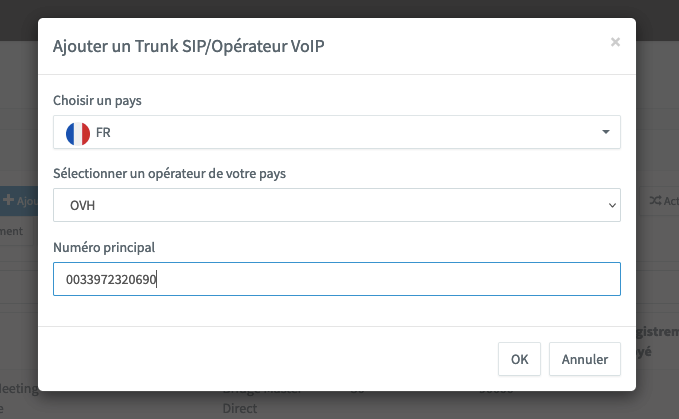
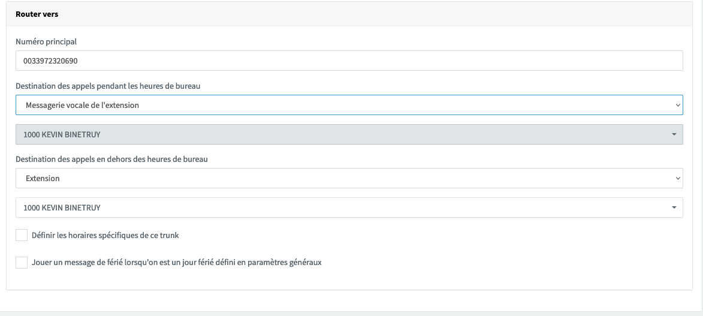
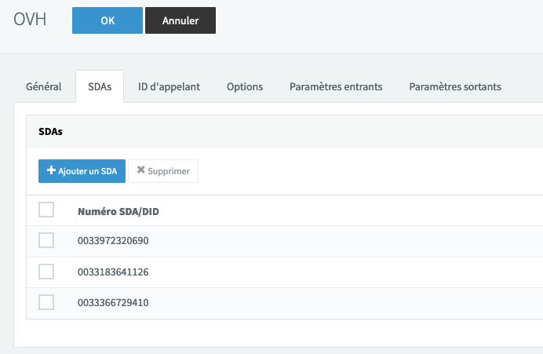
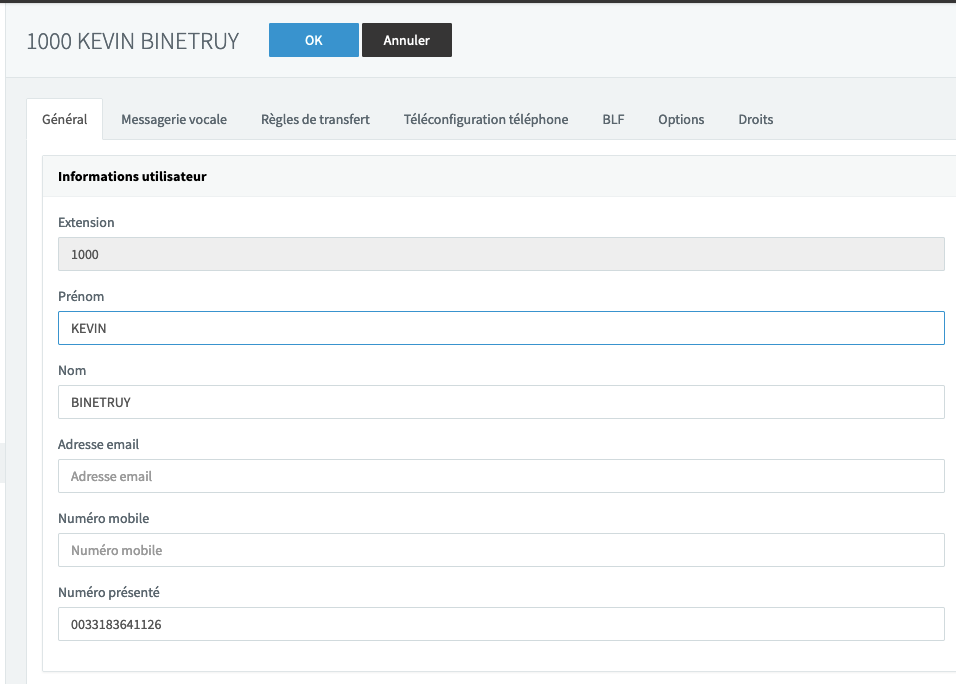
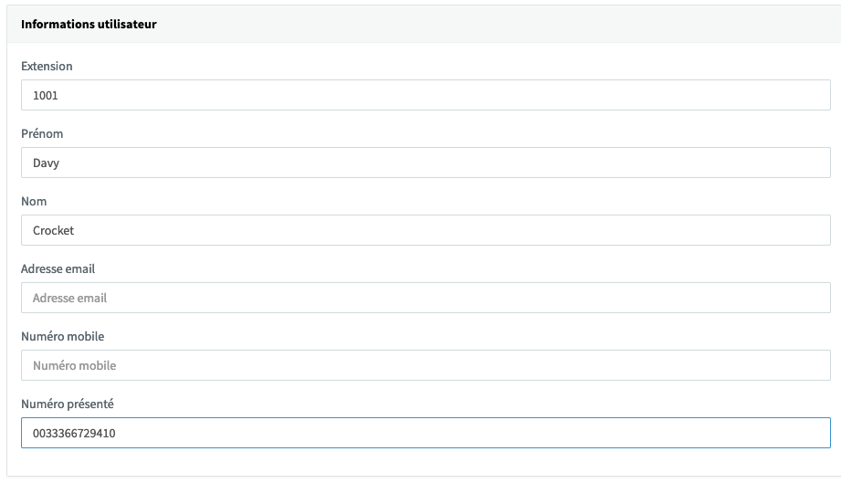
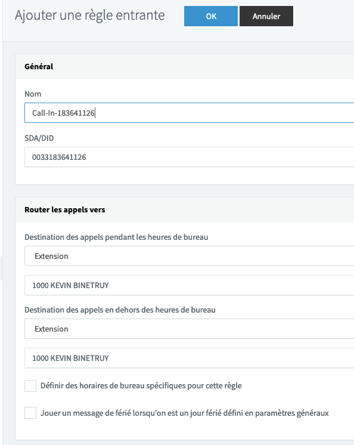

**Dernière mise à jour le 25/10/2022**

## Objectif

Pour configurer 3CX Phone System avec un SIP Trunk et deux DDI (**D**irect **D**ialling **I**nward), nous allons suivre le sénario suivant : 

>
> - 1 SIP Trunk : XX XX XX XX 90
> - 2 DDI : XX XX XX XX 26 et XX XX XX XX 10
> - 2 Extensions : 1000 et 1001
>
> Les deux extensions peuvent passer des appels sortants via le trunk. 
> L'extension 100 reçoit les appels du DDI XX XX XX XX 26 et présente ce DDI en appel sortant.
> L'extension 101 reçoit les appels du DDI XX XX XX XX 10 et présente ce DDI en appel sortant.
> Les appels reçus directement sur le numéro du trunk sont redirigés vers le répondeur de l'extension 100.
>

**Découvrez comment configurer un SIP Trunk OVHcloud avec l'IPBX 3CX et deux DDI.**

## Prérequis

- Un [SIP Trunk OVHcloud](https://www.ovhtelecom.fr/telephonie/sip-trunk/)
- Deux [alias configurés](https://docs.ovh.com/fr/voip/creer-redirection-avec-presentation/) en DDI (Redirection avec présentation du numéro)
- Un [softphone](https://docs.ovh.com/fr/voip/enregistrer-ligne-sip-softphone/) ou un téléphone SIP
- [3CX](https://www.3cx.fr/) installé, activé et à jour. 

Obtenez gratuitement 3CX [en cliquant ici](https://www.3cx.fr/pabx/download-pabx-ip/).

## En Pratique

> [!warning]
> 
> OVHcloud met à votre disposition des services dont la configuration, la gestion et la responsabilité vous incombent. Il vous revient de ce fait d'en assurer le bon fonctionnement.
>
> Nous mettons à votre disposition ce guide afin de vous accompagner au mieux sur des tâches courantes. Néanmoins, nous vous recommandons de faire appel à un [prestataire spécialisé](https://partner.ovhcloud.com/fr/) et/ou de contacter l'éditeur du service si vous éprouvez des difficultés. En effet, nous ne serons pas en mesure de vous fournir une assistance. Plus d'informations dans la section « Aller plus loin » de ce guide.
>

### Création du Trunk dans 3CX Phone System

Nous allons configurer le trunk sur 3CX, à l'aide du Template. 

- Connectez-vous à l'interface d'administration de 3CX.

{.thumbnail}

- Cliquez sur `Trunk SIP`{.action}.

{.thumbnail}

- Cliquez sur `Ajouter un Trunk SIP`{.action}.

{.thumbnail}

Complétez le formulaire pour sélectionner le template OVHcloud. 

- Dans le champ **Choisir un Pays**, sélectionnez le pays de votre Trunk. Dans ce guide nous sélectionnons `FR`.
- Dans le champ **Sélectionner un opérateur de votre pays**, sélectionnez `OVH`.
- Dans **Numéro principal**, entrez le numéro de votre trunk (ici, `0033XXXXXXX90`).
- Vérifiez les informations et cliquez sur `OK`{.action}.

L'écran suivant affiche les informations de configuration du Trunk (Proxy, ports, etc).

{.thumbnail}

Veuillez saisir les informations d'authentification du trunk dans le formulaire suivant : 

- Dans le champ **ID d'authentification (aka SIP User ID)**, saisissez le nom d'utilisateur de votre trunk. (Dans notre exemple 0033XXXXXXX90)
- Dans le champ **Mot de passe d'authentification**, tapez le mot de passe SIP de votre trunk. 
- Dans le champ **Nombre d'appels simultanés maximum**, saisissez la valeur correspondante à votre trunk. 

Choisissez ensuite la terminaison des appels passés directement sur le trunk. Dans l'exemple, l'option `Messagerie vocale de l'extension` est sélectionnée avec l'extension `1000...`. 

{.thumbnail}

Nous allons associer les DDI au trunk, cliquez sur l'onglet en haut de la page appelé `SDAs`{.action}.

- Cliquez sur le bouton `Ajouter un SDA`{.action}.
- Entrez les DDI souhaités.
- Cliquez sur `OK`{.action} en haut de la page pour sauvegarder la configuration.

{.thumbnail}

La configuration du trunk sur 3CX est maintenant terminée !

### Création et configuration des extensions

L'objectif de cette étape est de configurer les extensions 1000 et 1001.
Configurez l’extension 1000 pour lui permettre de présenter le DDI XX XX XX XX 26.

- Dans l'interface d'administration de 3CX, rendez-vous sur la catégorie `Utilisateurs`{.action}
- Double cliquez sur l'extension `1000`
- Dans le champ **Numéro présenté**, saisissez le DDI à présenter. Dans notre cas : 0033XXXXXXX26
- Cliquez sur `OK`{.action} pour prendre en compte la modification.

{.thumbnail}

Créez et configurez l'extension 1001 :

- Dans l'interface d'administration de 3CX, rendez-vous sur la catégorie `Utilisateurs`{.action}.
- Cliquez sur le bouton `Ajouter`{.action}.
- Dans le champ **Extension**, Saisissez `1001`.
- Saisissez ensuite les Nom, Prénom, Adresse mail et le numéro de mobile sur la fiche de création de l'extension. 
- Dans le champ **Identifiant d'appelant transmis**, saisissez le DDI à présenter. Dans l'exemple du guide, il s'agit du 0033XXXXXXX10.
- Cliquez sur `Appliquer`{.action} pour prendre en compte la modification.

{.thumbnail}

### Création des règles entrantes pour les DDI.

Créez des règles d'appel entrant lorsque les DDI sont appelés. 

- Dans l'interface d'administration de 3CX, rendez-vous sur la catégorie `Règles Entrantes`{.action}.
- Cliquez sur le bouton `Ajouter une règle SDA`{.action}.
- Dans le champ **Nom**, saisissez le nom de la route. Dans notre cas nous mettons `Call-In-XXXXXXX26`.
- Dans le champ **SDA/DID**, sélectionnez le DDI 0033XXXXXXX26.
- Dans le champ **Extension**, choisissez la 1000.
- Cliquez sur `OK`{.action} pour valider la configuration.

{.thumbnail}

Pour configurer le second DDI il vous faut appliquer la même procédure, à la différence que vous devez changer le DDI présenté et l'extension cible de l'appel.

## Aller plus loin

Échangez avec notre communauté d'utilisateurs sur <https://community.ovh.com>.
