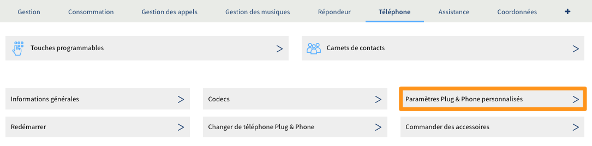

**Dernière mise à jour le 26/02/2020**

## Objectif

Les touches programmables (aussi appelées touches de fonction) permettent de lier une fonction aux touches de votre téléphone. À partir de votre [espace client OVHcloud](https://www.ovh.com/auth/?action=gotomanager){.external}, vous pouvez les configurer afin, par exemple, de joindre un collaborateur, d'appeler votre répondeur, de rejeter un appel, de mettre une communication en attente ou de renvoyer un appel.

**Ce guide vous présente les différentes possibilités de programmation de vos touches, ainsi que la manière de les effectuer.**

## Prérequis

- Posséder un téléphone fourni par OVHcloud avec des touches de fonction (cette information est disponible sur [notre site](https://www.ovhtelecom.fr/telephonie/comparatif-des-telephones.xml){.external}).
- Détenir une offre VoIP compatible (voir « Fonctionnalités du téléphone » sur [notre site](https://www.ovhtelecom.fr/telephonie/services_inclus/){.external}).
- Être connecté à l'[espace client OVHcloud](https://www.ovh.com/auth/?action=gotomanager){.external}.

## En pratique

### Configurer des touches programmables via votre espace client

Une fois connecté dans l'[espace client OVHcloud](https://www.ovh.com/auth/?action=gotomanager){.external} partie `Télécom`{.action}, cliquez sur `Téléphonie` et sélectionnez la ligne concernée. Cliquez ensuite sur l'onglet `Téléphone`{.action} puis sur `Touches programmables`{.action}.

{.thumbnail}

Vous arrivez alors sur l'écran permettant de configurer des touches. Il ne vous reste qu'à cliquer sur `...`{.action}, puis sur `Éditer`{.action}.

{.thumbnail}

### Tableau de description des touches et de leurs fonctions

> [!primary]
>
> Si vous possédez un téléphone OVHcloud avec plusieurs lignes, seules les touches programmables de la ligne principale seront prises en compte.
>

#### Fonction

Il s'agit de fonctions propres à la ligne.

|Option configurable|Description|
|---|---|
|Appeler un numéro|Permet d'appeler un numéro en appuyant sur une touche.|
|Aucune fonctionnalité|Permet de n'affecter aucune fonctionnalité à une touche.|
|Touche de ligne|Permet d'affecter une touche à une ligne du téléphone.|
|Appeler le répondeur|Permet d'appeler le répondeur de la ligne.|

#### Services

Il s'agit des services associés à la ligne.

|Option configurable|Description|
|---|---|
|Transférer tous les appels vers|Permet de mettre en place un renvoi inconditionnel vers un nouveau numéro ou une nouvelle ligne.|
|Activer/Désactiver le transfert inconditionnel|Permet d'activer/désactiver un renvoi inconditionnel existant.|
|Masquer le numéro de l'appelant|Permet de masquer le numéro d'appel de votre correspondant.|
|Transférer tous les appels vers le répondeur du|Permet de configurer un renvoi inconditionnel vers un répondeur OVHcloud.|
|Renvoi de tous les appels anonymes|Après activation, refuse tous les appels entrants dont le numéro est masqué.|
|Mode absent|Ce mode permet de bloquer les appels entrants sur le téléphone et de diffuser le message suivant à vos correspondants : « Votre correspondant est momentanément absent, merci de le rappeler ultérieurement. »|
|Double appel|Permet de configurer une touche pour lancer un second appel pendant une communication en cours.|
|Renvoi si la ligne est occupée|Permet de configurer un renvoi des appels.|
|Transférer tous les appels vers le fax du|Permet de transférer de manière inconditionnelle les appels vers une ligne de fax.|
|Masquer mon numéro|Permet d'émettre les appels de façon anonyme.|
|Renvoi si pas de réponse|Permet d'activer le renvoi d'appel vers une ligne ou un numéro en cas d'absence de réponse.|
|Mode ne pas déranger|Ce mode permet de bloquer les appels entrants sur le téléphone et de diffuser le message suivant à vos correspondants : « Votre correspondant ne souhaite pas être dérangé, merci de le rappeler ultérieurement. »|

#### Supervision

La supervision vous indique en temps réel si vos collaborateurs sont en ligne.

|Option configurable|Description|
|---|---|
|Supervision silencieuse|Permet de superviser une ligne via un système de voyant lumineux.|

#### Groupe d'appels

Il s'agit des fonctions associées à un alias configuré en file d'appels.

|Option configurable|Description|
|---|---|
|File d'appels - permuter le statut dans le groupe|Permet de permuter le statut dans le groupe.|
|File d'appels - transférer un appel|Permet de transférer un appel provenant d'une file d'appels.|
|File d'appels - rejoindre le groupe|Permet de rentrer dans un groupe d'appels.|
|File d'appels - quitter le groupe|Permet de sortir d'un groupe d'appels.|

#### Webservice

|Option configurable|Description|
|---|---|
|Associer une touche à une URL|Permet d'activer une fonction de type *SOAPI* hébergée sur un espace web.|
|Associer une touche à un SVI|Permet d'activer un serveur vocal interactif hébergé sur un espace web, qui sera joué lors d'appels entrants.|

### Module d'extension de touches

> [!primary]
>
> Pour savoir si votre poste est compatible avec un module d'extension de touches, rendez-vous sur [notre site](https://www.ovhtelecom.fr/telephonie/comparatif-des-telephones.xml){.external}.
> 

Afin de bénéficier de cette option, il faut posséder un module d’extension de touches compatible avec votre poste téléphonique. Pour utiliser ce module, il est nécessaire dans un premier temps de l'activer en vous connectant à votre [espace client OVHcloud](https://www.ovh.com/auth/?action=gotomanager){.external}. Toujours dans l'onglet `Téléphone`{.action}, choisissez cette fois `Paramètres Plug & Phone personnalisés`{.action}.

{.thumbnail}

Cliquez ensuite sur `Gérer les paramètres`{.action}.

{.thumbnail}

Pour finir, ajoutez dans le champ concerné le nombre de modules d'extension de touches à activer, puis validez en cliquant sur `Modifier les paramètres`{.action}.

{.thumbnail}

### Configurer les étiquettes de touches personnalisées

Vous pouvez également attribuer un nom personnalisé à chacune de vos touches programmables. Depuis l'onglet `Téléphone`{.action}, choisissez à nouveau `Paramètres Plug & Phone personnalisés`{.action}. Cliquez alors sur `Gérer les paramètres`{.action} et renseignez les noms souhaités dans les champs `Etiquette de touche`{.action}. La numérotation de ces touches correspond à l'ordre des touches de votre téléphone, la touche N°1 étant celle la plus en haut à gauche du poste.
Cliquez enfin sur `Modifier les paramètres`{.action} pour valider cette configuration

{.thumbnail}

> [!primary]
>
> Si vous ne constatez pas de mise à jour des touches après quelques minutes, redémarrez votre téléphone.Cela aura pour effet de forcer la mise à jour de ses paramètres.
>

## Aller plus loin

Échangez avec notre communauté d'utilisateurs sur <https://community.ovh.com>.