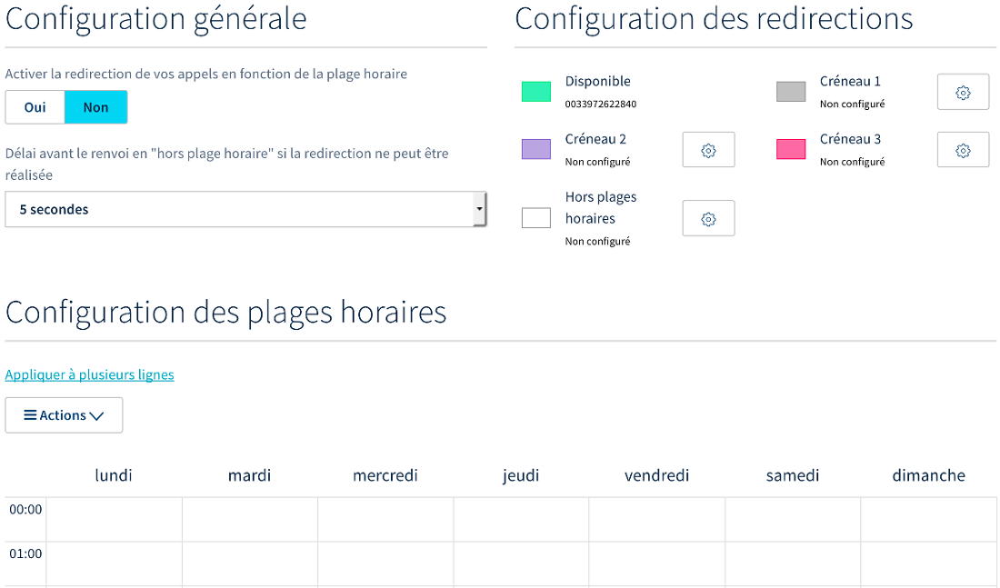

**Dernière mise à jour le 21/06/2022**

## Objectif

Votre ligne téléphonique OVHcloud vous permet de recevoir des appels. Pour diverses raisons, généralement organisationnelles, vous pouvez déterminer le moment où celle-ci est joignable. Cela passe par la mise en place de deux configurations : les plages horaires et les fermetures exceptionnelles.

**Découvrez comment configurer des plages horaires et des fermetures exceptionnelles sur votre ligne OVHcloud.**

## Prérequis

- Disposer d'une [ligne OVHcloud avec un forfait compatible](https://www.ovhtelecom.fr/telephonie/voip/){.external} ou d'une ligne Trunk.
- Disposer d'un accès à la gestion de la ligne concernée depuis votre [espace client OVHcloud](https://www.ovh.com/auth/?action=gotomanager&from=https://www.ovh.com/fr/&ovhSubsidiary=fr){.external}, partie `Télécom`{.action}.

{.thumbnail}

## En pratique

Deux configurations sont possibles pour déterminer quand votre ligne est joignable :

|Configuration|Description|
|---|---|  
|Gérer les plages horaires|Permet de créer des créneaux de disponibilité pour votre ligne et de définir vers où les appels doivent être renvoyés en dehors.|
|Gérer les fermetures exceptionnelles|Permet de définir des fermetures exceptionnelles de votre ligne et de spécifier où vos correspondants seront redirigés durant ces périodes. Ces configurations prennent le relais des plages horaires « normales » durant le laps de temps défini.|

Poursuivez la lecture de cette documentation en fonction de la configuration que vous souhaitez gérer.

- [Gérer les plages horaires](#plages-horaires)
- [Gérer les fermetures exceptionnelles](#fermetures-exceptionnelles)

### Gérer les plages horaires 

#### Étape 1 : accéder à la gestion des plages horaires

Pour démarrer la manipulation, connectez-vous à votre [espace client OVHcloud](https://www.ovh.com/auth/?action=gotomanager&from=https://www.ovh.com/fr/&ovhSubsidiary=fr){.external}, partie Télécom. Cliquez sur `Téléphonie`{.action} dans la barre de services à gauche, puis sélectionnez la ligne concernée.

Positionnez-vous sur l'onglet `Gestion des appels`{.action} et cliquez sur `Gérer les plages horaires`{.action}.

{.thumbnail}

La page qui s'affiche vous donne accès à trois parties afin de gérer vos plages horaires :

|Parties|Description|
|---|---|  
|Configuration générale|Il s'agit des paramètres généraux des plages horaires (activation, délai avant renvoi).|
|Configuration des redirections|Associées à des créneaux, ces redirections vous permettront d'adapter la manière dont vous êtes joignable (rediriger les appels vers une autre ligne, vers le répondeur, etc.).|
|Configuration des plages horaires|Définissez sur un agenda les plages horaires où vous êtes joignable. Pour correspondre au mieux à votre organisation, vous pourrez utiliser les redirections que vous configurerez et les associer à des plages horaires.|

{.thumbnail}

#### Étape 2 : configurer les redirections

Définissez dans un premier temps où les appels doivent être redirigés selon les créneaux. Vous pourrez utiliser ces derniers lorsque vous configurerez les plages horaires.

|Créneaux|Description|
|---|---|  
|Disponible|Il s'agit du créneau où vous serez disponible pour répondre aux appels sur votre ligne.|
|Créneau (1, 2 et 3)|Il s'agit de créneaux additionnels que vous pouvez utiliser. Vous devrez définir où seront redirigés les appels reçus.|
|Hors plages horaires|En dehors des plages horaires, les appels sont redirigés automatiquement sur le répondeur de votre ligne. Vous pouvez cependant modifier cette redirection.|

Pour modifier un créneau, cliquez sur l'icône en forme de roue dentée à côté de celui-ci. Définissez où seront redirigés les appels, puis cliquez sur le bouton `Modifier`{.action}. 

Sachez que les communications vers un numéro non enregistré chez OVHcloud (externe) seront décomptées de votre forfait ou facturées selon le [forfait auquel vous avez souscrit](https://www.ovhtelecom.fr/telephonie/voip/){.external} (voir la note en bas de page) et [les tarifs en vigueur](https://www.ovhtelecom.fr/telephonie/decouvrez/tarifs_telephonie.xml){.external}.

{.thumbnail}

#### Étape 3 : configurer les plages horaires

Une fois les créneaux configurés, définissez les plages horaires sur l'agenda. Il existe deux possibilités de le faire : cliquer sur un horaire et modifier la plage associée ou cliquer sur l’horaire de début souhaité puis glisser en maintenant le clic jusqu’à l’horaire de fin. Vous devez ensuite valider l’ajout de la plage horaire grâce au bouton `Ajouter`{.action}.

Vous pouvez également déplacer des plages existantes. Pour ce faire, cliquez sur ces dernières et, en maintenant le clic, glissez-les dans le tableau des horaires.

{.thumbnail}

Dès que toutes vos plages horaires sont configurées, cliquez sur le bouton `Valider`{.action} pour sauvegarder ces changements. Vous avez aussi la possibilité de cliquer sur `Appliquer à plusieurs numéros`{.action} pour dupliquer les paramètres sur d’autres files d’appels.

#### Étape 4 : activer l'utilisation des plages horaires

Il ne reste plus qu’à activer les plages horaires. Dans la partie `Configuration générale` de la page, cliquez sur `Oui`{.action} puis sur `Valider`{.action}.

Vous pouvez également personnaliser le délai avant renvoi en « hors plage horaire », si une redirection ne s'effectue pas (lorsqu'une ligne est indisponible, par exemple).

{.thumbnail}

### Gérer les fermetures exceptionnelles 

Pour compléter vos plages horaires, vous avez la possibilité de créer des fermetures exceptionnelles. Elles vous permettront de fermer votre file d’appels sur des plages horaires qui sont normalement considérées comme étant ouvertes. 

> [!primary]
>
> Les fermetures exceptionnelles complètent [vos plages horaires paramétrées](https://docs.ovh.com/fr/voip/configurer-plages-horaires-fermetures-exceptionnelles-ligne/#gerer-les-plages-horaires){.external}. Il est donc indispensable que ces dernières soient activées pour que les fermetures exceptionnelles s’appliquent.
>

Pour démarrer la manipulation, connectez-vous à votre [espace client OVHcloud](https://www.ovh.com/auth/?action=gotomanager&from=https://www.ovh.com/fr/&ovhSubsidiary=fr){.external}, partie Télécom. Cliquez sur `Téléphonie`{.action} dans la barre de services à gauche, puis sélectionnez la ligne concernée.

Positionnez-vous sur l'onglet `Gestion des appels`{.action} et cliquez sur `Gérer les fermetures exceptionnelles`{.action}.

{.thumbnail}

Sur la page qui apparaît, positionnez vos fermetures exceptionnelles sur le calendrier en cliquant sur les jours concernés. Complétez les informations demandées :
 
|Information|Description|
|---|---|
|Plage horaire/journée entière|Choisissez si la fermeture exceptionnelle concerne uniquement une plage horaire ou une journée entière.|
|Objet|Définissez un titre vous permettant d'identifier cette fermeture exceptionnelle dans le tableau.|
|Catégorie|Choisissez un créneau qui permettra de rediriger les appels reçus pendant la fermeture exceptionnelle.|
|Du/au|Définissez la date et l'heure (facultatif) de la fermeture exceptionnelle.|
|Description|Vous pouvez ajouter une description plus détaillée à la fermeture exceptionnelle.|
 
Une fois les informations renseignées, cliquez sur `Créer l'événement`{.action}. Répétez cette manipulation afin d'ajouter toutes les fermetures exceptionnelles que vous souhaitez créer. Puis cliquez sur le bouton `Valider`{.action} pour sauvegarder ces changements.
 
Enfin, dans la partie `Paramètres` de la page, assurez-vous que le « **fuseau horaire** » paramétré est correct et que les plages horaires sont activées. Si vous effectuez un changement, cliquez sur le bouton `Valider`{.action} pour le sauvegarder.

{.thumbnail}

## Aller plus loin

Échangez avec notre communauté d'utilisateurs sur <https://community.ovh.com>.
