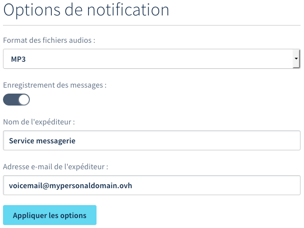

**Dernière mise à jour le 07/09/2018**

## Objectif

Chaque ligne OVH est associée à un répondeur que vous pouvez personnaliser et consulter de plusieurs manières. Selon vos besoins, vous pouvez également associer un répondeur à une seule ou plusieurs lignes.

**Apprenez à configurer et utiliser le répondeur de votre ligne téléphonique OVH.**

## Prérequis

- Disposer d'une [ligne téléphonique OVH](https://www.ovhtelecom.fr/telephonie/){.external}.
- Être connecté à l'[espace client OVH](https://www.ovh.com/auth/?action=gotomanager&from=https://www.ovh.com/fr/&ovhSubsidiary=fr){.external}, partie `Télécom`{.action}.

## En pratique

Les lignes OVH disposent par défaut d'un répondeur que vous pouvez consulter et personnaliser à votre guise. Si vous venez d'obtenir votre ligne téléphonique OVH ou si vous n'avez pas modifié la configuration initiale de cette dernière, le répondeur de votre ligne est activé par défaut et enregistre déjà les messages de vos correspondants. 

Vous avez également la possibilité de modifier l'association d'une ligne à son répondeur. Ceci vous permet en l'occurrence d'associer plusieurs lignes à un seul répondeur.

Poursuivez la lecture de cette documentation selon la manipulation que vous souhaitez réaliser avec votre répondeur.

- [Consulter le répondeur](https://docs.ovh.com/fr/voip/configurer-consulter-repondeur-ligne-ovh/#consulter-son-repondeur){.external}.
- [Personnaliser la configuration de son répondeur](https://docs.ovh.com/fr/voip/configurer-consulter-repondeur-ligne-ovh/#personnaliser-la-configuration-de-son-repondeur_1){.external}.
- [Associer une ligne à un répondeur](https://docs.ovh.com/fr/voip/configurer-consulter-repondeur-ligne-ovh/#associer-une-ligne-a-un-repondeur){.external}.

### Consulter son répondeur

Il existe trois méthodes pour consulter les messages laissés sur votre répondeur. Poursuivez vers celle que vous souhaitez utiliser.

- [Consulter son répondeur via un téléphone](https://docs.ovh.com/fr/voip/configurer-consulter-repondeur-ligne-ovh/#consulter-son-repondeur-via-un-telephone){.external}.
- [Consulter son répondeur via l'espace client](https://docs.ovh.com/fr/voip/configurer-consulter-repondeur-ligne-ovh/#consulter-son-repondeur-via-votre-espace-client){.external}.
- [Consulter son répondeur via les notifications e-mail](https://docs.ovh.com/fr/voip/configurer-consulter-repondeur-ligne-ovh/#consulter-son-repondeur-via-les-notifications-e-mail){.external}.

> [!primary]
>
> Si votre répondeur vous indique que vous n'avez aucun nouveau message alors qu'un correspondant vous affirme en avoir laissé un, assurez-vous que votre ligne est associée au bon répondeur. Aidez-vous des informations de la section « [Associer une ligne à un répondeur](https://docs.ovh.com/fr/voip/configurer-consulter-repondeur-ligne-ovh/#associer-une-ligne-a-un-repondeur){.external} » de cette documentation si nécessaire.
>

#### Consulter son répondeur via un téléphone

Depuis votre ligne téléphonique OVH, composez le **123** pour accéder au serveur de messagerie. Si vous souhaitez consulter votre répondeur depuis une autre ligne, utilisez le numéro adéquat ci-dessous selon le pays de la ligne concernée :

|Pays de la ligne|Numéro à appeler|
|---|---|
|Lignes françaises (+33)|+33 9 72 55 00 00|
|Lignes belges (+32)|+32 23 18 55 55|
|Lignes espagnoles (+34)|+34 5 12 70 77 07|
|Lignes suisses (+41)|+41 2 75 19 00 06|
|Lignes anglaises (+44)|+44 33 06 84 01 06|
|Lignes allemandes (+49)|+49 3 22 21 74 00 06|

Une fois en communication avec le serveur de messagerie, laissez-vous guider par celui-ci en appuyant sur les touches correspondant aux actions que vous souhaitez réaliser. Sachez que si vous appelez depuis une autre ligne, vous devrez indiquer le numéro associé au répondeur que vous souhaitez consulter, ainsi que son mot de passe d'accès à distance préalablement défini. 

Si vous n'avez pas défini de mot de passe d'accès à distance : connectez-vous à votre [espace client OVH](https://www.ovh.com/auth/?action=gotomanager&from=https://www.ovh.com/fr/&ovhSubsidiary=fr){.external} partie Télécom, cliquez sur `Téléphonie`{.action} dans la barre de services à gauche, puis sélectionnez la ligne concernée. Positionnez-vous ensuite sur l'onglet `Répondeur`{.action}, cliquez sur `Mot de passe accès répondeur`{.action} et suivez les indications.

#### Consulter son répondeur via votre espace client

Connecté à votre [espace client OVH](https://www.ovh.com/auth/?action=gotomanager&from=https://www.ovh.com/fr/&ovhSubsidiary=fr){.external}, partie Télécom, cliquez sur `Téléphonie`{.action} dans la barre de services à gauche, puis sélectionnez la ligne pour laquelle vous souhaitez consulter le répondeur. Positionnez-vous ensuite sur l'onglet `Répondeur`{.action} et cliquez sur `Écoute et gestion des messages`{.action}.

{.thumbnail}

Sur la nouvelle page, un tableau apparaît, dans lequel les messages se trouvent actuellement enregistrés sur votre répondeur. Trois boutons vous permettent respectivement de les lire (voir **1** dans l'image ci-dessous), de les télécharger (voir **2**) et de les supprimer (voir **3**).

{.thumbnail}

#### Consulter son répondeur via les notifications e-mail

Vous recevez une notification par e-mail sur les adresses renseignées dans la configuration du répondeur. Ceux-ci peuvent simplement vous notifier de la disponibilité d'un nouveau message mais peuvent aussi, selon votre choix, contenir en pièce jointe ce dernier.  

Si vous souhaitez consulter ou modifier les adresses e-mail utilisées pour les notifications, reportez-vous aux instructions de la section « [Personnaliser la configuration de son répondeur](https://docs.ovh.com/fr/voip/configurer-consulter-repondeur-ligne-ovh/#personnaliser-la-configuration-de-son-repondeur_1){.external} » de cette documentation.

### Personnaliser la configuration de son répondeur

Pour démarrer la manipulation, connectez-vous à votre [espace client OVH](https://www.ovh.com/auth/?action=gotomanager&from=https://www.ovh.com/fr/&ovhSubsidiary=fr){.external}, partie Télécom. Cliquez sur `Téléphonie`{.action} dans la barre de services à gauche, puis sélectionnez la ligne concernée. Positionnez-vous sur l'onglet `Répondeur`{.action}, puis cliquez sur `Configuration du répondeur`{.action}. 

{.thumbnail}

Trois parties sont visibles sur la page qui apparaît alors. Configurez votre répondeur selon ce que vous souhaitez activer et/ou paramétrer dans les parties correspondantes.

- **Accueil et enregistrement des messages** : faites votre choix parmi les paramètres proposés, puis appuyez sur le bouton `Appliquer les options`{.action} pour valider les modifications que vous venez d'effectuer.

|Paramètres|Détail|
|---|---|
|Enregistrement des messages|Active ou désactive le répondeur.|
|Message d'accueil du répondeur|Permet d'importer un message d'accueil personnalisé qui sera lu par votre répondeur.|

{.thumbnail}

- **Options de notification** : faites votre choix parmi les paramètres proposés, puis appuyez sur le bouton `Appliquer les options`{.action} pour valider les modifications que vous venez d'effectuer.

|Paramètres|Détail|
|---|---|
|Format des fichiers audio|Définit le format des fichiers audio que vous recevrez en pièce jointe dans les notifications e-mail lorsqu'un nouveau message sera reçu.|
|Activation des notifications|Active ou désactive la réception des notifications.|
|Nom de l'expéditeur|Personnalise le nom qui sera affiché en tant qu'expéditeur lorsqu'un e-mail de notification sera envoyé.|
|Adresse e-mail de l'expéditeur|Personnalise l'adresse e-mail qui sera utilisée en tant qu'expéditeur lorsqu'un e-mail de notification sera envoyé.|

{.thumbnail}

- **Adresses e-mail à notifier** : visualisez, grâce au tableau, les adresses qui recevront une notification, supprimez-en grâce à l'icône en forme de poubelle et ajoutez-en des nouvelles en cliquant sur le bouton `Ajouter une adresse e-mail`{.action}, puis en remplissant les champs demandés.

|Champs|Détail|
|---|---|
|E-mail|Renseignez l'adresse e-mail que vous souhaitez notifier.|
|Type de notification|Choisissez « Notification uniquement » pour recevoir un e-mail vous avertissant d'un nouveau message sur le répondeur. Sélectionnez « Message joint en attachement » pour recevoir la notification par e-mail ainsi que le message au format souhaité en pièce jointe.|

{.thumbnail}

### Associer une ligne à un répondeur

Cette association s'effectue par le biais de deux manipulations : la première permet de choisir le répondeur qui pourra être consulté depuis la ligne et la seconde permet de définir vers quel répondeur les correspondants sont renvoyés.

Pour débuter, connectez-vous à votre [espace client OVH](https://www.ovh.com/auth/?action=gotomanager&from=https://www.ovh.com/fr/&ovhSubsidiary=fr){.external}, partie Télécom. Cliquez sur `Téléphonie`{.action} dans la barre de services à gauche, puis sélectionnez la ligne concernée. Positionnez-vous sur l'onglet `Répondeur`{.action}, puis cliquez sur `Choix de la messagerie par défaut`{.action}.

{.thumbnail}

Sur la page qui s'affiche, sélectionnez dans le menu déroulant le nouveau répondeur que vous souhaitez associer à la ligne concernée. Vous avez la possibilité d’appliquer vos choix de configuration à plusieurs lignes, grâce au bouton `Appliquer à plusieurs lignes`{.action}. Cliquez sur le bouton `Valider`{.action} pour terminer la première manipulation.

{.thumbnail}

Retournez vers la gestion du répondeur, puis positionnez-vous maintenant sur l'onglet `Gestion des appels`{.action}. Cliquez alors sur le bouton `Renvoi d'appel`{.action}. 

{.thumbnail}

Sélectionnez, pour les renvois vers le répondeur, le même numéro de ligne sélectionné précédemment. Assurez-vous de faire correspondre les numéros. Si besoin, aidez-vous de notre documentation intitulée « [Filtrer et renvoyer ses appels](https://docs.ovh.com/fr/voip/comment-configurer-les-renvois-d-appels/){.external} ».

Vous avez la possibilité d’appliquer vos choix de configuration à plusieurs lignes, grâce au bouton `Appliquer à plusieurs lignes`{.action}. Cliquez sur le bouton `Valider`{.action} pour terminer l'opération.

{.thumbnail}

## Aller plus loin

Échangez avec notre communauté d'utilisateurs sur <https://community.ovh.com>.