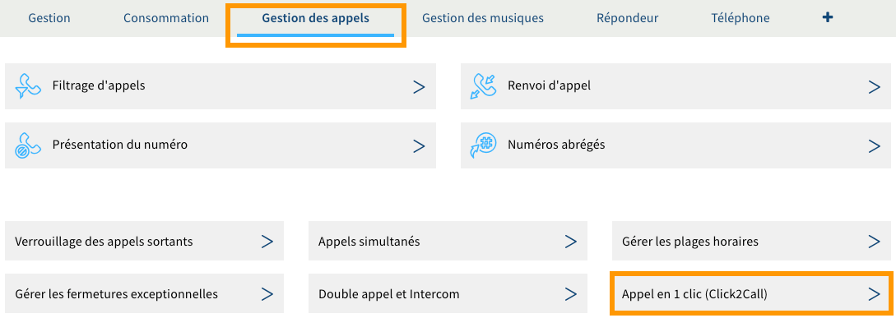

**Dernière mise à jour le 19/09/2018**

## Objectif

La fonctionnalité Click2Call (ou « appel en un clic ») permet de mettre en relation automatiquement deux interlocuteurs. Vous pouvez ainsi bénéficier, par exemple, d'un service de rappel automatique sur votre site internet (sous réserve d'intégration à ce dernier).

**Apprenez à configurer et utiliser la fonctionnalité Click2Call avec une ligne SIP OVH.**

## Prérequis

- Disposer d’une ligne SIP possédant un [forfait compatible](https://www.ovhtelecom.fr/telephonie/services_inclus/){.external} avec la fonctionnalité Click2Call.
- Être connecté à l'[espace client OVH](https://www.ovh.com/auth/?action=gotomanager&from=https://www.ovh.com/fr/&ovhSubsidiary=fr){.external}, partie `Télécom`{.action}.

## En pratique

### Configurer la fonctionnalité Click2Call

Vous avez la possibilité de configurer la fonctionnalité Click2Call depuis votre [espace client OVH](https://www.ovh.com/auth/?action=gotomanager&from=https://www.ovh.com/fr/&ovhSubsidiary=fr){.external} (manipulation simple) ou depuis les [API OVH](https://www.ovh.com/auth/?action=gotomanager&from=https://www.ovh.com/fr/&ovhSubsidiary=fr){.external} (manipulation experte).

> [!primary]
>
> Les communications lancées depuis la fonctionnalité Click2Call vers un numéro non enregistré chez OVH (externe) seront décomptées de votre forfait ou facturées selon le [forfait auquel vous avez souscrit](https://www.ovhtelecom.fr/telephonie/voip/){.external} (voir la note en bas de page) et [les tarifs en vigueur](https://www.ovhtelecom.fr/telephonie/decouvrez/tarifs_telephonie.xml){.external}.
>
> Le Click2Call peut être utilisé conjointement avec d'[autres fonctionnalités disponibles](https://www.ovhtelecom.fr/telephonie/services_inclus/){.external} sur votre ligne SIP, telles que le [filtrage d'appel](https://docs.ovh.com/fr/voip/comment-configurer-les-renvois-d-appels/){.external} (permettant par exemple d'empêcher tout appel vers des numéros commençant par « 08 »).
> 

#### Configurer le Click2Call depuis l'espace client

Connectez-vous à votre [espace client OVH](https://www.ovh.com/auth/?action=gotomanager&from=https://www.ovh.com/fr/&ovhSubsidiary=fr){.external} et rendez-vous dans la section `Télécom`. Cliquez sur `Téléphonie`{.action} dans la barre de services à gauche, puis sélectionnez la ligne concernée.

Positionnez-vous sur l'onglet `Gestion des appels`{.action} et cliquez sur `Appel en 1 clic (Click2Call)`{.action}.

{.thumbnail}

Pour que la fonctionnalité Click2Call puisse fonctionner, vous devez disposer d'au moins un identifiant Click2Call. 

**Si vous disposez déjà d'un identifiant Click2Call** : vous avez la possibilité de modifier son mot de passe en cliquant sur le pictogramme en forme de crayon ou de le supprimer en cliquant sur le pictogramme en forme de poubelle. Suivez alors les étapes qui apparaissent.

**Si vous ne disposez pas d'un identifiant Click2Call** : commencez par en créer un nouveau en cliquant sur `Ajouter un identifiant`{.action}. Renseignez alors l'identifiant que vous souhaitez ajouter puis définissez-lui un mot de passe en respectant les conditions qui apparaissent. Cliquez enfin sur `Valider`{.action}.

{.thumbnail}

Une fois que vous disposez d'au moins un identifiant Click2Call et de son mot de passe, vous pouvez poursuivre vers la section suivante « [Utiliser la fonctionnalité Click2Call](https://docs.ovh.com/fr/voip/configurer-utiliser-click2call/#utiliser-la-fonctionnalite-click2call){.external} » de cette documentation.

Si cela est nécessaire, l'interface de gestion de la fonctionnalité Click2Call vous permet de réaliser un appel de test vers le numéro de votre choix. Pour cela, dans la partie `Appel Click2Call`, renseignez le numéro dans la zone en dessous de « Numéro à appeler » puis cliquez sur `Appeler`{.action}.

{.thumbnail}

#### Configurer le Click2Call depuis les API OVH

Rendez-vous sur le lien <https://api.ovh.com/console/> puis connectez-vous avec votre identifiant client OVH. Dès lors, utilisez les API ci-dessous afin de configurer la fonctionnalité Click2Call. 

> [!api]
>
> @api {POST} /telephony/{billingAccount}/line/{serviceName}/click2CallUser
> 

Permet de créer un nouvel identifiant Click2Call et de lui définir son mot de passe.

> [!api]
>
> @api {GET} /telephony/{billingAccount}/line/{serviceName}/click2CallUser
> 

Permet de récupérer l'*id* d'un identifiant Click2Call créé précédemment.
 
> [!api]
>
> @api {GET} /telephony/{billingAccount}/line/{serviceName}/click2CallUser/{id}
> 

Permet de récupérer les informations de configuration d'un identifiant Click2Call, excepté son mot de passe.

> [!api]
>
> @api {POST} /telephony/{billingAccount}/line/{serviceName}/click2CallUser/{id}/changePassword
> 

Permet de modifier le mot de passe d'un identifiant Click2Call.

> [!api]
>
> @api {DELETE} /telephony/{billingAccount}/line/{serviceName}/click2CallUser/{id}
> 

Permet de supprimer un identifiant Click2Call.
 
### Utiliser la fonctionnalité Click2Call

Muni d'un identifiant Click2Call et de son mot de passe, vous pouvez à présent utiliser la fonctionnalité Click2Call. Pour cela, deux moyens existent. 

#### Utiliser le Click2Call depuis le logiciel EasyClick2Call

Le logiciel EasyClick2Call permet de passer des appels directement depuis un ordinateur. Pour cela, rendez-vous sur la page [EasyClick2Call](https://www.ovhtelecom.fr/telephonie/easyclick2call.xml){.external}, puis téléchargez le logiciel selon le système d'exploitation de votre ordinateur. 

Installez EasyClick2Call sur votre machine et ouvrez-le. Vous serez alors invité à renseigner des informations.

|Information|Description|
|---|---|
|Identifiant|Indiquez l'identifiant Click2Call.|
|Mot de passe|Renseignez le mot de passe de l'identifiant Click2Call.|
|Numéro appelant|Précisez le numéro de l'appelant. Il s'agit de la ligne pour laquelle l'identifiant Click2Call a été créé.|

Si les informations sont correctes, vous pouvez à présent utiliser la fonctionnalité Click2Call depuis le logiciel EasyClick2Call. Sachez que celui-ci interagit avec le presse-papiers de votre ordinateur : c'est-à-dire que si vous sélectionnez et copiez un numéro de téléphone, le logiciel EasyClick2Call vous proposera directement d'appeler ce numéro.

{.thumbnail}

#### Utiliser le Click2Call depuis les API OVH

Rendez-vous sur le lien <https://api.ovh.com/console/> puis connectez-vous avec votre identifiant client OVH. Les API renseignées ci-dessous vous permettront d'utiliser la fonctionnalité Click2Call. Vous pourrez par exemple intégrer ces dernières au code de votre site internet afin de générer un rappel automatique depuis un formulaire.

> [!api]
>
> @api {POST} /telephony/{billingAccount}/line/{serviceName}/click2CallUser/{id}/click2Call
> 

Permet d'exécuter les appels depuis la ligne où a été activé le Click2Call.

> [!api]
>
> @api {POST} /telephony/{billingAccount}/line/{serviceName}/click2Call
> 

Permet d'exécuter les appels depuis la ligne en activant le mode intercom de votre téléphone.

## Aller plus loin

Échangez avec notre communauté d'utilisateurs sur <https://community.ovh.com>.