**Dernière mise à jour le 04/08/2022**

## Objectif

Le Contact Center Solution (CCS) est la configuration la plus complète applicable à un numéro alias. Elle permet notamment de combiner les configurations avancées que sont la [file d'appels](https://docs.ovh.com/fr/voip/les-files-d-appels/) et le [serveur vocal interactif (SVI)](https://docs.ovh.com/fr/voip/svi-serveur-vocal-interactif/).

Vous pouvez par exemple proposer à vos appelants, via la seule composition de votre numéro principal, un choix de touches pour joindre chaque service de votre entreprise, chaque touche composée faisant sonner un ensemble de lignes selon une stratégie que vous définissez depuis l'espace client OVHcloud.

**Apprenez à configurer un CCS sur votre numéro alias depuis votre espace client OVHcloud.**

> [!warning]
>
> La configuration Contact Center Solution est une offre en version bêta. Son fonctionnement ne peut donc être garanti par les équipes de OVHcloud. De même, en cas de difficulté, nos équipes du support vous inviteront à appliquer une configuration de type « File d'appels » ou « Serveur vocal interactif » sur votre numéro.
>

## Prérequis

- Disposer d'un [numéro alias](https://www.ovhtelecom.fr/telephonie/numeros/){.external}.
- Être connecté à l'[espace client OVHcloud](https://www.ovh.com/auth?onsuccess=https%3A%2F%2Fwww.ovhtelecom.fr%2Fmanager&ovhSubsidiary=fr){.external}, partie `Télécom`{.action}.

{.thumbnail}

## Lexique

|Nom|Définition|
|---|---|
|Agent|Un agent est une ligne téléphonique, interne au compte OVHcloud ou externe à celui-ci, en capacité de sonner lorsque le numéro alias sera appelé.|
|File|Une file est un groupe d'agents, sur le principe de la [file d'appels](../les-files-d-appels/). La file permet de faire sonner ces agents selon une stratégie à définir.|
|Menu interactif|Un menu interactif propose à l'appelant des choix de touches pour faire sonner un agent/une file ou jouer un son, sur le principe du [serveur vocal interactif (SVI)](../svi-serveur-vocal-interactif/).|
|TTS|Un Text-To-Speech (TTS) est un son créé à partir d'un texte que vous définissez dans l'espace client OVHcloud.|

## En pratique

### Étape 1 : Appliquer la configuration Contact Center Solution 

Connectez-vous à votre [espace client OVHcloud](https://www.ovh.com/auth?onsuccess=https%3A%2F%2Fwww.ovhtelecom.fr%2Fmanager&ovhSubsidiary=fr){.external}, partie `Télécom`{.action}. 
Cliquez sur `Téléphonie`{.action}, sélectionnez le groupe de téléphonie puis le numéro à configurer. 
Dans l'onglet `Configuration`{.action}, cliquez sur `Passer en mode expert`{.action} pour sélectionner **Contact Center Solution**. 
Validez en cliquant sur `Paramétrer`{.action}. L'application de la configuration prend quelques secondes.

{.thumbnail}

Si une autre configuration est déjà appliquée sur votre numéro, cliquez sur `Configuration`{.action} puis `Changer de configuration`{.action}.

Une fois la configuration appliquée, cliquez sur l'onglet `Paramétrer la configuration`{.action}.

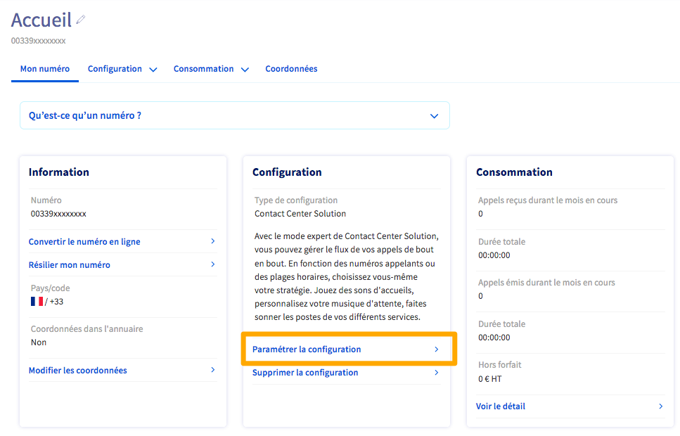{.thumbnail}

#### Présentation de la configuration

La configuration se présente sous la forme d'une arborescence étape par étape. À des fins de lisibilité, ce plan de configuration peut à tout moment être affiché verticalement ou horizontalement, via le bouton `Options d'affichage`{.action} situé en haut à gauche du plan.

{.thumbnail}

Le plan de configuration contient différents menus.

|Menu du numéro|Menu de la configuration|Menu d'étape|
|---|---|---|
|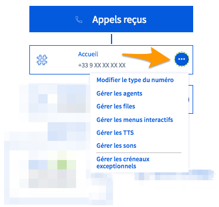{.thumbnail}|{.thumbnail}|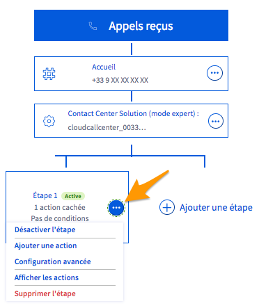{.thumbnail}|
|Permet de gérer les options principales de la configuration.|Permet de gérer les étapes du plan ainsi que les [options des appels](#options).|Permet d'ajouter des actions au sein d'une étape ainsi que des conditions d'exécution de l'étape.|

Les étapes décrites dans ce guide permettent d'aboutir à la création d'une configuration complète.

### Étape 2 : gérer les sons / gérer les TTS 

L'accueil téléphonique de vos appelants peut être amélioré grâce à l'ajout d'un ou plusieurs fichiers-sons, préalablement créés par vos soins ou définis via des Text-To-Speech (TTS) depuis l'espace client.

Il peut être intéressant de créer ou téléverser ces fichiers-sons dès le début de votre configuration.

#### Gérer les sons 

Si vous disposez déjà de vos fichiers-sons, vous pouvez les enregistrer dans votre configuration. Vous pouvez ainsi ajouter un son d'accueil d'un menu interactif ou encore une musique d'attente pour faire patienter vos appelants lorsque vos lignes sont occupées.

Ouvrez le `Menu Numéro`{.action} puis cliquez sur `Gérer les sons`{.action}.

{.thumbnail}

Cliquez sur `Ajouter un son`{.action} pour téléverser un son depuis votre poste.

#### Gérer les TTS 

Si vous ne disposez pas de fichiers-sons, la fonctionnalité Text-To-Speech permet d'en créer directement depuis l'espace client OVHcloud. Il vous suffit de renseigner le texte qui sera automatiquement énoncé par la voix de votre choix.

Ouvrez le `Menu Numéro`{.action} puis cliquez sur `Gérer les TTS`{.action}.

{.thumbnail}

Cliquez alors sur `+ Ajouter un TTS`{.action}, choisissez une voix parmi celles proposées puis renseignez le texte qui sera récité. Cliquez enfin sur `Créer`{.action}.

{.thumbnail}

### Étape 3 : créer les files 

Les files d'appels regroupent plusieurs agents (des lignes téléphoniques internes ou externes) qui vont sonner selon une stratégie que vous définissez dans l'espace client.

Leur fonctionnement est identique à la configuration [File d'appels](../les-files-d-appels/) applicable directement sur un numéro alias.

#### 3.1 Ajouter les agents 

Afin de créer vos files d'appels, vous devez d'abord ajouter toutes les lignes qui pourront être contactées lorsque votre numéro alias sera appelé. Ces lignes sont ici désignées comme des **agents**.

Ouvrez le `Menu Numéro`{.action} puis cliquez sur `Gérer les agents`{.action}.

{.thumbnail}

Vous pouvez ajouter deux types d'agents, des lignes SIP internes (appartenant à votre compte OVHcloud) et des lignes externes (fixes ou mobiles).

|Type de ligne|Méthode d'ajout|
|-----|---|
|**Ligne SIP interne**  {.thumbnail}|Pour ajouter une ligne SIP interne, cliquez sur la loupe à droite du champ « Numéro ».  Dans le menu qui s'affiche, sélectionnez une ligne puis cliquez sur `Valider`{.action}.  Confirmez en cliquant sur `Ajouter un agent`{.action}  Les lignes doivent être ajoutées l'une après l'autre.|
|**Ligne externe**  {.thumbnail}|Pour ajouter une ligne téléphonique externe, renseignez son numéro au format international (0033xxxxxxxxx pour la France) directement dans le champ « Numéro ».  Validez l'ajout de chaque ligne en cliquant sur `Ajouter un agent`{.action}.|

> [!warning]
> L'ajout d'une ligne externe peut occasionner des frais car un appel reçu par celle-ci sera comptabilisé en hors-forfait. Vous pouvez consulter nos tarifs hors-forfait en vigueur sur [cette page](https://www.ovhtelecom.fr/telephonie/decouvrez/tarifs_telephonie.xml){.external}. Nous vous conseillons donc de privilégier les lignes internes ou de n'utiliser une ligne externe qu'en solution de repli.
>

Les agents et leurs attributs sont visibles dans la « Liste des agents ». Vous pouvez modifier ces attributs en cliquant sur le stylo à droite de chaque agent.

{.thumbnail}

Les attributs que vous pouvez modifier sont les suivants :

|Nom|Définition|
|---|---|
|Description|Permet de renommer l'agent|
|Délai|Permet de définir la durée pendant laquelle la ligne sonnera. Une fois ce temps écoulé, et selon la stratégie d'appels de la file, l'appel sera alors transmis vers un autre agent de cette file.|
|Repos|Permet de définir la durée pendant laquelle l'agent ne prendra pas d'appel après avoir raccroché.|
|Appels simultanés|Permet de définir le nombre d'appels que la ligne pourra recevoir.|
|État|Permet de rendre disponible ou déconnecter un agent au sein des files.|

#### 3.2 Créer les files d'appels 

Vos agents sélectionnés, vous devez à présent les organiser dans une ou plusieurs files d'appels.

Ouvrez le `Menu Numéro`{.action} puis cliquez sur `Gérer les files`{.action}. Vous pouvez ici créer une ou plusieurs files d'appels. La première file est déjà créée.

{.thumbnail}

Cliquez sur `Ajouter un membre à la file`{.action} puis sur le menu déroulant pour afficher la liste des agents que vous avez préalablement créée. Cliquez sur un agent puis sur `Ajouter cet agent à la file`{.action} et réitérez cette action pour chaque agent à ajouter.

Vous pouvez également modifier les options de cette file en cliquant sur `Gérer les options`{.action}.

{.thumbnail}

Les options sont les suivantes :

|Option|Définition|
|---|---|
|Nom de la file|Cela vous permet de personnaliser le nom de votre file. C'est recommandé si vous comptez créer plusieurs files, afin de bien les différencier dans la construction de votre CCS.|
|Stratégie|Choisissez une stratégie de sonnerie pour vos agents qui pourront, par exemple, sonner tous en même temps ou l'un après l'autre.|
|Suivre les renvois d'appels|Définissez si les renvois d’appels configurés sur les lignes de la file doivent être appliqués ou non.|
|Nombre maximum d'appelants en attente|Définissez le nombre maximum d’appelants pouvant être en attente dans la file. Si ce nombre venait à être dépassé, les appelants suivants entendraient l'annonce sur débordement.|
|Temps d'attente maximum dans la file (en secondes)|Définissez la durée maximale d'attente dans cette file avant que l'appel ne passe à l'étape suivante de votre CCS.|
|Musique d'attente|Ce son sera joué à l’entrée dans la file d’attente jusqu’au décrochage de l’appel par une ligne.|
|Annonce sur débordement|Si le nombre maximum d'appelants en attente est atteint, les appelants suivants entendront cette annonce. Ainsi, vous pouvez diffuser un son invitant vos appelants à rappeler ultérieurement.|

Validez vos modifications en cliquant sur `Appliquer les modifications`{.action}.

Vous pouvez modifier l'ordre des agents membres d'une file en effectuant un glisser-déposer via le pictogramme (1) à gauche de chaque agent. Dans le cas d'une stratégie d'appel « Selon l'ordre défini des membres », l'agent le plus haut dans la file sonnera le premier. Puis le deuxième agent sonnera et ainsi de suite.

Vous pouvez également modifier (2) ici les attributs d'un agent ou supprimer celui-ci (3).

{.thumbnail}

Vous pouvez créer autant de files que nécessaire pour répondre à votre besoin.

> [!warning]
> Pour supprimer une file, celle-ci ne doit plus faire partie d'aucun menu interactif ou d'aucune étape du plan de configuration.
>

### Étape 4 : créer les menus interactifs (facultatif) 

À la différence de la configuration d'un numéro alias en [Serveur Vocal Interactif (SVI)](../svi-serveur-vocal-interactif/), le CCS permet d'associer une file d'appels entière (et non plus une simple ligne) à une touche de téléphone composée par un appelant.

Pour plus d'informations sur le fonctionnement d'un SVI, consultez notre guide [Configurer un serveur vocal interfactif](../svi-serveur-vocal-interactif/).

#### 4.1 Créer le premier menu 

Ouvrez le `Menu Numéro`{.action} puis cliquez sur `Gérer les menus interactifs`{.action}.

{.thumbnail}

Cliquez sur  `+ Ajouter un menu interactif`{.action}. Nommez ce nouveau menu (1) puis choisissez entre un son ou un TTS (2) pour l'accueil de votre menu interactif. Choisissez ensuite le son ou le TTS (3) parmi ceux déjà ajoutés ou créez-en un nouveau. **Ce son devra énoncer les différents choix de touches proposés à vos appelants (exemple : « Tapez 1 pour joindre l'accueil, tapez 2 pour joindre l'atelier...»)**.

Les mêmes choix vous sont proposés pour définir un son ou un TTS en cas d'action invalide (4). Celui-ci sera joué si l'appelant appuie sur une touche non reconnue par le serveur vocal interactif.

{.thumbnail}

Une fois ces informations définies, cliquez sur `Créer`{.action}. Vous pouvez maintenant créer les entrées du menu interactif, c'est à dire les choix de touches proposés à vos appelants et les actions qui y sont liées.

Cliquez sur le bouton `+`{.action} en bas de du menu pour ajouter votre première entrée.

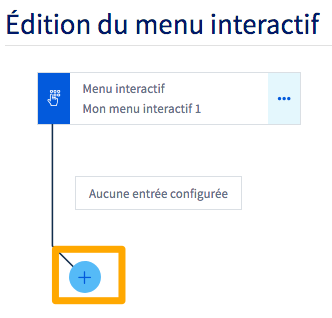{.thumbnail}

Dans le menu supplémentaire qui s'affiche, complétez les informations demandées.

{.thumbnail}

|Information|Description|
|---|---|
|Touche|Choisissez une touche parmi celles proposées.|
|Action à exécuter|Définissez l'action à déclencher lorsque l'appelant appuiera sur la touche correspondante. Aidez-vous des informations qui s'affichent pour choisir celle la plus adaptée à votre besoin.|
|Paramètre d'action supplémentaire|Selon l'action que vous avez définie, une case supplémentaire peut apparaître et vous inviter à renseigner un élément complémentaire. Suivez alors les indications qui s'affichent.|

Une fois les informations complétées, cliquez sur `Créer`{.action}. Répétez l'opération pour les entrées de menu supplémentaires.

{.thumbnail}

Selon vos besoins, répétez ces manipulations si vous voulez créer plusieurs menus interactifs. Vous pouvez également les imbriquer en tant que sous-menus d'un menu interactif principal, si vous souhaitez par exemple proposer plusieurs choix successifs à vos appelants.

### Étape 5 : configurer votre CCS 

Une fois vos files et menus interactifs créés, il faut maintenant les articuler dans le CCS.
 Chaque appel entrant va suivre une ou plusieurs étapes successives que vous allez définir. Au sein de chaque étape, une ou plusieurs actions devront également être créés.

Voici un exemple de configuration d'un CCS :

- Une étape 1, conditionnée à des créneaux horaires de fermeture, dans laquelle une seule action consistera à jouer un son invitant l'appelant à rappeler votre numéro pendant les horaires d'ouverture.
- Une étape 2 dans laquelle une seule action fera sonner une première file d'appels.
- Une étape 3 dans laquelle une première action fera sonner une deuxième file d'appels, différente de la première. Puis, une seconde action qui renverra l'appel vers un répondeur au bout de la durée maximum d'attente de cette deuxième file d'appels.

#### Ajouter des étapes et actions

Pour ajouter une étape, cliquez sur le bouton `+ Ajouter une étape`{.action} (1) à droite des étapes déjà crées.
 Pour ajouter une action au sein d'une étape (2), cliquez sur le bouton `+`{.action} sous l'étape concernée ou sur `+ Ajouter une action`{.action} dans le menu de votre étape.

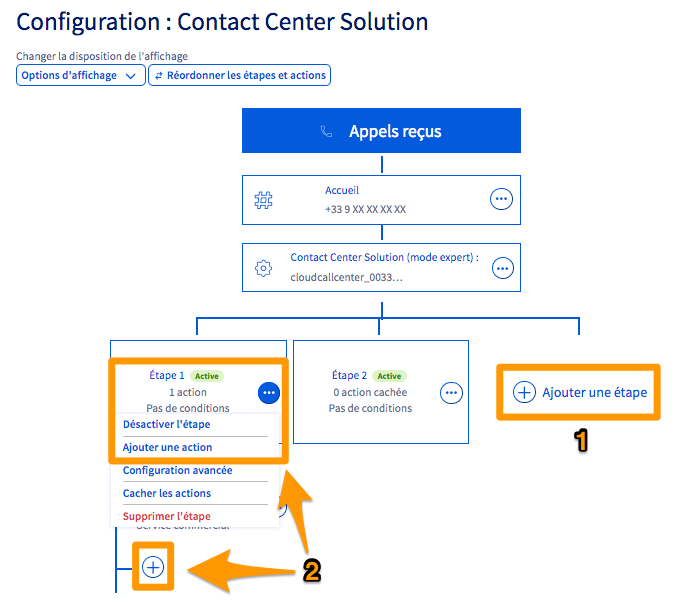{.thumbnail}

#### Afficher ou masquer les actions

A des fins de lisibilité, vous pouvez choisir à tout moment d'afficher ou masquer toutes les actions définies. Cliquez sur `Options d'affichage`{.action} puis sur `Afficher toutes les actions`{.action} ou `Masquer toutes les actions`{.action}.

{.thumbnail}

#### Réordonner les étapes et actions

Pour réordonner les étapes et actions de votre plan de configuration, cliquez sur le bouton `Réordonner les étapes et actions`{.action} situé en haut à gauche. Utilisez le bouton dédié pour modifier l'ordre de vos étapes et actions puis validez ce nouvel ordre en cliquant sur `Valider les modifications`{.action}.

{.thumbnail}

#### Ajouter une condition à une étape 

Lorsqu'une ou plusieurs conditions sont ajoutées à une étape, celles-ci doivent être remplies pour que l'étape se déclenche. Si les conditions d'une étape ne sont pas remplies, l'appel entrant passera à l'étape suivante du CCS.

Pour ajouter une condition à une étape, ouvrez le menu de l'étape via le bouton `...`{.action}, puis choisissez `Configuration avancée`{.action}. Le menu qui apparaît vous permet de définir jusqu'à trois types de conditions. Poursuivez selon la condition que vous désirez paramétrer :

- [Condition de « Jours exceptionnels »](./#condition-de-jours-exceptionnels)
- [Condition de « Plages horaires génériques »](./#condition-de-plages-horaires-generiques)
- [Condition de « Filtrages d'appels »](./#condition-de-filtrages-dappels)

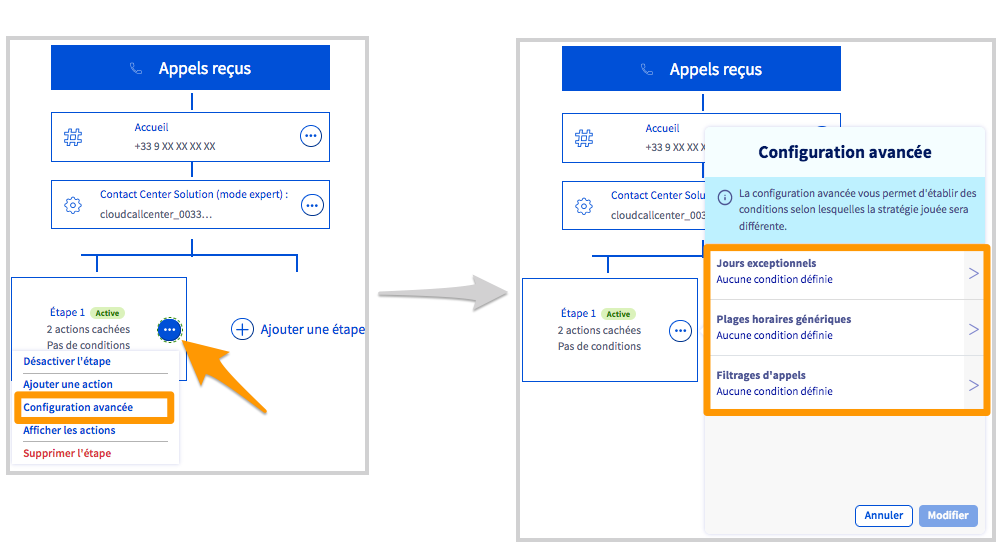{.thumbnail}

Une fois vos conditions créées, vous pouvez définir une ou plusieurs action(s) correspondant aux conditions non-vérifiées. Ces actions seront alors prises en compte pour les appels ne remplissant pas les conditions.

Ainsi, dans l'exemple ci-dessous, un appel pendant les plages horaires définies à l'étape 1 fera sonner les membres de la file d'appels nommée « Service commercial » (1).
 Un appel en dehors de ces plages horaires sera réceptionné sur le répondeur d'une ligne SIP OVHcloud (2).

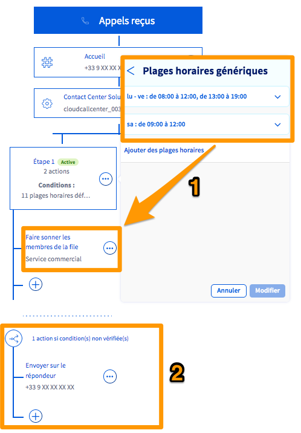{.thumbnail}

##### **Condition de « Jours exceptionnels »** 

Après avoir cliqué sur `Jours exceptionnels`{.action} depuis le menu de configuration avancée, choisissez le créneau que vous souhaitez appliquer. Vous revenez ensuite automatiquement dans la fenêtre de configuration avancée. Cliquez alors sur `Modifier`{.action}.

{.thumbnail}

Vous devez à présent configurer le créneau que vous venez de sélectionner (ou vous assurer que celui-ci l'est correctement). Pour cela, ouvrez le **Menu du Numéro** via le bouton `...`{.action} puis cliquez sur `Gérer les créneaux exceptionnels`{.action}.

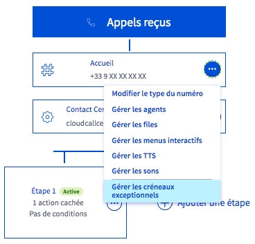{.thumbnail}

La page de gestion des fermetures exceptionnelles apparaît alors. Dans la partie `Planification des jours de fermeture`, positionnez vos fermetures exceptionnelles sur le calendrier en cliquant sur les jours concernés. Complétez les informations demandées :

|Information|Description|
|---|---|
|Plage horaire/journée entière|Choisissez si la fermeture exceptionnelle concerne uniquement une plage horaire ou une journée entière.|
|Objet|Définissez un titre vous permettant d'identifier cette fermeture exceptionnelle dans le calendrier.|
|Catégorie|Choisissez le créneau dans lequel vous souhaitez ajouter la fermeture exceptionnelle.|
|Du/au|Définissez la date et l'heure (le cas échéant) de la fermeture exceptionnelle.|
|Description|Vous pouvez ajouter une description plus détaillée sur cette fermeture exceptionnelle.|

Une fois les informations renseignées, cliquez sur `Créer l'événement`{.action}. Répétez cette manipulation afin d'ajouter toutes les fermetures exceptionnelles nécessaires. Cliquez enfin sur le bouton `Valider`{.action} pour sauvegarder ces changements.

{.thumbnail}

##### **Condition de « Plages horaires génériques »** 

Après avoir cliqué sur `Plages horaires génériques`{.action} depuis le menu de configuration avancée, cliquez sur `Ajouter des plages horaires`{.action}.

Configurez maintenant les plages horaires qui correspondent à vos besoins. Pour cela, sélectionnez les jours concernés puis renseignez les horaires dans les cases prévues à cet effet. Cliquez sur le bouton `V`{.action} à droite pour enregistrer la plage.

Une fois toutes vos plages horaires déifinies, cliquez sur le bouton `Modifier`{.action} pour les valider.

{.thumbnail}

> [!primary]
> Pour modifier une plage horaire déjà créée, il est nécessaire de la supprimer puis de créer une nouvelle plage horaire.
>

##### **Condition de « Filtrages d'appels »** 

Après avoir cliqué sur `Filtrages d'appels`{.action} depuis le menu de configuration avancée, choisissez si vous souhaitez filtrer vos appels entrants selon une « liste noire » ou une « liste blanche ».

|Liste|Description|
|---|---|
|Liste noire|Les numéros ou les tranches de numéros inscrits dans la liste ne peuvent plus vous contacter.|
|Liste blanche|**Seuls** les numéros ou les tranches de numéros inscrits dans la liste sont autorisés à vous contacter.|

Une fois que vous avez sélectionné la liste que vous souhaitez utiliser, complétez-la en ajoutant les numéros ou les tranches de numéros adéquats. Pour cela, utilisez le champ `Ajouter un numéro à la liste`, puis cliquez sur le bouton `Ajouter`{.action}. Vous pouvez supprimer une entrée dans la liste grâce à l'icône représentant une corbeille.

Pour enregistrer vos modifications, cliquez sur `Modifier`{.action}.

{.thumbnail}

### Gérer les options du CCS 

Des options supplémentaires sont disponibles en cliquant sur le bouton `(...)`{.action} du menu de la configuration :

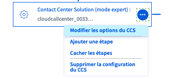{.thumbnail}

Les options disponibles dans ce menu vous permettent de :

- modifier le nom du CCS.
- gérer le timeout de transfert d'appel vers une ligne externe (ici exprimé en secondes). Lorsque votre configuration comporte un transfert vers une ligne externe, si cette ligne ne décroche pas avant la durée définie dans ce champ, l'appel passera à l'étape suivante de la configuration.
- gérer la présentation du numéro de vos appelants.
- accepter ou refus les appels masqués (anonymes).

{.thumbnail}

Trois options de présentation du numéro, sur le téléphone qui reçoit l'appel, sont possibles :

- présenter le numéro de l'appelant;
- présenter le numéro du CCS, c'est à dire le numéro alias qui a été composé par l'appelant, ce qui peut être utile si vous possédez plusieurs numéros alias configurés;
- présenter les deux numéros, celui de l'appelant et celui du CCS.

{.thumbnail}

### Tableau de bord 

Le tableau de bord vous permet d'obtenir des statistiques détaillées sur les appels reçus par votre numéro configuré en CCS et par les différentes files le composant.
Vous pourrez également obtenir des informations en temps réel sur les appels en cours sur votre numéro ainsi que sur la disponibilité de chaque ligne.

Pour consulter le tableau de bord, cliquez sur l'onglet `Consultation`{.action} puis sur `Tableau de bord`{.action}.

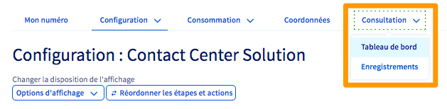{.thumbnail}

Le tableau de bord vous permet également d'interagir sur les appels en cours reçus par les membres de vos files d'appels.

#### Écouter ou chuchoter 

Cette fonction vous permet d'écouter une communication en cours ou de chuchoter à l'un et/ou l'autre des interlocuteurs.

Cliquez sur le bouton `...`{.action} à droite d'un appel en cours puis sur `Écouter ou chuchoter`{.action}.

{.thumbnail}

Choisissez alors l'option souhaitée parmi :

- Écouter
- Écouter et chuchoter à l'agent
- Écouter et chuchoter à tous

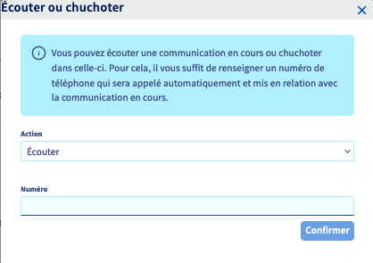{.thumbnail}

Saisissez un numéro de téléphone dans le champ prévu à cet effet et cliquez sur `Confirmer`{.action}. Ce numéro sera alors mis en relation avec la communication en cours.

#### Transférer l'appel

Vous pouvez transférer un appel en cours en cliquant sur le bouton `...`{.action} à droite d'un appel en cours puis sur `Transférer l'appel`{.action}.

Saisissez le numéro destinataire du transfert et cliquez sur `Transférer`{.action}.

{.thumbnail}

#### Mettre fin à l'appel

Vous pouvez raccrocher un appel en cours en cliquant sur le bouton `...`{.action} à droite d'un appel en cours puis sur `Mettre fin à l'appel`{.action}.

Cliquez alors sur `Raccrocher`{.action}.

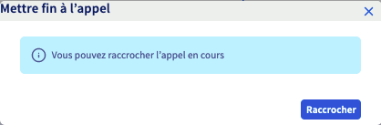{.thumbnail}

### Consulter les enregistrements 

Le CCS vous permet d'enregistrer les appels entrants sur les files d'appels actives dans votre configuration.

> [!primary]
>
> L'activation de l'enregistrement des appels entraînera le déclenchement automatique d'un message d'avertissement, pré-configuré par OVHcloud, lorsque votre numéro sera appelé. Ce message ne peut être supprimé ou modifié tant que l'enregistrement des appels est activé.
>

Pour activer l'enregistrement des appels, cliquez sur l'onglet `Consultation`{.action} puis sur `Enregistrements`{.action}.

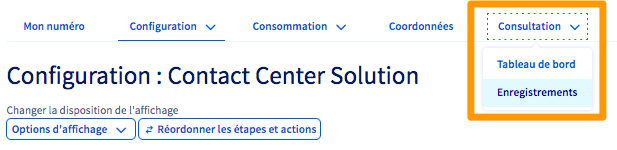{.thumbnail}

Sélectionnez, dans le menu déroulant de gauche, la file d'appels sur laquelle les appels seront enregistrés puis cochez la case `Enregistrement des appels`{.action}.

Vous pouvez laisser à vos appelants la possibilité de ne pas être enregistrés. Pour cela, cochez la case `Activer la demande de non enregistrement d'appel`{.action}. Sélectionnez la langue (Français ou Anglais) dans laquelle le message sera diffusé puis choisissez une touche pour que les appelants puissent activer cette option de non-enregistrement d'appel.

{.thumbnail}

Vous trouverez plus bas la liste des enregistrements que vous pourrez télécharger.

> [!primary]
> Ces enregistrements sont conservés sur nos serveurs pendant une durée de 60 jours. Ils sont ensuite automatiquement supprimés.
>

{.thumbnail}

## Aller plus loin

Échangez avec notre communauté d'utilisateurs sur <https://community.ovh.com>.
