**Dernière mise à jour le 12/01/2021**

## Objectif

Le Contact Center Solution (CCS) est la configuration la plus complète applicable à un numéro alias. Elle permet par exemple de combiner les configurations avancées que sont la [file d'appels](https://docs.ovh.com/fr/voip/les-files-d-appels/) et le [serveur vocal interactif (SVI)](https://docs.ovh.com/fr/voip/svi-serveur-vocal-interactif/).

Vous pouvez par exemple proposer à vos appelants, via la seule composition de votre numéro principal, un choix de touches pour joindre chaque service de votre entreprise, chaque touche composée faisant sonner un ensemble de lignes selon une stratégie que vous définissez depuis l'espace client OVHcloud.

**Apprenez à configurer un CCS sur votre numéro alias depuis votre espace client OVHcloud.**

> [!warning]
>
> La configuration Contact Center Solution est une offre en beta. Son fonctionnement ne peut donc être garanti par les équipes de OVHcloud. De même, en cas de difficulté, nos équipes du support vous inviteront à appliquer une configuration de type « File d'appels » ou « Serveur vocal interactif » sur votre numéro.
> 

## Prérequis

- Disposer d'un [numéro alias](https://www.ovhtelecom.fr/telephonie/numeros/){.external}.
- Être connecté à l'[espace client OVHcloud](https://www.ovh.com/auth/?action=gotomanager&from=https://www.ovh.com/fr/&ovhSubsidiary=fr){.external}, partie `Télécom`{.action}

## Lexique

|Nom|Définition|
|---|---|
|Agent|Un agent est une ligne téléphonique, interne au compte OVHcloud ou externe à celui-ci, en capacité de sonner lorsque le numéro alias sera appelé.|
|File|Une file est un groupe d'agents, sur le principe de la [file d'appels](../les-files-d-appels/). La file permet de faire sonner ces agents selon une stratégie à définir.|
|Menu interactif|Un menu interactif propose à l'appelant des choix de touches pour faire sonner un agent/une file ou jouer un son, sur le principe du [serveur vocal interactif (SVI)](../svi-serveur-vocal-interactif/).|
|TTS|Un Text-To-Speech (TTS) est un son créé à partir d'un texte que vous rédigez dans l'espace client OVHcloud.|

## En pratique

### Étape 1 : Appliquer la configuration Contact Center Solution

Connectez-vous à votre [espace client OVHcloud](https://www.ovh.com/auth/?action=gotomanager&from=https://www.ovh.com/fr/&ovhSubsidiary=fr){.external}, partie « Télécom ». Cliquez sur `Téléphonie`{.action} dans la barre de services à gauche, puis sélectionnez le numéro concerné. 
Dans l'onglet `Configuration`{.action}, cliquez sur `Passer en mode expert`{.action} pour sélectionner **Contact Center Solution**. 
Validez en cliquant sur `Paramétrer`{.action}. L'application de la configuration prend quelques secondes.

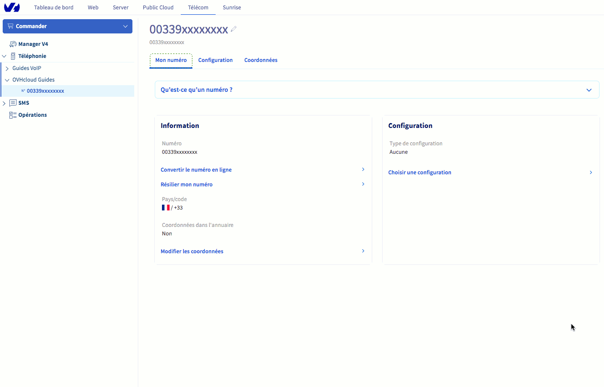{.thumbnail}

Dans le cas d'une autre configuration déjà appliquée à votre numéro, cliquez sur `Configuration`{.action} puis `Changer de configuration`{.action}.

Une fois la configuration appliquée, cliquez sur l'onglet `Paramétrer la configuration`{.action}.

{.thumbnail}

La configuration se présente sous la forme d'une arborescence étape par étape qui comprend :

- un menu principal sous la forme d'une bulle (1) permettant de gérer les options générales de la configuration;
- des étapes (2) créées à chaque nouvel ajout appliqué à votre configuration;
- des actions (3) définies au sein de chaque étape.

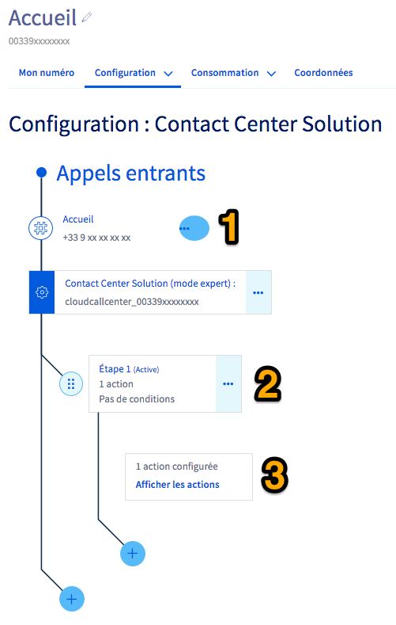{.thumbnail}

### Étape 2 : gérer les sons / gérer les TTS

L'accueil téléphonique de vos appelants peut être amélioré grâce à l'ajout d'un ou plusieurs fichiers-sons, préalablement créés par vos soins ou définis via des Text-To-Speech (TTS) depuis l'espace client.

#### 2.1 Gérer les sons

Cliquez sur la bulle `...`{.action} du menu principal puis sur `Gérer les sons`{.action}.

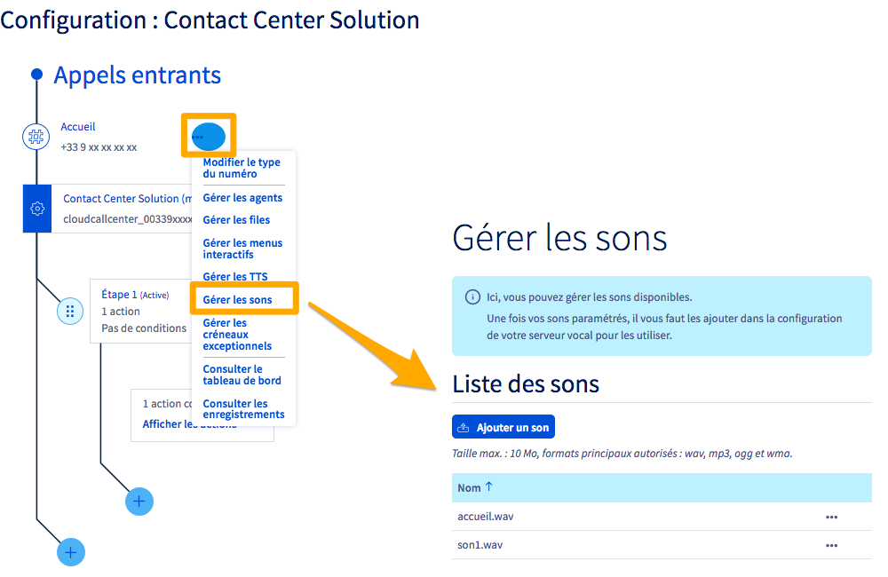{.thumbnail}

Cliquez sur `Ajouter un son`{.action} pour téléverser un son depuis votre poste. Vous pouvez ainsi ajouter un son d'accueil d'un menu interactif ou encore une musique d'attente pour faire patienter vos appelants pendant que vos lignes sont occupées.

#### 2.2 Gérer les TTS

Cliquez sur la bulle `...`{.action} du menu principal puis sur `Gérer les TTS`{.action}.

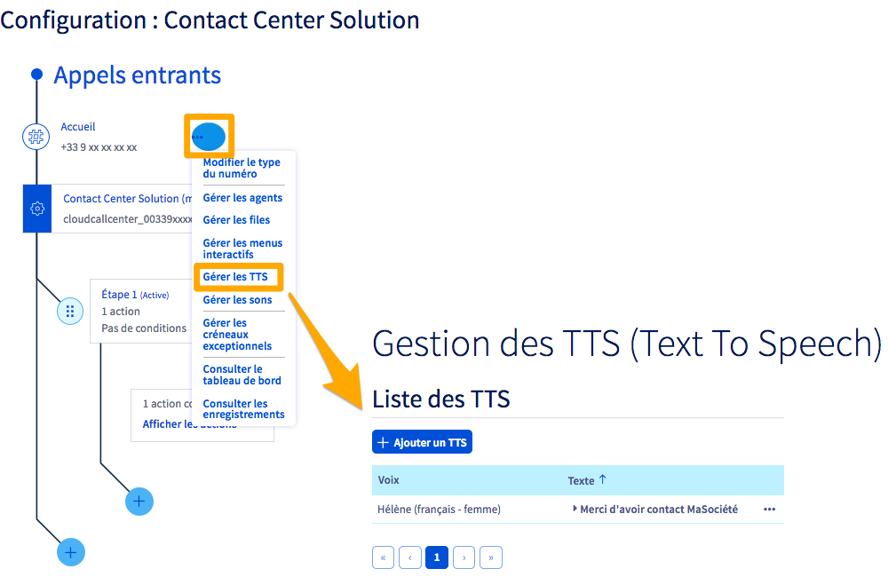{.thumbnail}

Cliquez alors sur `+ Ajouter un TTS`{.action}, choisissez une voix parmi celles proposées puis tapez le texte qui sera récité. Cliquez enfin sur `Créer`{.action}.

### Étape 3 : créer les files

Les files d'appels regroupent plusieurs agents (des lignes téléphoniques internes ou externes) qui vont sonner selon une stratégie que vous définissez dans l'espace client.

Leur fonctionnement est identique à la configuration [File d'appels](../les-files-d-appels/) applicable directement sur un numéro alias.

#### 3.1 Ajouter les agents

Afin de créer vos files d'appels, vous devez d'abord ajouter toutes les lignes qui pourront être contactées lorsque votre numéro alias sera appelé.

Cliquez sur la bulle `...`{.action} du menu principal puis sur `Gérer les agents`{.action}.

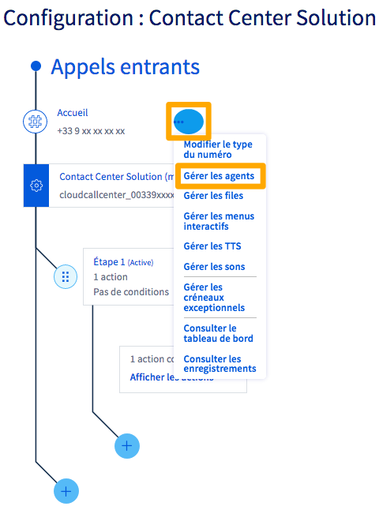{.thumbnail}

Vous pouvez ajouter deux types d'agents, des lignes SIP internes (appartenant à votre compte OVHcloud) et des lignes externes (fixes ou mobiles).

Pour ajouter une ligne SIP interne (1), cliquez sur la loupe à droite du champ « Numéro ». Dans le menu qui s'affiche, sélectionnez une ligne puis cliquez sur `Valider`{.action}. Les lignes doivent être ajoutées l'une après l'autre.

Pour ajouter une ligne externe (2), renseignez son numéro au format international (0033xxxxxxxxx pour la France) dans le champ « Numéro » puis validez l'ajout de chaque ligne en cliquant sur `Ajouter un agent`{.action}.

> [!warning]
> L'ajout d'une ligne externe peut occasionner des frais car un appel reçu par celle-ci sera comptabilisé en hors-forfait. Vous pouvez consulter nos tarifs hors-forfait en vigueur sur [cette page](https://www.ovhtelecom.fr/telephonie/decouvrez/tarifs_telephonie.xml){.external}.
>

{.thumbnail}

Les agents et leurs attributs sont visibles dans la « Liste des agents ». Vous pouvez modifier ces attributs en cliquant sur le stylo à droite de chaque agent.

{.thumbnail}

Les attributs que vous pouvez modifier sont les suivants :

|Nom|Définition|
|---|---|
|Description|Permet de renommer l'agent|
|Délai|Permet de définir la durée pendant laquelle la ligne sonnera. Une fois ce temps écoulé, et selon la stratégie d'appels de la file, l'appel sera alors transmis vers un autre agent de cette file.|
|Repos|Permet de définir la durée pendant laquelle l'agent ne prendra pas d'appel après avoir raccroché.|
|Appels simultanés|Permet de définir le nombre d'appels que la ligne pourra recevoir.|
|État|Permet de rendre disponible ou déconnecter un agent au sein des files.|

#### 3.2 Créer les files d'appels

Vos agents sélectionnés, vous devez à présent les organiser dans une ou plusieurs files d'appels.

Cliquez sur la bulle `...`{.action} du menu principal puis sur `Gérer les files`{.action}. Vous pouvez ici créer une ou plusieurs files d'appels. La première file est déjà créée.

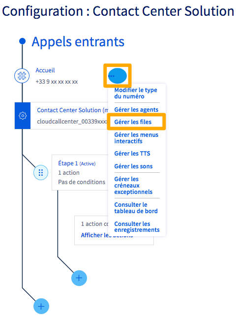{.thumbnail}

Cliquez sur `Ajouter un membre à la file`{.action} puis sur le menu déroulant pour afficher la liste des agents que vous avez préalablement créée. Cliquez sur un agent puis sur `Ajouter cet agent à la file`{.action} et réitérez cette action pour chaque agent à ajouter.

Vous pouvez également modifier les options de cette file en cliquant sur `Gérer les options`{.action}.

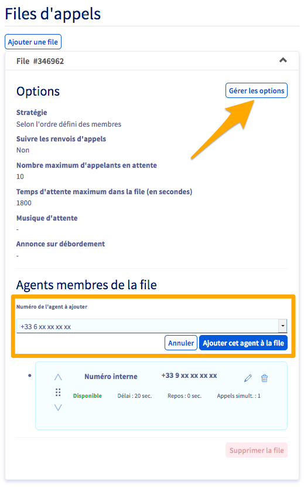{.thumbnail}

Les options sont les suivantes :

|Option|Définition|
|---|---|
|Nom de la file|Vous permet de personnaliser le nom de votre file. C'est recommandé si vous comptez créer plusieurs files, afin de bien les différencier dans la construction de votre CCS.|
|Stratégie|Choisissez une stratégie de sonnerie pour vos agents qui pourront, par exemple, sonner tous en même temps ou l'un après l'autre;|
|Suivre les renvois d'appels|Définissez si les renvois d’appels configurés sur les lignes de la file doivent être appliqués ou non.|
|Nombre maximum d'appelants en attente|Définissez le nombre maximum d’appelants pouvant être en attente dans la file. Si ce nombre venait à être dépassé, les appelants suivants entendraient l'annonce sur débordement|
|Temps d'attente maximum dans la file (en secondes)|Définissez la durée maximale d'attente dans cette file avant que l'appel ne passe à l'étape suivante de votre CCS.|
|Musique d'attente|Ce son sera joué à l’entrée dans la file d’attente jusqu’au décrochage de l’appel par une ligne|
|Annonce sur débordement|Le ou les appelants concernés par le débordement entendront alors l’annonce que vous avez définie.|

Validez vos modifications en cliquant sur `Appliquer les modifications`{.action}.

Vous pouvez modifier l'ordre des agents membres d'une file en effectuant un glisser-déposer via le pictogramme (1) à gauche de chaque agent. Dans le cas d'une stratégie d'appel «Selon l'ordre défini des membres», l'agent le plus haut dans la file sonnera le premier. Puis le deuxième agent sonnera et ainsi de suite.

Vous pouvez également modifier (2) ici les attributs d'un agent ou supprimer celui-ci (3).

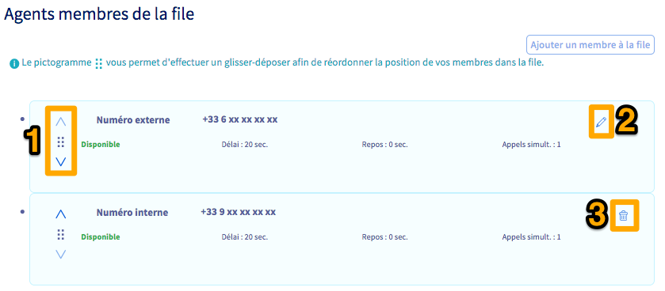{.thumbnail}

Vous pouvez créer autant de files que nécessaire pour répondre à votre besoin.

### Étape 4 : créer les menus interactifs (facultatif)

À la différence de la configuration d'un numéro alias en [Serveur Vocal Interactif (SVI)](../svi-serveur-vocal-interactif/), le CCS permet aux appelants de faire sonner des files entières (et non plus une simple ligne) en composant les touches de leurs téléphones.

#### 4.1 Créer le premier menu

Cliquez sur la bulle `...`{.action} du menu principal puis sur `Gérer les menus interactifs`{.action}.

{.thumbnail}

Cliquez sur  `+ Ajouter un menu interactif`{.action}. Nommez ce nouveau menu (1) puis choisissez entre un son ou un TTS (2) pour l'accueil de votre menu interactif. Choisissez ensuite le son ou le TTS (3) parmi ceux déjà ajoutés. Ce son/TTS devra énoncer les différents choix de touches proposés à vos appelants.

Les mêmes choix vous sont proposés pour définir un son ou un TTS en cas d'action invalide (4). Celui-ci sera joué si l'appelant appuie sur une touche non reconnue par le serveur vocal interactif.

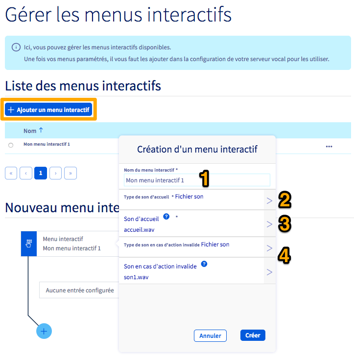{.thumbnail}

Une fois ces informations définies, cliquez sur `Créer`{.action}. Vous pouvez maintenant créer les entrées du menu interactif, c'est à dire les choix de touches proposés à vos appelants et les actions qui y sont liées.

Cliquez sur le bouton `+`{.action} en bas de du menu pour ajouter votre première entrée.

{.thumbnail}

Dans le menu supplémentaire qui s'affiche, complétez les informations demandées.

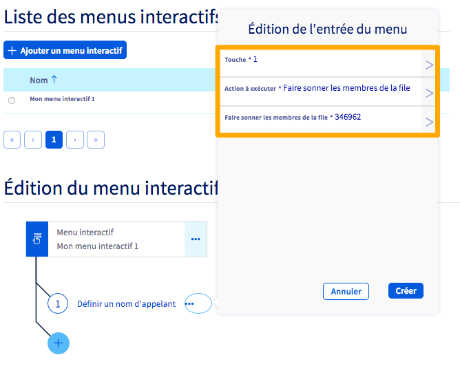{.thumbnail}

|Information|Description|
|---|---|
|Touche|Choisissez une touche parmi celles proposées.|
|Action à exécuter|Définissez l'action qui s'effectuera lorsque l'appelant appuiera sur la touche correspondante. Aidez-vous des informations qui s'affichent pour choisir celle la plus adaptée à votre besoin.|
|Paramètre d'action supplémentaire|Selon l'action que vous avez définie, une case supplémentaire peut apparaître et vous inviter à renseigner un élément complémentaire. Suivez alors les indications qui s'affichent.|

Une fois les informations complétées, cliquez sur `Créer`{.action}. Répétez l'opération pour les entrées de menu supplémentaires.

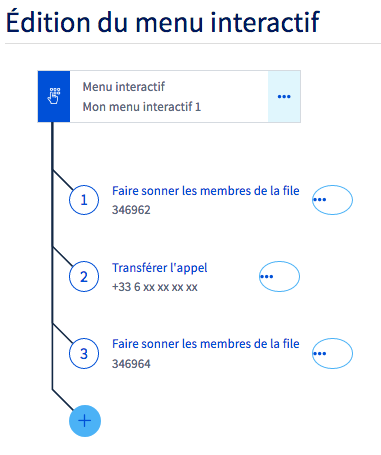{.thumbnail}

Selon vos besoins, répétez ces manipulations si vous voulez créer plusieurs menus interactifs. Vous pourrez également les imbriquer en tant que sous-menus d'un menu interactif principal, si vous souhaitez par exemple proposer de nouveaux choix après le premier menu interactif.

### Étape 5 : configurer votre CCS

Une fois vos files et menus interactifs créés, il faut maintenant les articuler dans le CCS.
Chaque appel entrant va suivre une ou plusieurs étapes successives que vous allez définir. Au sein de chaque étape, une ou plusieurs actions devront également être créés. 

Voici un exemple de configuration d'un CCS :

- Une étape 1, conditionnée à des créneaux horaires de fermeture, dans laquelle une seule action consistera à jouer un son invitant l'appelant à rappeler votre numéro pendant les horaires d'ouverture.
- Une étape 2 dans laquelle une seule action fera sonner une première file d'appels.
- Une étape 3 dans laquelle une première action fera sonner une seconde file d'appels, différente de la première. Puis, une seconde action qui renverra l'appel vers un répondeur au bout de la durée maximum d'attente de cette seconde file d'appels.

Pour ajouter une étape, cliquez sur le bouton **`+`{.action}** (1) le plus en bas à gauche de votre plan de configuration.
 Pour ajouter une action au sein d'une étape, cliquez sur le bouton **`+`{.action}** (2) sous l'étape concernée.
 Pour modifier l'ordre de vos étapes/actions, effectuez un glisser-déposer via le bouton dédié (3) à gauche de chaque étape/action.

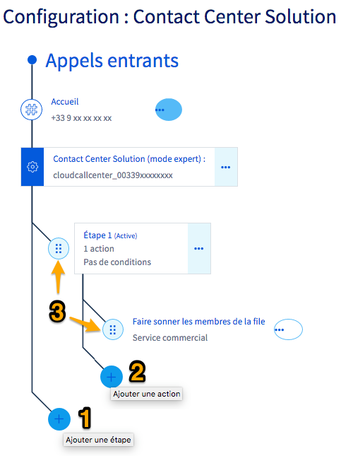{.thumbnail}

#### Ajouter une condition à une étape

Lorsqu'une ou plusieurs conditions sont ajoutées à une étape, celles-ci doivent être remplies pour que l'étape se déclenche. Si les conditions ne sont pas remplies, le cheminement prévu dans votre CCS passera à l'étape suivante.

Pour ajouter une condition à une étape, cliquez sur le bouton `...`{.action} à côté de l'étape concernée, puis choisissez `Configuration avancée`{.action}. Une fenêtre s'affiche alors ; vous pouvez y définir jusqu'à trois types de conditions. Poursuivez selon la condition que vous désirez paramétrer :

- [Condition de « Jours exceptionnels »](./#condition-de-jours-exceptionnels)
- [Condition de « Plages horaires génériques »](./#condition-de-plages-horaires-generiques)
- [Condition de « Filtrages d'appels »](./#condition-de-filtrages-dappels)

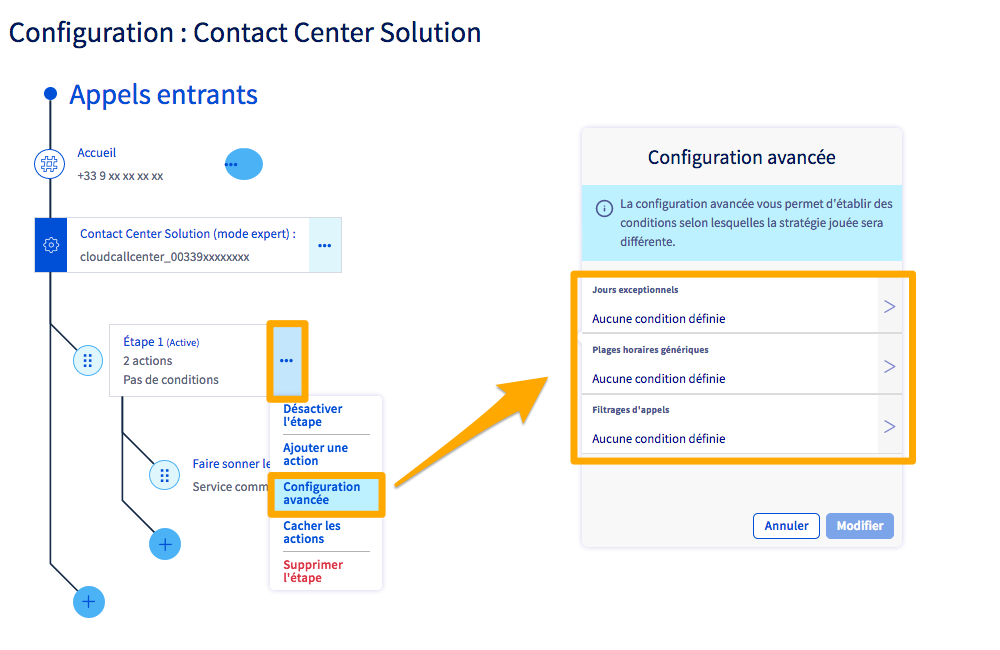{.thumbnail}

Une fois vos conditions créées, vous pouvez définir une ou plusieurs action(s) correspondant aux conditions non-vérifiées. Ces actions seront alors prises en compte lors d'appels ne vérifiant pas les conditions.

Ainsi, dans l'exemple ci-dessous, un appel pendant les plages horaires définies à l'étape 1 fera sonner les membres de la file d'appels nommée « Service commercial » (1).
Un appel en dehors de ces plages horaires sera réceptionné sur le répondeur d'une ligne SIP OVHcloud (2).

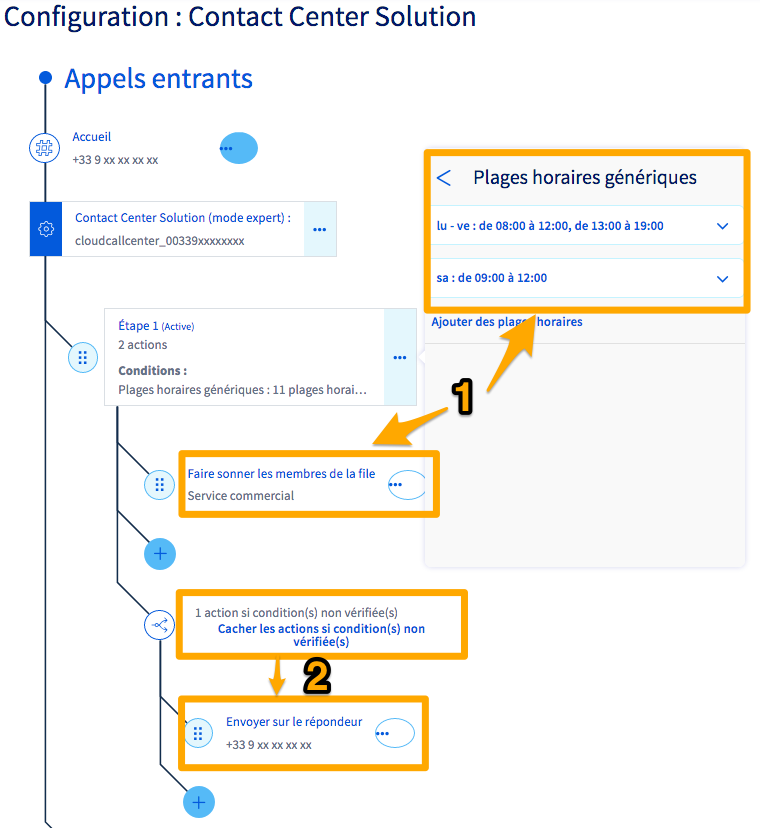{.thumbnail}

##### **Condition de « Jours exceptionnels »**

Après avoir cliqué sur `Jours exceptionnels`{.action} depuis la fenêtre de configuration avancée, choisissez le créneau que vous souhaitez appliquer. Vous revenez ensuite automatiquement dans la fenêtre de configuration avancée. Cliquez alors sur `Modifier`{.action}.

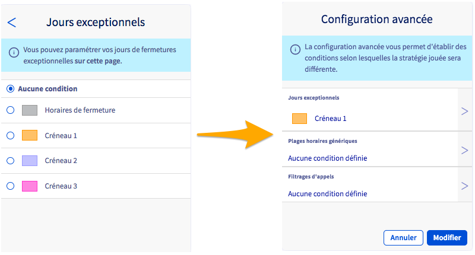{.thumbnail}

Vous devez à présent configurer le créneau que vous venez de sélectionner. Pour cela, cliquez sur le bouton `...`{.action} le plus proche des appels entrants, puis choisissez `Gérer les créneaux exceptionnels`{.action}.

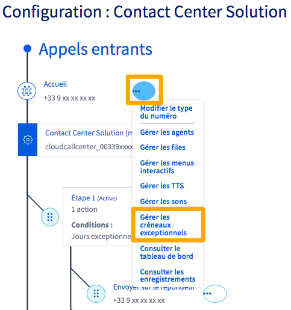{.thumbnail}

La page de gestion des fermetures exceptionnelles apparaît alors. Dans la partie `Planification des jours de fermeture`, positionnez vos fermetures exceptionnelles sur le calendrier en cliquant sur les jours concernés. Complétez les informations demandées :

|Information|Description|
|---|---|
|Plage horaire/journée entière|Choisissez si la fermeture exceptionnelle concerne uniquement une plage horaire ou une journée entière.|
|Objet|Définissez un titre vous permettant d'identifier cette fermeture exceptionnelle dans le calendrier.|
|Catégorie|Choisissez le créneau dans lequel vous souhaitez ajouter la fermeture exceptionnelle.|
|Du/au|Définissez la date et l'heure (le cas échéant) de la fermeture exceptionnelle.|
|Description|Vous pouvez ajouter une description plus détaillée à la fermeture exceptionnelle.|

Une fois les informations renseignées, cliquez sur `Créer l'événement`{.action}. Répétez cette manipulation afin d'ajouter toutes les fermetures exceptionnelles nécessaires. Cliquez enfin sur le bouton `Valider`{.action} pour sauvegarder ces changements.

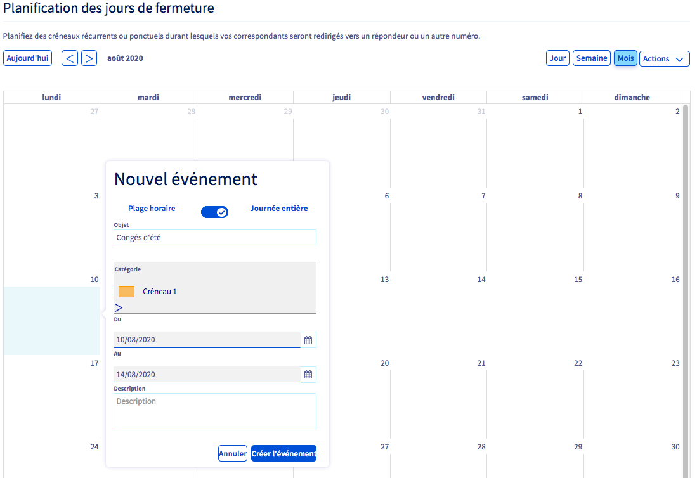{.thumbnail}

##### **Condition de « Plages horaires génériques »**

Après avoir cliqué sur `Plages horaires génériques`{.action} depuis la fenêtre de configuration avancée, deux possibilités existent :

- **vous n'avez aucune plage horaire définie** : vous devez dans ce cas cliquer sur le bouton `Ajouter des plages horaires`{.action} ;
- **vous avez déjà au moins une plage horaire définie** : vous devez alors soit cliquer sur la plage concernée si vous souhaitez la modifier, soit cliquer sur le bouton `Ajouter des plages horaires`{.action} pour en ajouter une nouvelle.

Configurez maintenant les plages horaires qui correspondent à vos besoins. Pour cela, renseignez l'heure de début et l'heure de fin dans les zones prévues à cet effet. Utilisez ensuite le bouton `+`{.action} pour les ajouter. Une fois le paramétrage terminé, utilisez le bouton `<`{.action} situé dans la partie supérieure de la fenêtre des plages horaires génériques, puis cliquez sur le bouton `Modifier`{.action}.

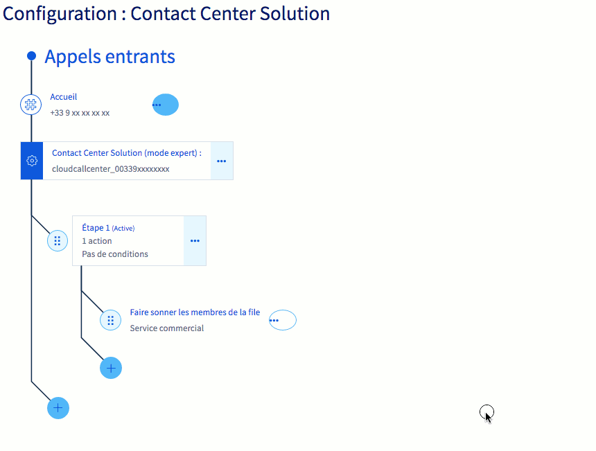{.thumbnail}

##### **Condition de « Filtrages d'appels »**

Après avoir cliqué sur `Filtrages d'appels`{.action} depuis la fenêtre de configuration avancée, choisissez si vous souhaitez filtrer vos communications selon une « liste noire » ou une « liste blanche ». 

|Liste|Description|
|---|---|
|Liste noire|Les numéros ou les tranches de numéros inscrits dans la liste ne peuvent plus vous contacter.|
|Liste blanche|Seuls les numéros ou les tranches de numéros inscrits dans la liste sont autorisés à vous contacter.|

Une fois que vous avez sélectionné la liste que vous souhaitez utiliser, complétez-la en ajoutant les numéros ou les tranches de numéros adéquats. Pour cela, utilisez la zone `Ajouter un numéro à la liste`, puis cliquez sur le bouton `Ajouter`{.action}. Vous pouvez supprimer une entrée dans la liste grâce à l'icône représentant une corbeille. 

Pour terminer la manipulation, utilisez le bouton `<`{.action} situé dans la partie supérieure de la fenêtre de filtrage d'appels, puis cliquez sur le bouton `Modifier`{.action}.

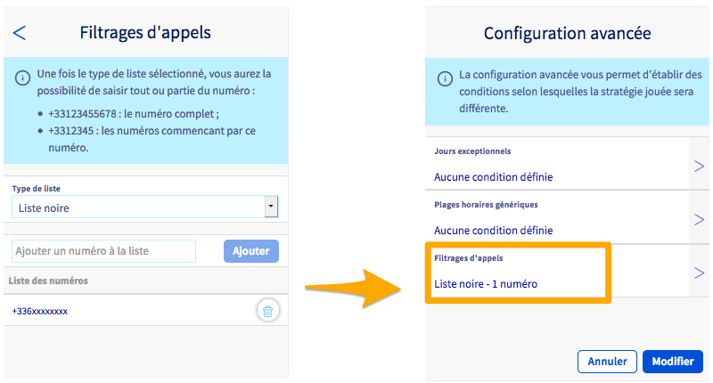{.thumbnail}

### Consulter le tableau de bord

Le tableau de bord vous permet d'obtenir des statistiques détaillées sur les appels reçus par votre numéro configuré en CCS et  par les différentes files le composant.
Vous pourrez également obtenir des informations en temps réel sur les appels en cours sur votre numéros ainsi que sur la disponibilité de chaque ligne.

Pour consulter le tableau de bord, cliquez sur le bouton `...`{.action} le plus proche des appels entrants, puis choisissez `Consulter le tableau de bord`{.action}.

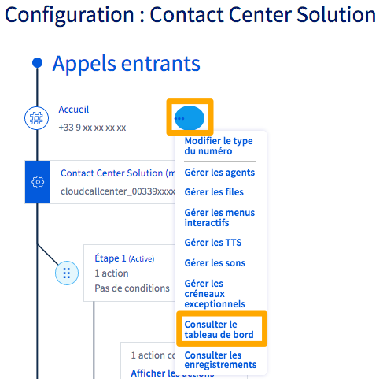{.thumbnail}

### Consulter les enregistrements

Le CCS vous permet d'enregistrer les appels entrants sur votre numéro. 

> [!primary]
>
> L'activation de l'enregistrement des appels entraînera le déclenchement automatique d'un message d'avertissement pré-configuré par OVHcloud lorsque votre CCS sera appelé. Ce message ne peut être supprimé ou modifié tant que l'enregistrement des appels est activé.
>

Pour activer l'enregistrement des appels, cliquez sur le bouton `...`{.action} le plus proche des appels entrants, puis choisissez `Consulter les enregistrements`{.action}.

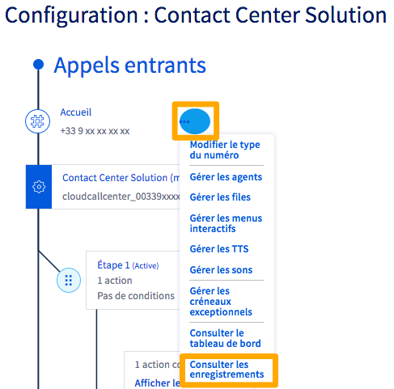{.thumbnail}

Cochez la case `Enregistrement des appels`{.action} pour l'activer. Vous pouvez également laisser à vos appelants la possibilité de ne pas être enregistrés, via une touche à presser que vous pourrez choisir. 

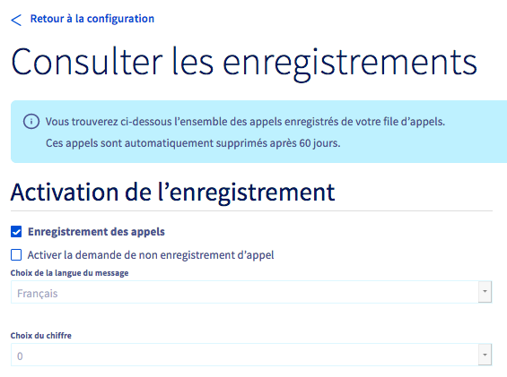{.thumbnail}

Vous trouverez dans ce même menu la liste des enregistrements que vous pourrez télécharger. Ces appels sont conservés sur nos serveurs pendant une durée de 60 jours. Ils sont ensuite automatiquement supprimés.

{.thumbnail}

## Aller plus loin

Échangez avec notre communauté d'utilisateurs sur <https://community.ovh.com>.
