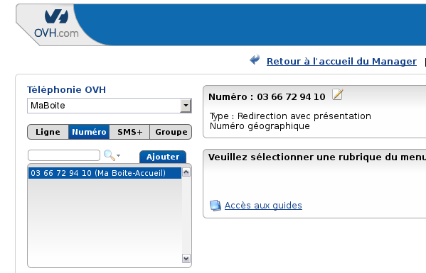
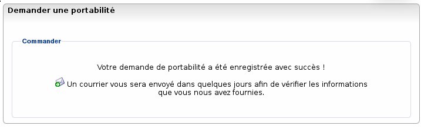

### Préambule {#préambule}

La portabilité du numéro est un service proposé dans nos offres de téléphonie. Il vous permet de conserver le numéro de téléphone que vous aviez chez votre ancien opérateur. Cette opération est gratuite pour les numéros géographiques (01 à 05) ainsi que les numéros non géographiques (09).

Le délai de réalisation est de 7 jours ouvrés pour un particulier et de 10 jours ouvrés pour un professionnel à compter de la date de validation de votre mandat.

Niveau : Débutant

------------------------------------------------------------------------

### Effectuer la demande de portabilité via l'Espace Client {#effectuer-la-demande-de-portabilité-via-lespace-client}

Lorsque vous lancez une demande de portabilité, il faut que votre numéro soit **toujours actif** chez votre ancien opérateur. **Vous ne devez pas demander la résiliation** de votre ligne avant la réalisation de la portabilité chez OVH.

Pour demander la portabilité de votre numéro :

-   Connectez-vous à votre Espace Client OVH : <https://www.ovhtelecom.fr/espaceclient/>
-   Cliquez sur le lien "**Administrez vos services de téléphonie via l'ancienne interface.**"
-   Cliquez sur l'onglet "**Numéro**".
-   Cliquez sur le bouton "**Ajouter**".

{.thumbnail}

-   Cliquez sur le lien "**Demander la portabilité de numéro(s) chez OVH**" pour accéder au formulaire de dépôt.

{.thumbnail}

-   Vous devez remplir les champs indiqués dans le formulaire :
    -   **Forme légale** : concerne le type d'organisation qui est facturée pour le / les numéro(s) à porter. Vous avez le choix entre **Particulier** (Ligne personnelle, facturée en votre nom propre),**Professionnel** (professions libérales, auto-entrepreneur, etc.) et **Entreprise**.

    -   **Groupe de facturation** : vous permet de choisir dans quel groupe de facturation vous souhaitez intégrer vos numéros portés.
    -   **Type de numéro** : vous permet de choisir si vous portez un **numéro fixe** ou **numéro spécial**.

        Si vous devez porter un numéro spécial, un champ supplémentaire est à remplir :

        - **Catégorie** : il s'agit de classifier les services proposés derrière le numéro.

    -   **Numéro à porter** : Dans ce champ vous devez entrer votre numéro à porter.

        Le drapeau à côté du champ **Numéro à porter** vous permet de choisir le **pays concerné**par le numéro à porter.

        Vous ne pouvez pas porter seulement un SDA, il faut porter la tranche complète : **la tête de ligne** et **les SDA**.

        Le fait de choisir **Professionnel** ou **Entreprise** vous permet d'accéder au formulaire pour ajouter les SDA.

        {.thumbnail}

        **Cas spécifique avec Free**

        Dans les cas d'une portabilité d'un numéro attributaire Free, un code RIO vous sera demandé. Vous trouverez ce code RIO dans l'espace client de Free.

    -   **Date de portabilité** : vous avez le choix entre deux types de date :
        -   -   **Choisir la date** : vous choisissez une date précise dans le calendrier afin de planifier votre portabilité.
            -   **Au plus tôt**: la date la plus proche sera choisie automatiquement.

                Veuillez noter qu'un délai incompressible de 7 jours ouvrés pour un particulier et de 10 jours ouvrés pour un professionnel est nécessaire après réception du mandat de portabilité.

    -   **Publier dans les annuaires** : vous pouvez demander à faire paraître le numéro dans les annuaires une fois celui-ci porté.
    -   **Informations personnelles**et **Adresse d’installation de la ligne**: il faut définir les informations indiquées sur la facture de votre ligne.

Une fois les champs complétés, vous pouvez cliquer sur le bouton **Commander**. Une confirmation de prise en compte s'affiche alors à l'écran.

{.thumbnail}

Vous recevrez dans quelques jours [un mandat de portabilité](#Demanderlaportabilitédemonnuméro-mandat).

### Le mandat de portabilité {#le-mandat-de-portabilité}

Ce dernier permet à OVH d’obtenir votre autorisation pour porter vos numéros. Il vous est envoyé par e-mail, à l’adresse renseignée dans votre profil OVH.

Ce mandat est à nous renvoyer, daté, signé et dans le cadre d’une entreprise avec le cachet apposé sur le mandat, via l’un de ces canaux :
 
- **depuis votre [espace client OVH](https://www.ovh.com/auth/?action=gotomanager){.external}** (au format PDF) ;
- **par e-mail (au format PDF)** : validation.portabilite@ovh.net ;
- **par fax** : 09 72 10 01 44 ;
- **par courrier** : OVH - 2 Rue Kellermann - 59100 Roubaix.
 
Pour un traitement plus rapide, nous vous invitons à privilégier l’envoi du mandat via votre [espace client OVH](https://www.ovh.com/auth/?action=gotomanager){.external}. Par e-mail, courrier ou fax, le traitement est réalisé sous 24 à 48 heures ouvrées après réception.

### Suivi du déroulement de votre portabilité {#suivi-du-déroulement-de-votre-portabilité}

Pour suivre votre demande de portabilité :

-   Connectez-vous à votre Espace Client OVH : <https://www.ovhtelecom.fr/espaceclient/>
-   Cliquez sur le lien "**Administrez vos services de téléphonie via l'ancienne interface**".
-   Cliquez sur l'onglet **Portabilité**.
-   Cliquez sur **Portabilité en cours**.

Vous pouvez ainsi suivre le statut d'envoi du mandat et le statut de la portabilité.

### **Que faire en cas d'erreur ?** {#que-faire-en-cas-derreur}

En cas d'erreur sur votre portabilité, un mail vous est automatiquement envoyé afin que vous puissiez entrer en contact avec notre support. Vous pourrez ainsi régler directement l'erreur rencontrée et relancer la demande de portabilité.

### Annuler une demande de portabilité {#annuler-une-demande-de-portabilité}

Il est possible de demander une annulation de la portabilité en cours. Pour cela, cliquez sur la croix rouge en haut à droite de la portabilité que vous souhaitez annuler sur l'interface de suivi.

L'annulation de la portabilité s'effectuera sous réserve de l'acceptation par l'opérateur attributaire.

### Préparer la configuration des numéros portés {#préparer-la-configuration-des-numéros-portés}

Vos numéros portés sont disponibles 48 heures avant dans votre Espace Client et sont activés sur le réseau OVH. Vous pouvez alors **configurer vos numéros** en avance afin de limiter la coupure de service.