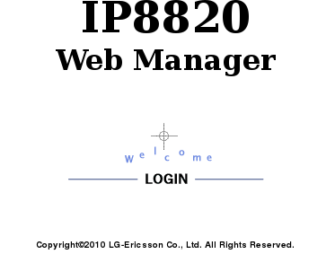
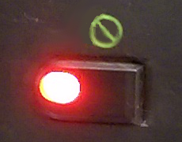

------------------------------------------------------------------------

**Sommaire :**

Niveau : Débutant

------------------------------------------------------------------------

### Configuration d'un LG {#configuration-dun-lg}

Si votre téléphone est bloqué et affiche "**Undefined call server**" ou que vous l'avez réinitialisé, il va falloir le reconfigurer via ces étapes :

-   **Connectez-vous** sur votre **EspaceClientTelecom** : <https://www.ovhtelecom.fr/espaceclient/>
-   Cliquez sur le lien "**Administrez vos services de téléphonie via l'ancienne interface**".
-   Cliquez sur la ligne **associée** au poste.
-   Cliquez sur l'onglet "**Assistance**" dans le menu "**Navigation**".
-   Cliquez sur "**Dépannage plug and Phone**".

{.thumbnail}

-   Le formulaire vous demande l'adresse **IP Publique** depuis laquelle le téléphone vient se connecter. Généralement (hors configuration particulière), votre ordinateur utilise la même IP Publique que le téléphone. Vous la trouverez en bas à droite du formulaire. Cliquez sur "**Suivant**".

{.thumbnail}

-   Cliquez sur le bouton "**Reconfiguration manuelle**".
-   Sur le téléphone, appuyez sur la touche"**Paramètres**" (à gauche des touches de navigation).
-   Appuyez sur la **touche "7"** pour accéder au menu**Verr./Déverr. Config**. Le mot de passe à entrer est **0000**.
-   Appuyez sur la **touche "6"** pour accéder au menu **Valeurs par défaut**. Appuyez sur **Oui** pour confirmer la remise à zéro.
-   Appuyez sur la **touche "9"** pour redémarrer le téléphone et confirmez en appuyant sur "**Yes**".

Le téléphone est remis à zéro, il faut à présent définir le serveur d’approvisionnement :

-   Récupérez l'adresse IP du poste en appuyant sur la **touche** paramètre **représentée** par un **engrenage**.

{.thumbnail}

-   Appuyez sur la **touche** "**8**" pour accéder au menu **Informations**.
-   Notez l'**adresse IP** affichée.
-   Dans votre **Navigateur Internet** sur votre ordinateur, entrez dans la barre d'adresse l'IP du téléphone sous cette forme :**http://ip\_relevée\_du\_tel:8000**Vous devriez arriver sur cette page : {.thumbnail}
-   Cliquez sur le logo "**Login**". Le nom d'**utilisateur** est **private** et le **mot de passe** est **lip**.
-   Rendez-vous dans le**menu Upgrade Configuration** à gauche de la page.
-   Cochez le bouton "**HTTP / HTTPS**".
-   Entrez l'adresse suivante : **`http://lgn.prov.voip.ovh.net/ip8820`** dans le champ **"HTTP/HTTPS URL"**.
-   Dans le champ "**MAC Cfg. Format**", entrez **cfg/$MAC**

{.thumbnail}

-   En bas de page, cliquez sur le bouton "**Change**" puis "**Restart**".

Le téléphone va redémarrer et se reconfigurer.

------------------------------------------------------------------------

### Mon téléphone peut appeler / recevoir des appels mais affiche "Absence réseau" {#mon-téléphone-peut-appeler-recevoir-des-appels-mais-affiche-absence-réseau}

Si le message "**Absence réseau**" s'affiche mais que votre téléphone fonctionne, il s'agit simplement d'un défaut de branchement du câble Ethernet sur le téléphone.

Assurez vous que le câble Ethernet connecté au dos du téléphone est branché sur le port **1**du schéma ci dessous :

{.thumbnail}

------------------------------------------------------------------------

### Mon téléphone affiche "Connexion ..." ou "Erreur de téléchargement XML" {#mon-téléphone-affiche-connexion-...-ou-erreur-de-téléchargement-xml}

Si le téléphone vous affiche ce message, c'est qu'il ne parvient pas à récupérer sa configuration sur nos serveurs. Vérifiez que votre accès Internet fonctionne et que votre téléphone est bien branché sur votre réseau local. N'hésitez pas à consulter le guide sur[**les branchements**]({originalUrl}/display/CRTEL/Branchements+LG+8820)pour vous en assurer.

------------------------------------------------------------------------

### Mon téléphone a le bouton "Sens interdit" allumé en rouge {#mon-téléphone-a-le-bouton-sens-interdit-allumé-en-rouge}

Lorsque le bouton "**Sens Interdit**" est allumé en rouge sur le téléphone, cela signifie que le mode "**Ne pas déranger**" est activé. Ce mode permet de bloquer les appels entrants sur le téléphone et de diffuser le message suivant à votre correspondant "**Votre correspondant ne souhaite pas être dérangé, merci de le rappeler ultérieurement**".

{.thumbnail}
